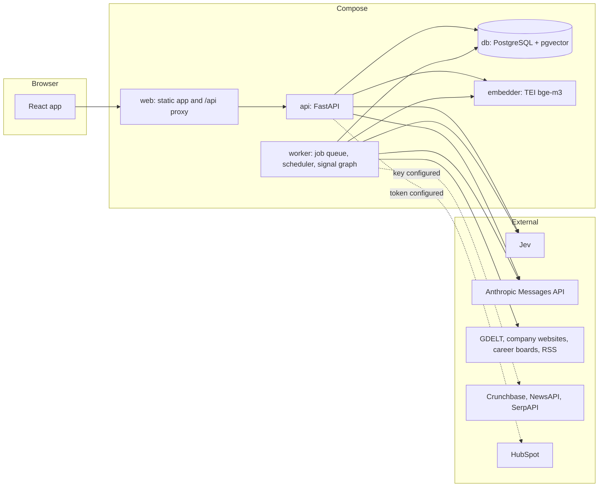

# Architecture overview

## Purpose

LeadRadar turns public company information into explained, scored and ranked leads for each Orange Systems service. It gathers documents about target accounts from public sources, asks each service's configurable signal questions of every relevant passage with a fast classifier, sends only the uncertain answers to an LLM, keeps every positive answer as a finding with a verbatim quote, and computes an explainable Fit, Intent and Priority score with deterministic rules. Sales staff without AI expertise work the ranked list, read why each lead is there, and give feedback that becomes labelled data. The product objective and its roles are in [business requirements](/requirements/business.md).

## Principles

These hold across every structure below; a change that breaks one needs a decision record.

| Id | Principle | What it means in practice |
|---|---|---|
| P-01 | **One store.** | PostgreSQL with `pgvector` holds everything ([ADR-01](/architecture/adrs/adr-01-one-postgresql-store.md)); a value is stored once, except where a read pays for a copy, such as a finding's `observed_at`. |
| P-02 | **No evidence, no finding.** | A finding exists only with a verbatim quote of a stored document, its address and its date ([RULE-02](/requirements/business.md#business-rules)). |
| P-03 | **Models answer, rules score.** | The classifier and the LLM answer questions and write text; [rules](/architecture/rules.md) alone compute scores, standings, bands and exclusions ([ADR-03](/architecture/adrs/adr-03-models-answer-rules-score.md)). |
| P-04 | **Cheap first.** | The classifier sees every relevant passage; the LLM sees only uncertain answers and confirmed positives ([ADR-02](/architecture/adrs/adr-02-classification-cascade.md)). |
| P-05 | **Configuration is data, versioned where it moves a score.** | Services, questions, ICP, weights, rules and thresholds change without code; scoring settings are immutable versions ([ADR-06](/architecture/adrs/adr-06-rule-based-scoring-with-versioned-settings.md)). |
| P-06 | **Every entity earns its place.** | A table, column or enum value exists only where a flow reads or writes it; derivable values are computed. |
| P-07 | **Idempotent steps.** | Every pipeline step converges under retry, so a job or a run can be repeated safely ([N-05](/requirements/system.md)). |
| P-08 | **Free core first.** | Paid sources are optional plug-ins; every P0 capability works on the free core ([ADR-07](/architecture/adrs/adr-07-source-plug-ins-with-a-free-core.md)). |
| P-09 | **Pure core, effects at the edges.** | Rules are pure functions with the clock injected; adapters do the I/O. |
| P-10 | **Fail visibly.** | An unavailable dependency is reported as an error with what still works ([Degradation](#degradation)); nothing is faked. |

## Topology

Two processes run the product's code, which is one Python package: the [api service](/architecture/services/api.md) answers the frontend and does the interactive AI calls (question preview, outreach), and the [worker](/architecture/services/worker.md) runs every background job — fetching, processing, the signal graph, scoring, discovery, evaluation and housekeeping. They share the database and the AI gateway module, and never call each other: the api enqueues jobs, the worker picks them up ([ADR-04](/architecture/adrs/adr-04-postgres-job-queue-and-a-worker.md)). The [frontend](/architecture/services/frontend.md) is a static React app served by the `web` container, which also proxies `/api/v1` to the api so the browser sees one origin.

## Runtime

One `docker compose up` starts the stack locally, and the same Compose file runs it on one cloud virtual machine in an EU region for the demo ([S-RUN-01](/requirements/system.md)).

| Container | Image | Role |
|---|---|---|
| `web` | nginx with the built frontend | Serves the app; proxies `/api/v1` to `API_UPSTREAM` |
| `api` | the product image, `uvicorn` entry point | REST API; applies the Alembic migrations at start |
| `worker` | the product image, worker entry point | Jobs, scheduler, housekeeping; `WORKER_CONCURRENCY` jobs at a time; more containers may run |
| `db` | PostgreSQL 16 with `pgvector` | The [SQL store](/architecture/sql-store.md) |
| `embedder` | Hugging Face Text Embeddings Inference, CPU, model `BAAI/bge-m3` | The [embedder](/architecture/interfaces.md#embedder) |

Configuration comes from environment variables only; secrets (API keys, the HubSpot token, seed passwords) are never committed, logged or returned by the API. Each service's keys and defaults are in its runtime section: [api](/architecture/services/api.md#runtime), [worker](/architecture/services/worker.md#runtime), [frontend](/architecture/services/frontend.md#runtime).

**Fixture mode** ([ADR-11](/architecture/adrs/adr-11-recorded-fixtures.md)). `FIXTURE_MODE` is `off`, `record` or `replay`. In `record`, every source plug-in request and every classifier and LLM call is stored under `FIXTURE_DIR`, keyed by a SHA-256 of the adapter name and the normalised request. In `replay`, they are answered from those files; a request with no file fails its step with `FIXTURE_MISSING` and is never sent live. The embedder is local and runs in every mode. Replay is how the demo and the acceptance tests run offline and repeatably ([S-RUN-02](/requirements/system.md)).

**Seeding.** `make seed-demo` loads the [demo dataset](#demo-dataset) into an empty database: users, services, questions, active scoring versions, accounts and their sources, and the labelled items exported to `FIXTURE_DIR/evaluation_items.json` once the team has labelled them ([S-RUN-03](/requirements/system.md)). It never fetches: refreshes run afterwards, in replay mode for the demo.

## Store ownership

The api service owns the schema and applies migrations; both processes write the store, each only the tables or columns below, so that no fact has two writers.

| Table | Written by the api | Written by the worker |
|---|---|---|
| [`app_user`](/architecture/sql-store.md#app_user), [`auth_session`](/architecture/sql-store.md#auth_session) | all | deletes expired sessions |
| [`service`](/architecture/sql-store.md#service), [`signal_question`](/architecture/sql-store.md#signal_question), [`scoring_config`](/architecture/sql-store.md#scoring_config) | all | — |
| [`account`](/architecture/sql-store.md#account) | user-entered fields, `status` | `CRUNCHBASE` and `CLASSIFIER` attributes, `crunchbase_id`, `last_refreshed_at`, `next_refresh_at` |
| [`account_alias`](/architecture/sql-store.md#account_alias) | all | — |
| [`account_source`](/architecture/sql-store.md#account_source) | `MANUAL` rows, any row's `status` | `DETECTED` rows |
| [`contact`](/architecture/sql-store.md#contact) | all | persona mapping, retention erasure |
| [`discovery_candidate`](/architecture/sql-store.md#discovery_candidate) | decisions | creation |
| [`source_plugin`](/architecture/sql-store.md#source_plugin) | `enabled`, limits | `last_success_at`, `last_error`, `last_error_at` |
| [`plugin_usage`](/architecture/sql-store.md#plugin_usage), [`document`](/architecture/sql-store.md#document), [`chunk`](/architecture/sql-store.md#chunk), [`document_triage`](/architecture/sql-store.md#document_triage), [`classification`](/architecture/sql-store.md#classification), [`account_score`](/architecture/sql-store.md#account_score), [`evaluation_result`](/architecture/sql-store.md#evaluation_result) | — | all |
| [`pipeline_run`](/architecture/sql-store.md#pipeline_run), [`job`](/architecture/sql-store.md#job) | creation, cancellation | claiming, progress, completion |
| [`finding`](/architecture/sql-store.md#finding) | `status` from finding feedback | creation, `SUPERSEDED` |
| [`alert`](/architecture/sql-store.md#alert) | acknowledgement | creation |
| [`disqualifier_override`](/architecture/sql-store.md#disqualifier_override), [`lead_feedback`](/architecture/sql-store.md#lead_feedback), [`finding_feedback`](/architecture/sql-store.md#finding_feedback), [`outreach_draft`](/architecture/sql-store.md#outreach_draft), [`crm_sync`](/architecture/sql-store.md#crm_sync) | all | — |
| [`evaluation_item`](/architecture/sql-store.md#evaluation_item) | `MANUAL` and `FINDING_FEEDBACK` rows | `STALE` on reclassification |
| [`audit_event`](/architecture/sql-store.md#audit_event) | appends | appends |

## AI roles and boundaries

Every call goes through the one [AI gateway](/architecture/services/worker.md#ai-gateway), which applies the [Budget guard](/architecture/rules.md#budget-guard) to Anthropic calls, validates output, honours fixture mode and writes the `AI_CALL` audit row whose `ai_role` is one of the roles below. A role nothing calls does not exist (P-06).

| Role | Provider | Purpose | Allowed output | Validation |
|---|---|---|---|---|
| `CLASSIFIER` | Jev, or `LLM_CLASSIFIER_MODEL` when `CLASSIFIER_PROVIDER` is `LLM` | [Triage](/architecture/rules.md#triage), [Signal classification](/architecture/rules.md#signal-classification), [Account attributes](/architecture/rules.md#account-attributes), [Persona mapping](/architecture/rules.md#persona-mapping) | Probabilities over the answer values given | Every question answered; probabilities sum to 1 |
| `ESCALATION` | `LLM_EVIDENCE_MODEL` | Decide an uncertain answer ([Escalation](/architecture/rules.md#escalation)) | Strength, confidence and, when positive, quote, translation, rationale | Strength in the question's values; quote verbatim |
| `EVIDENCE` | `LLM_EVIDENCE_MODEL` | Quote, translate and justify a confident positive ([Evidence extraction](/architecture/rules.md#evidence-extraction)) | Quote, translation, rationale | Quote verbatim; translation present exactly for non-English |
| `DISCOVERY_EXTRACTION` | `LLM_EVIDENCE_MODEL` | Name the companies a relevant news item is about ([Discovery](/architecture/rules.md#discovery)) | Organisation names with optional country and website, each with a quote | Quote verbatim; website only when stated |
| `OUTREACH` | `LLM_OUTREACH_MODEL` | Draft a message from findings ([Outreach grounding](/architecture/rules.md#outreach-grounding)) | Subject, body, cited finding ids | Citations ⊆ findings given; length; no contact data invented |

No role produces a score, a band, a standing or an exclusion, and no role's text is shown as a fact without the quote it rests on. Embeddings are not an AI role: they are local, deterministic and make no judgement.

## Degradation

A failure is degrading when a deterministic path remains, blocking when it does not. Nothing is replaced by a placeholder: an unavailable dependency is an error that names it.

| Dependency down | What happens | What still works |
|---|---|---|
| One source plug-in | Its fetch step fails; the run ends `PARTIAL` naming it | The other plug-ins, the rest of the pipeline, every screen |
| Classifier | `SIGNAL` jobs fail and are retried; the run ends `PARTIAL`; question preview answers `503` | Fetching and processing; scoring from existing findings; every screen |
| Anthropic API, or its daily budget reached | Escalation and evidence pairs wait as `PENDING_LLM`; preview and outreach answer `503` or `429` | Classification by Jev; confident negatives; scoring from existing findings; every screen |
| Embedder | `PROCESS` jobs fail and are retried; the run ends `PARTIAL`; question preview on an account answers `503` | Scoring, every screen, preview on pasted text |
| HubSpot | The push answers `503`; the attempt is recorded | Everything else |
| Database | Blocking: the api answers `503` and `/health` reports `DOWN`; the worker stops claiming jobs | Nothing |

## Production path

What the MVP deliberately leaves out, and how it would be added without changing the principles:

- **Tenancy.** An `organisation_id` on every table with PostgreSQL row-level security, so other IT service providers can use the product.
- **Sign-in.** OpenID Connect single sign-on beside or instead of local accounts.
- **Scale.** Managed PostgreSQL; more worker containers; a shared rate limiter per provider instead of the per-process one of [Plug-in availability](/architecture/rules.md#plug-in-availability); GDELT's 15-minute feed as a streaming source.
- **Learning.** Weights learned from lead outcomes (`B-29`), calibrated against the labelled set, proposed to an Admin as a scoring draft, never applied automatically.
- **Compliance.** Data-processing agreements with every AI and data provider; a records-of-processing entry for contacts; configurable retention per market.
- **Notification and CRM.** Email or chat delivery of alerts; two-way CRM sync of lead status.

## Demo dataset

The seed is the acceptance tests' concrete data and the demo's walk-through. Its literal values are the ones below.

**Users.** `admin@leadradar.local` with role `ADMIN` and `sales@leadradar.local` with role `SALES`; passwords from `SEED_ADMIN_PASSWORD` and `SEED_SALES_PASSWORD`.

**Accounts.**

| Name | Domain | Country | Industry | Parent |
|---|---|---|---|---|
| Lufthansa Group | `lufthansagroup.com` | `DE` | `AEROSPACE_AVIATION` | |
| SWISS | `swiss.com` | `CH` | `AEROSPACE_AVIATION` | Lufthansa Group |
| Air France-KLM | `airfranceklm.com` | `FR` | `AEROSPACE_AVIATION` | |
| DHL Group | `dhl.com` | `DE` | `LOGISTICS_TRANSPORT` | |
| Kuehne+Nagel | `kuehne-nagel.com` | `CH` | `LOGISTICS_TRANSPORT` | |
| DB Schenker | `dbschenker.com` | `DE` | `LOGISTICS_TRANSPORT` | |
| DSV | `dsv.com` | `DK` | `LOGISTICS_TRANSPORT` | |
| Siemens | `siemens.com` | `DE` | `MANUFACTURING` | |
| Bosch | `bosch.com` | `DE` | `AUTOMOTIVE` | |
| ZF Group | `zf.com` | `DE` | `AUTOMOTIVE` | |
| Continental | `continental.com` | `DE` | `AUTOMOTIVE` | |
| Schaeffler | `schaeffler.com` | `DE` | `AUTOMOTIVE` | |
| Commerzbank | `commerzbank.de` | `DE` | `BANKING` | |
| Erste Group | `erstegroup.com` | `AT` | `BANKING` | |
| Raiffeisen Bank International | `rbinternational.com` | `AT` | `BANKING` | |
| UBS | `ubs.com` | `CH` | `BANKING` | |
| Allianz | `allianz.com` | `DE` | `INSURANCE` | |
| Munich Re | `munichre.com` | `DE` | `INSURANCE` | |
| Zurich Insurance Group | `zurich.com` | `CH` | `INSURANCE` | |
| Generali | `generali.com` | `IT` | `INSURANCE` | |

**Service `INTELLIGENT_AUTOMATION`** — "Intelligent Automation". Description: "Automating business processes end to end with RPA, AI, agentic AI and process mining, from discovery to operation." Value proposition: "Orange Systems designs, builds and runs automation that removes manual work from finance, operations and customer processes, with measurable savings within months."

| Key | Question | Answer type | Polarity | Source types | Weight | Hint terms |
|---|---|---|---|---|---|---|
| `COST_PROGRAM` | Does the company announce or run a cost-reduction, efficiency or profitability programme? | `YES_NO` | `POSITIVE` | `NEWS`, `COMPANY_PUBLICATION` | `HIGH` | cost reduction; efficiency programme; savings target; Kostensenkung; Effizienzprogramm |
| `DIGITAL_TRANSFORMATION` | Does the company describe a digital transformation initiative that changes how its processes run? | `YES_NO` | `POSITIVE` | `NEWS`, `COMPANY_PUBLICATION` | `MEDIUM` | digital transformation; Digitalisierung |
| `AUTOMATION_INITIATIVE` | Does the company run or plan AI, RPA, agentic AI or process-mining projects in its business processes? | `SCALE` | `POSITIVE` | `NEWS`, `COMPANY_PUBLICATION` | `HIGH` | RPA; process mining; agentic AI; intelligent automation; KI-Agenten |
| `AUTOMATION_HIRING` | Is the company hiring for RPA development, automation engineering, AI, business analysis or process excellence? | `YES_NO` | `POSITIVE` | `JOB_POSTING` | `MEDIUM` | |
| `NEW_EXECUTIVE` | Has the company appointed a new CIO, COO, CDO or head of transformation, automation or process excellence? | `YES_NO` | `POSITIVE` | `NEWS`, `COMPANY_PUBLICATION`, `COMPANY_PROFILE` | `MEDIUM`, half-life 180 days | appointed; new CIO; neuer CIO |
| `SHARED_SERVICES` | Does the company consolidate processes or build or expand shared service centres? | `YES_NO` | `POSITIVE` | `NEWS`, `COMPANY_PUBLICATION` | `MEDIUM` | shared services; global business services; consolidation |
| `IN_HOUSE_AUTOMATION` | Does the company describe a strong in-house automation or AI capability, such as its own automation centre of excellence or platform? | `SCALE` | `NEGATIVE` | `NEWS`, `COMPANY_PUBLICATION` | `MEDIUM` | centre of excellence; in-house |
| `INCUMBENT_PROVIDER` | Does the company name an existing external provider for automation or AI services? | `CHOICE`: `NONE_NAMED` (`NONE`), `PLATFORM_VENDOR` (`WEAK`), `SERVICE_PROVIDER` (`MEDIUM`), `STRATEGIC_PARTNERSHIP` (`STRONG`) | `NEGATIVE` | `NEWS`, `COMPANY_PUBLICATION` | `LOW` | partnership; UiPath; Celonis |
| `INSOLVENCY` | Is the company in insolvency, restructuring under creditor protection, or being wound up? | `YES_NO` | `NEGATIVE` | `NEWS`, `COMPANY_PROFILE` | `NONE` | insolvency; Insolvenz |

ICP: `SECTOR` (`INDUSTRY`: `AEROSPACE_AVIATION`, `LOGISTICS_TRANSPORT`, `MANUFACTURING`, `AUTOMOTIVE`, `BANKING`, `INSURANCE`; `HIGH`), `REGION` (`GEOGRAPHY`: `DE`, `AT`, `CH`, `NL`, `BE`, `LU`, `FR`, `IT`, `DK`, `SE`, `NO`, `FI`; `MEDIUM`), `SIZE` (`EMPLOYEE_RANGE` min 5000; `MEDIUM`), `COMPLEXITY` (`OPERATIONAL_COMPLEXITY`: `MEDIUM`, `HIGH`; `LOW`). Disqualifiers: `OUTSIDE_EUROPE` ("Outside the target region", `ICP_MISMATCH` on `REGION`), `INSOLVENT` ("In insolvency", `SIGNAL` on `INSOLVENCY`, min strength `MEDIUM`). All other settings are the defaults.

**Service `CYBERSECURITY`** — "Cybersecurity services". Description: "Security assessments, managed detection and response, and regulatory readiness for NIS2, DORA and the Cyber Resilience Act." Value proposition: "Orange Systems assesses, strengthens and monitors a company's security posture and gets it audit-ready for European regulation."

| Key | Question | Answer type | Polarity | Source types | Weight | Hint terms |
|---|---|---|---|---|---|---|
| `SECURITY_INCIDENT` | Does the text report a cyber-attack, data breach, ransomware or major IT outage at the company? | `SCALE` | `POSITIVE` | `NEWS` | `HIGH`, half-life 120 days | cyber attack; data breach; ransomware; Cyberangriff |
| `REGULATION_PRESSURE` | Is the company preparing for or subject to security regulation such as NIS2, DORA or the Cyber Resilience Act? | `YES_NO` | `POSITIVE` | `NEWS`, `COMPANY_PUBLICATION` | `MEDIUM` | NIS2; DORA; Cyber Resilience Act; KRITIS |
| `SECURITY_HIRING` | Is the company hiring security roles such as SOC analysts, security engineers, a CISO or GRC specialists? | `YES_NO` | `POSITIVE` | `JOB_POSTING` | `MEDIUM` | |
| `NEW_CISO` | Has the company appointed a new CISO or head of security? | `YES_NO` | `POSITIVE` | `NEWS`, `COMPANY_PUBLICATION`, `COMPANY_PROFILE` | `MEDIUM`, half-life 180 days | CISO; head of security |
| `CLOUD_MIGRATION` | Does the company run a large cloud migration or IT modernisation programme? | `YES_NO` | `POSITIVE` | `NEWS`, `COMPANY_PUBLICATION` | `LOW` | cloud migration; IT modernisation |
| `MANAGED_SOC_IN_PLACE` | Does the company name an existing managed security or SOC provider? | `YES_NO` | `NEGATIVE` | `NEWS`, `COMPANY_PUBLICATION` | `MEDIUM` | managed SOC; MDR |
| `INSOLVENCY` | Is the company in insolvency, restructuring under creditor protection, or being wound up? | `YES_NO` | `NEGATIVE` | `NEWS`, `COMPANY_PROFILE` | `NONE` | insolvency; Insolvenz |

ICP: `SECTOR` (`INDUSTRY`: `BANKING`, `INSURANCE`, `ENERGY_UTILITIES`, `HEALTHCARE_PHARMA`, `MANUFACTURING`, `AUTOMOTIVE`, `LOGISTICS_TRANSPORT`, `AEROSPACE_AVIATION`; `HIGH`), `REGION` (as Intelligent Automation; `MEDIUM`), `SIZE` (`EMPLOYEE_RANGE` min 1000; `MEDIUM`). Exclusion rule: `INSOLVENT` as Intelligent Automation. All other settings are the defaults.

**Fixtures.** `FIXTURE_DIR` holds a recording of one refresh of every demo account on the free core, made with `FIXTURE_MODE=record`, and of the classifier and LLM calls it caused. The acceptance criteria name this recording "the demo recording".
