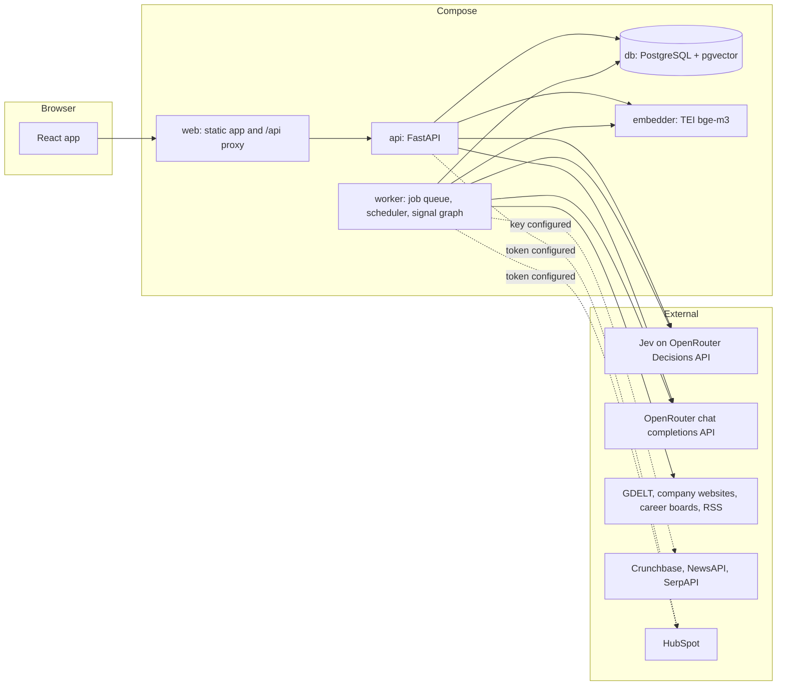

# Architecture overview

## Purpose

LeadRadar turns public company information into explained, scored and ranked leads for each Orange Systems service. It gathers documents about target accounts from public sources, asks each service's configurable signal questions of every relevant passage with a fast classifier, sends only the uncertain answers to an LLM, keeps every positive answer as a finding with a verbatim quote, notes the other buying signals it sees as open signals, and computes an explainable Fit, Intent and Priority score with deterministic rules, which an LLM then interprets in words. Sales staff without AI expertise work the ranked list, read why each lead is there and why it matters, follow each company's engagement, and give feedback that becomes labelled data. Every day the product refreshes the accounts, looks for new companies and reads replies from HubSpot. The product objective and its roles are in [business requirements](/requirements/business.md).

## Principles

These hold across every structure below; a change that breaks one needs a decision record.

| Id | Principle | What it means in practice |
|---|---|---|
| P-01 | **One store.** | PostgreSQL with `pgvector` holds everything ([ADR-01](/architecture/adrs/adr-01-one-postgresql-store.md)); a value is stored once, except where a read pays for a copy, such as a finding's `observed_at`. |
| P-02 | **No evidence, no finding.** | A finding exists only with a verbatim quote of a stored document, its address and its date ([RULE-02](/requirements/business.md#business-rules)). |
| P-03 | **Models answer, rules score.** | The classifier and the LLM answer questions and write text; [rules](/architecture/rules.md) alone compute scores, standings, bands and exclusions ([ADR-03](/architecture/adrs/adr-03-models-answer-rules-score.md)). |
| P-04 | **Cheap first.** | The classifier sees every relevant passage; the LLM sees only uncertain answers and confirmed positives ([ADR-02](/architecture/adrs/adr-02-classification-cascade.md)). |
| P-05 | **Configuration is data, versioned where it moves a score.** | Services, questions, ICP, weights, rules and thresholds change without code; scoring settings are immutable versions ([ADR-06](/architecture/adrs/adr-06-rule-based-scoring-with-versioned-settings.md)). |
| P-06 | **Every entity earns its place.** | A table, column or enum value exists only where a flow reads or writes it; derivable values are computed. |
| P-07 | **Idempotent steps.** | Every pipeline step converges under retry, so a job or a run can be repeated safely ([N-05](/requirements/system.md)). |
| P-08 | **Free core first.** | Paid sources are optional plug-ins; every P0 capability works on the free core ([ADR-07](/architecture/adrs/adr-07-source-plug-ins-with-a-free-core.md)). |
| P-09 | **Pure core, effects at the edges.** | Rules are pure functions with the clock injected; adapters do the I/O. |
| P-10 | **Fail visibly.** | An unavailable dependency is reported as an error with what still works ([Degradation](#degradation)); nothing is faked. |

## Topology

```mermaid
flowchart LR
  subgraph Browser
    SPA[React app]
  end
  subgraph Compose
    WEB[web: static app and /api proxy]
    API[api: FastAPI]
    WRK[worker: job queue, scheduler, signal graph]
    DB[(db: PostgreSQL + pgvector)]
    EMB[embedder: TEI bge-m3]
  end
  subgraph External
    JEV[Jev on OpenRouter Decisions API]
    ANT[OpenRouter chat completions API]
    SRC[GDELT, company websites, career boards, RSS]
    PAID[Crunchbase, NewsAPI, SerpAPI]
    HUB[HubSpot]
  end
  SPA --> WEB --> API
  API --> DB
  WRK --> DB
  API --> EMB
  WRK --> EMB
  API --> JEV
  API --> ANT
  WRK --> JEV
  WRK --> ANT
  WRK --> SRC
  WRK -. key configured .-> PAID
  API -. token configured .-> HUB
  WRK -. token configured .-> HUB
```

Two processes run the product's code, which is one Python package: the [api service](/architecture/services/api.md) answers the frontend and does the interactive AI calls (question preview, outreach drafting, and persona mapping when a contact is added without a persona), and the [worker](/architecture/services/worker.md) runs every background job — fetching, processing, the signal graph, open signals, scoring, interpretation, discovery, the engagement sync, evaluation and housekeeping. They share the database and the AI gateway module, and never call each other: the api enqueues jobs, the worker picks them up ([ADR-04](/architecture/adrs/adr-04-postgres-job-queue-and-a-worker.md)). The [frontend](/architecture/services/frontend.md) is a static React app served by the `web` container, which also proxies `/api/v1` to the api so the browser sees one origin.

## Runtime

One `docker compose up` starts the stack locally, and the same Compose file runs it on one cloud virtual machine in an EU region for the demo ([S-RUN-01](/requirements/system.md)). The stack serves plain HTTP from `web`; on the cloud machine the cloud provider's load balancer terminates HTTPS and forwards to `web`, so the Compose file is the same in both places.

| Container | Image | Role |
|---|---|---|
| `web` | nginx with the built frontend | Serves the app; proxies `/api/v1` to `API_UPSTREAM` |
| `api` | the product image, `uvicorn` entry point | REST API; applies the Alembic migrations at start |
| `worker` | the product image, worker entry point | Jobs, scheduler, housekeeping; `WORKER_CONCURRENCY` jobs at a time; more containers may run |
| `db` | PostgreSQL 16 with `pgvector` | The [SQL store](/architecture/sql-store.md) |
| `embedder` | Hugging Face Text Embeddings Inference, CPU, model `BAAI/bge-m3` | The [embedder](/architecture/interfaces.md#embedder) |

Configuration comes from environment variables only; secrets (API keys, the HubSpot token, the database and seed passwords) are never committed, logged or returned by the API. Each service's keys and defaults are in its runtime section: [api](/architecture/services/api.md#runtime), [worker](/architecture/services/worker.md#runtime), [frontend](/architecture/services/frontend.md#runtime).

The database has two roles. The owner, the `db` container's user, creates and changes the schema; only the api's migration step connects as it, through `MIGRATION_DATABASE_URL`. The application role `leadradar_app` is created by the `db` container's init script with the password `APP_DB_PASSWORD`; the api and the worker serve through `DATABASE_URL` as that role, which may read and write every table but only read and append [`audit_event`](/architecture/sql-store.md#audit_event).

**Fixture mode** ([ADR-11](/architecture/adrs/adr-11-recorded-fixtures.md)). `FIXTURE_MODE` is `off`, `record` or `replay`. In `record`, every source plug-in request, every classifier and LLM call and every HubSpot exchange is stored under `FIXTURE_DIR`, keyed by a SHA-256 of the adapter name and the normalised request. In `replay`, they are answered from those files; a request with no file fails its step with `FIXTURE_MISSING` and is never sent live. The embedder is local and runs in every mode. Record and replay read the clock from `CLOCK_FILE`, set to the time of the recording, so that fetch windows match the recorded requests and decay gives the same scores on every replay. Replay needs no provider key; `CLASSIFIER_PROVIDER` and the model ids must be those of the recording, because they are part of each request's key. Replay is how the demo and the acceptance tests run offline and repeatably ([S-RUN-02](/requirements/system.md)).

**Fixture files.** One exchange per file, at `FIXTURE_DIR/<adapter>/<key>.json`, where `<adapter>` is `JEV` or `OPENROUTER` for an AI gateway call, `HUBSPOT` for a HubSpot exchange, or the plug-in's [`source_plugin`](/architecture/sql-store.md#source_plugin) `code` for a source request. The normalised request is `{adapter, method, url, body}`: `url` with its `api_key` query parameter, SerpAPI's credential, removed and the others sorted; `body` the parsed JSON of a JSON body, the text of any other body, or null. Headers and the `api_key` parameter are left out, so no key or credential is ever stored. `<key>` is the SHA-256, in lower-case hex, of the normalised request serialised as JSON with sorted keys, no whitespace and non-ASCII characters unescaped. The file is the JSON object `{adapter, request, response}`: `request` is the normalised request; `response` is `{status, content_type}`, plus `location`, the `Location` header, for a redirect status, with one of `json` for a JSON body, `text` for any other text and `base64` for binary content such as a PDF, or `{error}` with `TIMEOUT` or `TRANSPORT_ERROR` for an exchange that failed before an answer, which replay raises again. `record` overwrites the file of a repeated request, so a retried call keeps its last attempt.

**Seeding.** `make seed-demo` loads the [demo dataset](#demo-dataset) into an empty database: users, industries, markets, services, questions, active scoring versions, provider facts, and the accounts with their sources, imported from the demo account file by the rules of `API-22` and then linked to their parents, their relationship statuses and the suggested accounts ([S-RUN-03](/requirements/system.md)). It never fetches. The relationship statuses and the suggested accounts are seeded only while the seeded services have no discovery candidate, so a database seeded before them gains them and a later change by a user is kept. A repeat invocation succeeds without changing a complete matching seed; an incomplete or different existing seed fails clearly. Sources a refresh detected and attribute values its enrichment filled where the demo account file leaves them empty are the account's, not the seed's, and do not make a seed different. The **demo refresh** follows it: `make refresh-demo` requests a refresh of every active account through `API-33` and waits until every run is final, in replay mode for the demo and the acceptance tests. It fails if a requested run is missing or ends in a status other than `SUCCEEDED`; the P1 scheduler would find the same accounts due, and one refresh per account is all either can queue. Labels reference passages, which exist only after a refresh, so `make export-labels` writes every active evaluation item to `FIXTURE_DIR/evaluation_items.json`, a JSON array of `{account_domain, content_hash, ordinal, service_code, question_key, question_revision, expected_strength}` sorted by those keys, and `make seed-labels` loads them after the demo refresh, matching each to its passage and writing it as a `MANUAL` label of the demo Admin; an entry that matches no passage or question fails the command, naming it; replay reproduces the same documents and passages, so every exported label finds its passage.

## Store ownership

The api service owns the schema and applies migrations; both processes write the store, each only the tables or columns below, so that no fact has two writers.

| Table | Written by the api | Written by the worker |
|---|---|---|
| [`app_user`](/architecture/sql-store.md#app_user), [`auth_session`](/architecture/sql-store.md#auth_session) | all | deletes expired sessions |
| [`service`](/architecture/sql-store.md#service), [`signal_question`](/architecture/sql-store.md#signal_question), [`scoring_config`](/architecture/sql-store.md#scoring_config), [`industry`](/architecture/sql-store.md#industry), [`market`](/architecture/sql-store.md#market), [`provider_fact`](/architecture/sql-store.md#provider_fact) | all | — |
| [`account`](/architecture/sql-store.md#account) | user-entered fields, including an accepted discovery candidate's attributes, `status`, `relationship_status` | `CRUNCHBASE` and `CLASSIFIER` attributes, `crunchbase_id`, `last_refreshed_at`, `next_refresh_at` |
| [`account_alias`](/architecture/sql-store.md#account_alias) | all | — |
| [`account_source`](/architecture/sql-store.md#account_source) | `MANUAL` rows, any row's `status` | `DETECTED` rows |
| [`contact`](/architecture/sql-store.md#contact) | all, including persona mapping and erasure on request | erasure at the end of retention |
| [`discovery_candidate`](/architecture/sql-store.md#discovery_candidate) | decisions | creation |
| [`source_plugin`](/architecture/sql-store.md#source_plugin) | `enabled`, limits | `last_success_at`, `last_error`, `last_error_at` |
| [`plugin_usage`](/architecture/sql-store.md#plugin_usage), [`document`](/architecture/sql-store.md#document), [`chunk`](/architecture/sql-store.md#chunk), [`document_triage`](/architecture/sql-store.md#document_triage), [`classification`](/architecture/sql-store.md#classification), [`account_score`](/architecture/sql-store.md#account_score), [`score_interpretation`](/architecture/sql-store.md#score_interpretation), [`evaluation_result`](/architecture/sql-store.md#evaluation_result) | — | all |
| [`open_signal`](/architecture/sql-store.md#open_signal) | `status`, `question_id` and the decision from an Admin's decision | creation |
| [`engagement_status`](/architecture/sql-store.md#engagement_status) | `MANUAL` rows | `HUBSPOT` rows |
| [`pipeline_run`](/architecture/sql-store.md#pipeline_run) | runs a user or a change starts; cancellation | scheduled refreshes; status, stage, progress, errors, completion |
| [`job`](/architecture/sql-store.md#job) | the first-stage jobs of the runs it creates; cancellation | first-stage jobs of scheduled refreshes; claiming, retries, next-stage jobs, completion |
| [`finding`](/architecture/sql-store.md#finding) | `status` from finding feedback | creation, `SUPERSEDED` |
| [`alert`](/architecture/sql-store.md#alert) | acknowledgement | creation |
| [`disqualifier_override`](/architecture/sql-store.md#disqualifier_override), [`lead_feedback`](/architecture/sql-store.md#lead_feedback), [`finding_feedback`](/architecture/sql-store.md#finding_feedback), [`outreach_draft`](/architecture/sql-store.md#outreach_draft), [`crm_sync`](/architecture/sql-store.md#crm_sync) | all | — |
| [`evaluation_item`](/architecture/sql-store.md#evaluation_item) | `MANUAL` and `FINDING_FEEDBACK` rows | `STALE` on reclassification |
| [`audit_event`](/architecture/sql-store.md#audit_event) | appends | appends |

## AI roles and boundaries

Every call goes through the one [AI gateway](/architecture/services/worker.md#ai-gateway), which applies the [Budget guard](/architecture/rules.md#budget-guard) to LLM calls, validates output, honours fixture mode and writes the `AI_CALL` audit row whose `ai_role` is one of the roles below. A role nothing calls does not exist (P-06).

| Role | Provider | Purpose | Allowed output | Validation |
|---|---|---|---|---|
| `CLASSIFIER` | Jev, or `LLM_CLASSIFIER_MODEL` when `CLASSIFIER_PROVIDER` is `LLM` | [Triage](/architecture/rules.md#triage), [Signal classification](/architecture/rules.md#signal-classification), [Account attributes](/architecture/rules.md#account-attributes), [Persona mapping](/architecture/rules.md#persona-mapping) | Probabilities over the answer values given | Every question answered; probabilities sum to 1 |
| `ESCALATION` | `LLM_EVIDENCE_MODEL` | Decide an uncertain answer ([Escalation](/architecture/rules.md#escalation)) | Strength, confidence and, when positive, quote, translation, rationale | Strength in the question's values; quote verbatim |
| `EVIDENCE` | `LLM_EVIDENCE_MODEL` | Quote, translate and justify a confident positive ([Evidence extraction](/architecture/rules.md#evidence-extraction)) | Quote, translation, rationale | Quote verbatim; translation present exactly for non-English |
| `DISCOVERY_EXTRACTION` | `LLM_EVIDENCE_MODEL` | Name the companies a relevant news item is about ([Discovery](/architecture/rules.md#discovery)) | Organisation names with optional country and website, each with a quote | Quote verbatim; website only when stated |
| `OPEN_SIGNAL` | `LLM_EVIDENCE_MODEL` | Note buying signals no question asks about ([Open signals](/architecture/rules.md#open-signals)) | Label, polarity, quote, translation, why it matters | Quote verbatim; translation present exactly for non-English |
| `INTERPRETATION` | `LLM_INTERPRETATION_MODEL` | Explain in words why a ranked account is worth approaching and why each counted signal matters ([Interpretation](/architecture/rules.md#interpretation)) | Summary, what holds it back, one note per counted finding, cited open signal and fact ids | Citations ⊆ inputs; every counted positive finding explained; no number its inputs do not carry; length |
| `OUTREACH` | `LLM_OUTREACH_MODEL` | Draft a message from findings and provider facts ([Outreach grounding](/architecture/rules.md#outreach-grounding)) | Subject, body, cited finding and fact ids | Citations ⊆ findings and facts given; no number they do not carry; length; no contact data invented |
| `TONE_CHECK` | `LLM_OUTREACH_MODEL` | Review the current text of an outreach draft | Verdict, one-line summary, phrase and suggested rewrite notes | Verdict and note shape; every note identifies a phrase and its rewrite |

No role produces a score, a band, a standing or an exclusion, and no role's text is shown as a fact without the quote or provider fact it rests on. Embeddings are not an AI role: they are local, deterministic and make no judgement.

## Degradation

A failure is degrading when a deterministic path remains, blocking when it does not. Nothing is replaced by a placeholder: an unavailable dependency is an error that names it. The screen wording is each row as a user reads it: its first sentence names what is unavailable without a product, provider or model name, and what still works follows as a list.

| Dependency down | What happens | What still works | Screen wording |
|---|---|---|---|
| One source plug-in | Its fetch step fails; the run ends `PARTIAL` naming it | The other plug-ins, the rest of the pipeline, every screen | **A source plug-in is unavailable.** Still works: The other source plug-ins · The rest of the refresh · Every screen |
| Classifier | `SIGNAL` jobs fail and are retried; the run ends `PARTIAL`; question preview, and a contact added without a persona, answer `503` | Fetching and processing; scoring from existing findings; every screen | **Quick checks are unavailable.** Still works: Collecting and preparing new documents · Scores from the signals already found · Every screen |
| OpenRouter | Every classifier and LLM call fails, Jev's included: `SIGNAL` jobs fail and are retried and the run ends `PARTIAL`; open signals and interpretations wait for the account's next run; preview, outreach generation and tone check, and a contact added without a persona answer `503` | Fetching and processing; scoring from existing findings; every screen; the current outreach editor text | **The AI service is unavailable.** Still works: Collecting and preparing new documents · Scores from the signals already found · Every screen |
| LLM daily budget reached | Escalation and evidence pairs wait as `PENDING_LLM`, open signals and interpretations wait for the next run, and with the LLM classifier adapter classification waits too; preview, outreach generation and tone check answer `429`, and so does a contact added without a persona under the LLM classifier adapter | Classification by Jev; confident negatives; scoring from existing findings; every screen; the current outreach editor text | **Today's budget for detailed checks is used up.** Still works: Scores from the signals already found · Every screen |
| Embedder | `PROCESS` jobs fail and are retried; the run ends `PARTIAL`; question preview on an account, or on pasted text longer than `WHOLE_DOCUMENT_MAX_CHARS`, answers `503` | Scoring, every screen, preview on shorter pasted text | **Text analysis is unavailable.** Still works: Scores from the signals already found · Every screen · Try it on short pasted text |
| HubSpot | The push answers `503` and the attempt is recorded; the engagement sync run fails naming HubSpot and every status stays as it was | Statuses set by people; everything else | **HubSpot is unavailable.** Still works: Statuses set by people · Everything else |
| Database | Blocking: every contract except `API-61` answers `503 UPSTREAM_UNAVAILABLE`, `API-61` answers `503` with the database `DOWN`, and the worker stops claiming jobs | Nothing | **The database is unavailable.** Nothing works until it is back. |

The Screen wording cells are literal cells ([Literal cells](/guidelines/documents/common.md#literal-cells-and-illustrative-ones)): the client shows them exactly as written. The cell's shape is fixed: the bold headline sentence, then either "Still works: " with the items separated by " · ", or one closing sentence.

## Production path

What the MVP deliberately leaves out, and how it would be added without changing the principles:

- **Tenancy.** An `organisation_id` on every table with PostgreSQL row-level security, so other IT service providers can use the product.
- **Sign-in.** OpenID Connect single sign-on beside or instead of local accounts.
- **Scale.** Managed PostgreSQL; more worker containers; a shared rate limiter per provider instead of the per-process one of [Plug-in availability](/architecture/rules.md#plug-in-availability); GDELT's 15-minute feed as a streaming source.
- **Learning.** Weights learned from lead outcomes (`B-29`), calibrated against the labelled set, proposed to an Admin as a scoring draft, never applied automatically.
- **Compliance.** Data-processing agreements with every AI and data provider; a records-of-processing entry for contacts; configurable retention per market.
- **Notification and CRM.** Email or chat delivery of alerts and of the daily summary; writing the engagement status back to the CRM, and reading it from CRMs other than HubSpot.

## Demo dataset

The seed is the acceptance tests' concrete data and the demo's walk-through. Its literal values are the ones below.

**Users.** `admin@leadradar.local` with role `ADMIN` and display name admin, and `sales@leadradar.local` with role `SALES` and display name Ana, who signs the demo's outreach drafts; passwords from `SEED_ADMIN_PASSWORD` and `SEED_SALES_PASSWORD`.

**Industries.** Seeded as `ACTIVE` [`industry`](/architecture/sql-store.md#industry) rows; an Admin adds, renames and retires them afterwards. A label is the short name every screen shows.

| Code | Label |
|---|---|
| `AEROSPACE_AVIATION` | Aviation and aerospace |
| `AUTOMOTIVE` | Automotive |
| `BANKING` | Banking |
| `INSURANCE` | Insurance |
| `LOGISTICS_TRANSPORT` | Logistics and transport |
| `MANUFACTURING` | Manufacturing |
| `ENERGY_UTILITIES` | Energy and utilities |
| `TELECOM_MEDIA` | Telecom and media |
| `RETAIL_CONSUMER` | Retail and consumer goods |
| `HEALTHCARE_PHARMA` | Healthcare and pharma |
| `PUBLIC_SECTOR` | Public sector |
| `TECHNOLOGY` | Technology |
| `PROFESSIONAL_SERVICES` | Professional services |
| `OTHER` | Other |

**Markets.** Seeded as `ACTIVE` [`market`](/architecture/sql-store.md#market) rows.

| Code | Name | Countries |
|---|---|---|
| `DACH` | DACH | `DE`, `AT`, `CH` |
| `BENELUX` | Benelux | `BE`, `NL`, `LU` |
| `NORDICS` | Nordics | `DK`, `SE`, `NO`, `FI` |
| `EU` | European Union | `AT`, `BE`, `BG`, `HR`, `CY`, `CZ`, `DK`, `EE`, `FI`, `FR`, `DE`, `GR`, `HU`, `IE`, `IT`, `LV`, `LT`, `LU`, `MT`, `NL`, `PL`, `PT`, `RO`, `SK`, `SI`, `ES`, `SE` |

**Accounts.**

| Name | Domain | Country | Industry | Parent |
|---|---|---|---|---|
| Lufthansa Group | `lufthansagroup.com` | `DE` | `AEROSPACE_AVIATION` | |
| SWISS | `swiss.com` | `CH` | `AEROSPACE_AVIATION` | Lufthansa Group |
| Air France-KLM | `airfranceklm.com` | `FR` | `AEROSPACE_AVIATION` | |
| DHL Group | `dhl.com` | `DE` | `LOGISTICS_TRANSPORT` | |
| Kuehne+Nagel | `kuehne-nagel.com` | `CH` | `LOGISTICS_TRANSPORT` | |
| DB Schenker | `dbschenker.com` | `DE` | `LOGISTICS_TRANSPORT` | |
| DSV | `dsv.com` | `DK` | `LOGISTICS_TRANSPORT` | |
| Siemens | `siemens.com` | `DE` | `MANUFACTURING` | |
| Bosch | `bosch.com` | `DE` | `AUTOMOTIVE` | |
| ZF Group | `zf.com` | `DE` | `AUTOMOTIVE` | |
| Continental | `continental.com` | `DE` | `AUTOMOTIVE` | |
| Schaeffler | `schaeffler.com` | `DE` | `AUTOMOTIVE` | |
| Commerzbank | `commerzbank.de` | `DE` | `BANKING` | |
| Erste Group | `erstegroup.com` | `AT` | `BANKING` | |
| Raiffeisen Bank International | `rbinternational.com` | `AT` | `BANKING` | |
| UBS | `ubs.com` | `CH` | `BANKING` | |
| Allianz | `allianz.com` | `DE` | `INSURANCE` | |
| Munich Re | `munichre.com` | `DE` | `INSURANCE` | |
| Zurich Insurance Group | `zurich.com` | `CH` | `INSURANCE` | |
| Generali | `generali.com` | `IT` | `INSURANCE` | |

**Relationship statuses.** After the import, the seed sets each account's [`relationship_status`](/architecture/sql-store.md#account) through `API-24`; the accounts not listed keep `PROSPECT`.

| Relationship status | Accounts |
|---|---|
| `CLIENT` | Siemens, Allianz, Munich Re, Continental |
| `PAST_CLIENT` | Commerzbank, Air France-KLM, Schaeffler |
| `IN_TALKS` | Bosch, UBS, Kuehne+Nagel, Erste Group, ZF Group |
| `DO_NOT_CONTACT` | Generali, Raiffeisen Bank International |
| `PROSPECT` | Lufthansa Group, SWISS, DHL Group, DB Schenker, DSV, Zurich Insurance Group |

**Demo account file.** `FIXTURE_DIR/demo_accounts.csv` holds one [`AccountImportRow`](/architecture/interfaces.md#accountimportrow) per account of the table, with the name, domain, country and industry above, plus the account's `careers_url`, `newsroom_url`, `investor_relations_url` and `rss_url` where it has one, its `employee_count` and its `operational_complexity`, collected by the team when it records the fixtures. Source detection and profile enrichment are P1, so the demo's hiring signals and its size and complexity criteria rest on these values.

**Service `INTELLIGENT_AUTOMATION`** — "Intelligent Automation". Description: "Automating business processes end to end with RPA, AI, agentic AI and process mining, from discovery to operation." Value proposition: "Orange Systems designs, builds and runs automation that removes manual work from finance, operations and customer processes, with measurable savings within months."

| Key | Question | Answer type | Polarity | Source types | Weight | Hint terms |
|---|---|---|---|---|---|---|
| `COST_PROGRAM` | Does the company announce or run a cost-reduction, efficiency or profitability programme? | `YES_NO` | `POSITIVE` | `NEWS`, `COMPANY_PUBLICATION` | `HIGH` | cost reduction; efficiency programme; savings target; Kostensenkung; Effizienzprogramm |
| `DIGITAL_TRANSFORMATION` | Does the company describe a digital transformation initiative that changes how its processes run? | `YES_NO` | `POSITIVE` | `NEWS`, `COMPANY_PUBLICATION` | `MEDIUM` | digital transformation; Digitalisierung |
| `AUTOMATION_INITIATIVE` | Does the company run or plan AI, RPA, agentic AI or process-mining projects in its business processes? | `SCALE` | `POSITIVE` | `NEWS`, `COMPANY_PUBLICATION` | `HIGH` | RPA; process mining; agentic AI; intelligent automation; KI-Agenten |
| `AUTOMATION_HIRING` | Is the company hiring for RPA development, automation engineering, AI, business analysis or process excellence? | `YES_NO` | `POSITIVE` | `JOB_POSTING` | `MEDIUM` | |
| `NEW_EXECUTIVE` | Has the company appointed a new CIO, COO, CDO or head of transformation, automation or process excellence? | `YES_NO` | `POSITIVE` | `NEWS`, `COMPANY_PUBLICATION`, `COMPANY_PROFILE` | `MEDIUM`, half-life 180 days | appointed; new CIO; neuer CIO |
| `SHARED_SERVICES` | Does the company consolidate processes or build or expand shared service centres? | `YES_NO` | `POSITIVE` | `NEWS`, `COMPANY_PUBLICATION` | `MEDIUM` | shared services; global business services; consolidation |
| `IN_HOUSE_AUTOMATION` | Does the company describe a strong in-house automation or AI capability, such as its own automation centre of excellence or platform? | `SCALE` | `NEGATIVE` | `NEWS`, `COMPANY_PUBLICATION` | `MEDIUM` | centre of excellence; in-house |
| `INCUMBENT_PROVIDER` | Does the company name an existing external provider for automation or AI services? | `CHOICE`: `NONE_NAMED` ("None named", `NONE`), `PLATFORM_VENDOR` ("Platform vendor", `WEAK`), `SERVICE_PROVIDER` ("Service provider", `MEDIUM`), `STRATEGIC_PARTNERSHIP` ("Strategic partnership", `STRONG`) | `NEGATIVE` | `NEWS`, `COMPANY_PUBLICATION` | `LOW` | partnership; UiPath; Celonis |
| `INSOLVENCY` | Is the company in insolvency, restructuring under creditor protection, or being wound up? | `YES_NO` | `NEGATIVE` | `NEWS`, `COMPANY_PROFILE` | `NONE` | insolvency; Insolvenz |

ICP: `SECTOR` (`INDUSTRY`: `AEROSPACE_AVIATION`, `LOGISTICS_TRANSPORT`, `MANUFACTURING`, `AUTOMOTIVE`, `BANKING`, `INSURANCE`; `HIGH`), `REGION` (`GEOGRAPHY`: `DE`, `AT`, `CH`, `NL`, `BE`, `LU`, `FR`, `IT`, `DK`, `SE`, `NO`, `FI`; `MEDIUM`), `SIZE` (`EMPLOYEE_RANGE` min 5000; `MEDIUM`), `COMPLEXITY` (`OPERATIONAL_COMPLEXITY`: `MEDIUM`, `HIGH`; `LOW`). Disqualifier: `INSOLVENT` ("In insolvency", on `INSOLVENCY`, min strength `MEDIUM`). All other settings are the defaults; an account outside `REGION` ranks lower and stays ranked ([ADR-22](/architecture/adrs/adr-22-icp-criteria-weigh-never-exclude.md)).

**Service `CYBERSECURITY`** — "Cybersecurity services". Description: "Security assessments, managed detection and response, and regulatory readiness for NIS2, DORA and the Cyber Resilience Act." Value proposition: "Orange Systems assesses, strengthens and monitors a company's security posture and gets it audit-ready for European regulation."

| Key | Question | Answer type | Polarity | Source types | Weight | Hint terms |
|---|---|---|---|---|---|---|
| `SECURITY_INCIDENT` | Does the text report a cyber-attack, data breach, ransomware or major IT outage at the company? | `SCALE` | `POSITIVE` | `NEWS` | `HIGH`, half-life 120 days | cyber attack; data breach; ransomware; Cyberangriff |
| `REGULATION_PRESSURE` | Is the company preparing for or subject to security regulation such as NIS2, DORA or the Cyber Resilience Act? | `YES_NO` | `POSITIVE` | `NEWS`, `COMPANY_PUBLICATION` | `MEDIUM` | NIS2; DORA; Cyber Resilience Act; KRITIS |
| `SECURITY_HIRING` | Is the company hiring security roles such as SOC analysts, security engineers, a CISO or GRC specialists? | `YES_NO` | `POSITIVE` | `JOB_POSTING` | `MEDIUM` | |
| `NEW_CISO` | Has the company appointed a new CISO or head of security? | `YES_NO` | `POSITIVE` | `NEWS`, `COMPANY_PUBLICATION`, `COMPANY_PROFILE` | `MEDIUM`, half-life 180 days | CISO; head of security |
| `CLOUD_MIGRATION` | Does the company run a large cloud migration or IT modernisation programme? | `YES_NO` | `POSITIVE` | `NEWS`, `COMPANY_PUBLICATION` | `LOW` | cloud migration; IT modernisation |
| `MANAGED_SOC_IN_PLACE` | Does the company name an existing managed security or SOC provider? | `YES_NO` | `NEGATIVE` | `NEWS`, `COMPANY_PUBLICATION` | `MEDIUM` | managed SOC; MDR |
| `INSOLVENCY` | Is the company in insolvency, restructuring under creditor protection, or being wound up? | `YES_NO` | `NEGATIVE` | `NEWS`, `COMPANY_PROFILE` | `NONE` | insolvency; Insolvenz |

ICP: `SECTOR` (`INDUSTRY`: `BANKING`, `INSURANCE`, `ENERGY_UTILITIES`, `HEALTHCARE_PHARMA`, `MANUFACTURING`, `AUTOMOTIVE`, `LOGISTICS_TRANSPORT`, `AEROSPACE_AVIATION`; `HIGH`), `REGION` (as Intelligent Automation; `MEDIUM`), `SIZE` (`EMPLOYEE_RANGE` min 1000; `MEDIUM`). Disqualifier: `INSOLVENT` as Intelligent Automation. All other settings are the defaults.

**Service `DATA_PLATFORM`** — not seeded; `AC-66` creates it through the REST contracts. "Data and analytics platforms". Description: "Building and modernising data platforms, warehouses and analytics so that decisions rest on current, trusted data." Value proposition: "Orange Systems designs, builds and runs data platforms that turn scattered operational data into reporting and analytics within months."

| Key | Question | Answer type | Polarity | Source types | Weight | Hint terms |
|---|---|---|---|---|---|---|
| `DATA_PLATFORM_PROGRAM` | Does the company build or modernise a data platform, data warehouse or analytics capability? | `YES_NO` | `POSITIVE` | `NEWS`, `COMPANY_PUBLICATION` | `MEDIUM` | data platform; data warehouse; analytics |
| `DATA_HIRING` | Is the company hiring data engineers, data scientists or analytics specialists? | `YES_NO` | `POSITIVE` | `JOB_POSTING` | `MEDIUM` | |

It has no ICP criteria and no disqualifiers; all settings are the defaults, and it is activated as version 1.

**Suggested accounts.** For each seeded service, one `DISCOVERY` [`pipeline_run`](/architecture/sql-store.md#pipeline_run) requested by the Admin and `SUCCEEDED`, with these [`discovery_candidate`](/architecture/sql-store.md#discovery_candidate) rows of origin `CRUNCHBASE_SEARCH`, no document and no quote; each `fit_estimate` is the [Fit score](/architecture/rules.md#fit-score) over the attributes below under the service's active settings. The rejected one records the Admin and the reason.

| Service | Name | Domain | Country | Industry | Employees | Status |
|---|---|---|---|---|---|---|
| `INTELLIGENT_AUTOMATION` | Hapag-Lloyd | `hlag.com` | `DE` | `LOGISTICS_TRANSPORT` | 14000 | `PENDING` |
| `INTELLIGENT_AUTOMATION` | BASF | `basf.com` | `DE` | `MANUFACTURING` | 112000 | `PENDING` |
| `INTELLIGENT_AUTOMATION` | ING Group | `ing.com` | `NL` | `BANKING` | 60000 | `PENDING` |
| `INTELLIGENT_AUTOMATION` | Swiss Re | `swissre.com` | `CH` | `INSURANCE` | 14000 | `PENDING` |
| `INTELLIGENT_AUTOMATION` | Example Logistik | | `DE` | `LOGISTICS_TRANSPORT` | | `PENDING` |
| `INTELLIGENT_AUTOMATION` | Mahle | `mahle.com` | `DE` | `AUTOMOTIVE` | 72000 | `REJECTED`, reason "Already works with a strategic automation partner." |
| `CYBERSECURITY` | E.ON | `eon.com` | `DE` | `ENERGY_UTILITIES` | 72000 | `PENDING` |
| `CYBERSECURITY` | Fresenius | `fresenius.com` | `DE` | `HEALTHCARE_PHARMA` | 190000 | `PENDING` |
| `CYBERSECURITY` | Nordea | `nordea.com` | `FI` | `BANKING` | 30000 | `PENDING` |

**Provider facts.** Seeded as `ACTIVE` [`provider_fact`](/architecture/sql-store.md#provider_fact) rows, each taken from the Orange Systems website at the address beside it; the owner reviews them and an Admin adds, edits and retires them afterwards. A fact without a service applies to every service.

| Fact | Services | Source |
|---|---|---|
| Orange Systems has more than 900 professionals. | | `https://systems.orange.md/` |
| Orange Systems has more than 15 years of experience delivering IT solutions. | | `https://systems.orange.md/` |
| Orange Systems delivers more than 500 projects a year for more than 50 clients in 25 countries. | | `https://systems.orange.md/` |
| Orange Systems is the leading IT hub of the Orange Group. | | `https://systems.orange.md/about/` |
| Orange Systems is certified to ISO 9001, ISO 27001 and ISO 14001. | | `https://systems.orange.md/about/` |
| Orange Systems has more than 50 experts in data and AI technologies. | `INTELLIGENT_AUTOMATION` | `https://systems.orange.md/analytics/` |
| Orange Systems has delivered data analytics and AI solutions for more than 10 years. | `INTELLIGENT_AUTOMATION` | `https://systems.orange.md/analytics/` |
| Orange Systems has automated more than 750 processes with RPA. | `INTELLIGENT_AUTOMATION` | `https://systems.orange.md/rpa/` |
| Orange Systems' automation has saved its clients more than 17 million euros. | `INTELLIGENT_AUTOMATION` | `https://systems.orange.md/rpa/` |
| Orange Systems' automation saved more than 2.5 million manual hours in 2024 and 2025. | `INTELLIGENT_AUTOMATION` | `https://systems.orange.md/rpa/` |
| Orange Systems is a UiPath Platinum Partner for RPA and process mining. | `INTELLIGENT_AUTOMATION` | `https://systems.orange.md/rpa/` |
| Orange Systems has more than 20 certified security professionals. | `CYBERSECURITY` | `https://systems.orange.md/cybersec/` |
| Orange Systems' security team has more than 10 years of experience on average. | `CYBERSECURITY` | `https://systems.orange.md/cybersec/` |
| Orange Systems' security operations automate 80% of threat detection. | `CYBERSECURITY` | `https://systems.orange.md/cybersec/` |

**Source plug-ins.** Seeded as [`source_plugin`](/architecture/sql-store.md#source_plugin) rows, one per plug-in value, each `enabled` and with no `daily_quota`.

| Code | Rate limit per minute |
|---|---|
| `GDELT` | `10` |
| `RSS` | `30` |
| `WEBSITE` | `30` |
| `CAREERS` | `30` |
| `CRUNCHBASE` | `30` |
| `NEWSAPI` | `30` |
| `SERPAPI` | `30` |

`GDELT`'s limit matches the pacing of `GDELT_MIN_INTERVAL_S` ([worker Runtime](/architecture/services/worker.md#runtime)).

**Fixtures.** `FIXTURE_DIR` holds a recording of one refresh of every demo account on the free core, made with `FIXTURE_MODE=record`, of the classifier and LLM calls it caused — open signals and interpretations included — and of one quality check over the exported labels under each classifier adapter. The acceptance criteria name this recording "the demo recording". Beside it, "the discovery recording" holds one discovery run for Intelligent Automation on the free core. It holds no Crunchbase exchange, since no Crunchbase key is expected ([ADR-19](/architecture/adrs/adr-19-source-provider-terms-and-limits.md)); only the P1 criterion `AC-69` needs one, recorded if a key becomes available. "The scale-out recording" holds, on the free core, one refresh of every demo account made after `DATA_PLATFORM` was created, given its questions and activated beside the two seeded services, and the classifier and LLM calls it caused. "The HubSpot recording" holds one engagement sync against a HubSpot test account whose contacts replied, booked a meeting and were marked unqualified, for `AC-88`.

## Demo walkthrough

The live demo is scenarios `SC-A` to `SC-D` in order, on the demo recording in replay mode with `CLOCK_FILE` set to the recording time, so every step shows the same data on every run. It takes about twelve minutes. The presenter signs in as `sales@leadradar.local` for steps 1 to 4 and as `admin@leadradar.local` from step 5. A step marked P1 depends on a P1 screen; when that screen is not built, the step is skipped and the next one still works.

| Step | Minutes | Screen | What the audience sees | Scenario | Judging criterion |
|---|---|---|---|---|---|
| 1 | 0–1 | — | The problem in one sentence: a sales manager researches accounts by hand, from news, reports and job boards, and ranks them by feel ([Annex 1](/reference/annex-1-participant-reference-pack.md)). | — | Business impact |
| 2 | 1–3 | [Prospects](/features/prospect-dashboard.md#prospects) | Intelligent Automation's ranked accounts with bands and top signals; Lufthansa Group and DHL Group near the top. | `SC-A` | Usability and UX |
| 3 | 3–5 | [Account detail](/features/prospect-dashboard.md#account-detail) | DHL Group's Why tab: the interpretation of why DHL is worth approaching for Intelligent Automation and why each signal matters, then the ICP criteria it meets, German quotes with English translations, and its in-house automation counting against it; one signal opens the original press release. | `SC-A`, `SC-C` | Signal relevance and accuracy, AI/ML innovation |
| 4 | 5–6 | Account detail, [Runs](/features/signal-pipeline.md#runs) | Refresh now on Lufthansa Group: the run moves through fetch, triage, classify, evidence, score and interpret. | `SC-A` | Technical execution |
| 5 | 6–8 | [Service editor](/features/service-configuration.md#service-editor) | The Admin adds a question — which automation or process platforms the company uses, with UiPath and Celonis as hint terms — and tries it on an account (P1); saving re-checks stored passages only. | `SC-B` | Configurability, AI/ML innovation |
| 6 | 8–9 | [Scoring settings](/features/service-configuration.md#scoring-settings) | Hiring counts more: preview the change (P1), activate it with a note, and watch the ranking move without fetching anything. | `SC-B` | Configurability |
| 7 | 9–10 | [Industries and markets](/features/service-configuration.md#industries-and-markets), [Prospects](/features/prospect-dashboard.md#prospects) | Narrow the `REGION` criterion to the DACH market and activate it: Air France-KLM, Generali and DSV move down the ranking but stay in it, each with the missed criterion in its breakdown. | `SC-C` | Configurability, Business impact and scalability |
| 8 | 10–11 | [Quality report](/features/evaluation-and-feedback.md#quality-report) | Precision against the gate on labelled passages, per question, the classifier alone against the cascade, and how much evidence the selection leaves unread. | `SC-D` | Signal relevance and accuracy, AI/ML innovation |
| 9 | 11–12 | Quality report's Impact panel (P1) | The closing sentence, read from the panel: researching one account by hand takes `MANUAL_RESEARCH_MINUTES_PER_ACCOUNT` minutes; LeadRadar refreshed N accounts at €C and M minutes each, finding S signals, at P precision on L labelled passages. | — | Business impact |

The closing sentence is built only from the [Impact](/architecture/rules.md#impact) values of the demo run, so every number the audience hears can be traced to stored data; the manual time is presented as the sales team's estimate.
