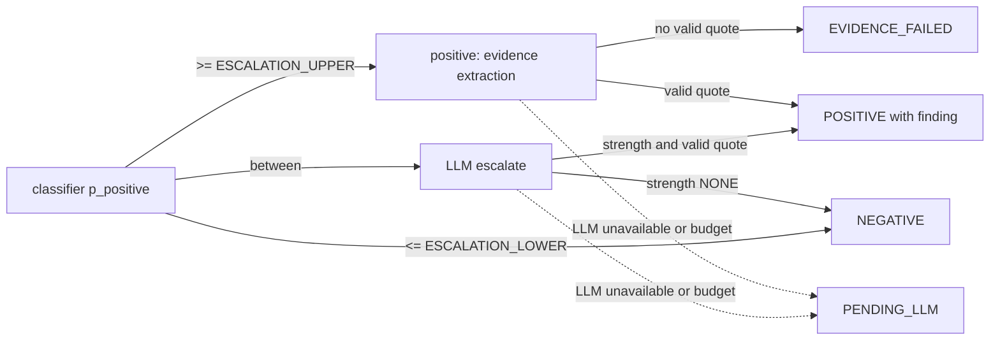

# Rules

Each rule states its inputs, its algorithm and what holds afterwards. Numbers are configuration keys, defined with their defaults in the [worker runtime](/architecture/services/worker.md#runtime) or the [api runtime](/architecture/services/api.md#runtime), or keys of the [scoring settings document](/architecture/sql-store.md#scoring-settings-document); a rule never states a literal threshold. Every rule except the model calls it names is a pure function of its inputs: the clock and randomness are injected. Models answer questions and write text; the scoring rules alone decide every score, band, standing and exclusion ([RULE-03](/requirements/business.md#business-rules), [ADR-03](/architecture/adrs/adr-03-models-answer-rules-score.md)).

Rounding is half up, to an integer, wherever a rule says "rounded".

## Account identity

**Inputs.** A domain or URL; a company name.

**Domain normalisation.** Add `https://` if no scheme is present, take the host, lower-case it, drop a trailing dot, convert to IDNA, and reduce it to its registrable domain with the Public Suffix List: `https://www.Lufthansa.com/de` → `lufthansa.com`, `group.dhl.com` → `dhl.com`. A value with no registrable domain is refused as `VALIDATION`.

**Name normalisation.** Unicode NFKC, case-fold, replace punctuation with spaces, drop the legal-form and grouping tokens `ag`, `se`, `gmbh`, `kg`, `kgaa`, `plc`, `ltd`, `limited`, `inc`, `corp`, `corporation`, `sa`, `nv`, `bv`, `spa`, `group`, `holding`, `co`, and collapse whitespace: "Deutsche Lufthansa AG" → `deutsche lufthansa`.

**Matching.** Every account stores its own name as an [`account_alias`](/architecture/sql-store.md#account_alias). A company matches an account when their normalised domains are equal, or when its normalised name equals one of the account's normalised aliases.

**Invariants.** One account per registrable domain. An account's domain never changes.

## Account attributes

**Inputs.** The account; Crunchbase profile fields when the `CRUNCHBASE` plug-in fetched them; the account's `COMPANY_PROFILE` document or website home page text.

**Precedence.** `MANUAL` > `CRUNCHBASE` > `CLASSIFIER`. A value is written only when the attribute is null or its [`attribute_origin`](/architecture/sql-store.md#account) is of lower precedence, and the origin is recorded with it. A user's edit always writes `MANUAL`.

**Crunchbase mapping.** Headquarters country → `country_code`; category → `industry` through the category table of the [Crunchbase adapter](/architecture/services/worker.md#source-plug-ins); the lower bound of the employee range → `employee_count`; the lower bound of the revenue range, converted at `USD_EUR_RATE` → `revenue_eur`.

**Operational complexity.** When the attribute has no `MANUAL` or `CRUNCHBASE` value, the classifier answers the scale question "How complex are this company's operations, judged by the countries it operates in and its business units?" with levels `LOW`, `MEDIUM`, `HIGH`, each labelled with its meaning under [`account`](/architecture/sql-store.md#account) `operational_complexity`, over the profile or home page text. The most probable level is stored with origin `CLASSIFIER` when its probability is at least `ATTRIBUTE_MIN_P`; otherwise the attribute stays unknown.

**After.** Any attribute change enqueues a `RESCORE` run with trigger `ACCOUNT_CHANGE` for every active service ([Rescoring](#rescoring)).

## Persona mapping

**Inputs.** A contact's `job_title`, in any language.

**Algorithm.** The classifier answers the choice question "Which role best describes this job title?" with the [persona values](/architecture/sql-store.md#contact) as options. The most probable persona is stored with origin `CLASSIFIER` when its probability is at least `ATTRIBUTE_MIN_P`, else `OTHER`. A `MANUAL` persona is never remapped.

## Source detection

**Inputs.** The account's `WEBSITE` source, created as `https://{domain}/` when the account is created; its other [`account_source`](/architecture/sql-store.md#account_source) rows.

**Algorithm.** On each refresh the `WEBSITE` plug-in reads the home page and records, for each source kind the account has no source of, the first link that is on the account's registrable domain (or, for `CAREERS`, on a public applicant-tracking host: `boards.greenhouse.io`, `jobs.lever.co`, `*.myworkdayjobs.com`, `jobs.smartrecruiters.com`) and whose path or link text contains one of the kind's terms:

| Kind | Terms |
|---|---|
| `NEWSROOM` | `press`, `news`, `newsroom`, `media`, `presse`, `medien`, `aktuelles` |
| `INVESTOR_RELATIONS` | `investor`, `investors`, `annual-report`, `geschaeftsbericht`, `finanzberichte` |
| `CAREERS` | `careers`, `career`, `jobs`, `karriere`, `stellenangebote` |
| `RSS_FEED` | a `<link rel="alternate">` of type RSS or Atom |

When `SERPAPI` is available and a kind is still missing, one web search `"{name}" careers` or `"{name}" investor relations annual report` records the first result on the account's domain. Detected sources have origin `DETECTED`.

**Invariants.** At most one detected source per kind. A kind with a `MANUAL` source is never detected. An existing URL is never added twice.

## Plug-in availability

**Inputs.** [`source_plugin`](/architecture/sql-store.md#source_plugin), [`plugin_usage`](/architecture/sql-store.md#plugin_usage), the plug-in's key configuration.

**Algorithm.** A plug-in is **available** when it is `enabled`, its key is configured if it needs one, and today's `requests` are below `daily_quota` when a quota is set. Requests to one provider are spaced to stay within `rate_limit_per_minute` in each worker process. Every request increments `plugin_usage` for the UTC day, whether it succeeds or not. A failed request sets `last_error` and `last_error_at` and adds an entry to the run's `errors`; the other plug-ins of the run continue.

**Invariants.** An unavailable plug-in makes no request. Every P0 capability works with only the free-core plug-ins available ([RULE-08](/requirements/business.md#business-rules)).

## Fetch window

**Inputs.** The account, its aliases and sources; the available plug-ins; the active questions of the active services; the account's existing documents.

**Algorithm.**

1. The window is the last `FETCH_LOOKBACK_DAYS` days. Per plug-in, the lower bound is raised to one day before the newest `published_at` of the account's documents from that plug-in, so a refresh asks only for new items. A provider whose search reaches back less far than the window is asked for what it holds; older company publications come from `WEBSITE`.
2. A news plug-in (`GDELT`, `NEWSAPI`, `SERPAPI`) sends one query per active service: the account's name or any alias, combined with any `hint_terms` of that service's active questions whose `source_types` include `NEWS`; a service without such terms queries the name alone.
3. `WEBSITE` reads the account's `WEBSITE`, `NEWSROOM` and `INVESTOR_RELATIONS` sources and same-host links, at most `CRAWL_MAX_PAGES_PER_SITE` pages to link depth 2, newest first by sitemap date when the site has a sitemap, plus at most `CRAWL_MAX_PDFS` of the newest linked PDF reports.
4. `CAREERS` reads every posting listed on the account's `CAREERS` sources that was posted within the window.
5. `CRUNCHBASE` reads the matched organisation's profile, key people and events once per refresh.
6. `RSS` reads each `RSS_FEED` source.
7. Across plug-ins at most `MAX_DOCUMENTS_PER_REFRESH` documents are kept per refresh, split evenly across the available plug-ins, newest first.

**Invariants.** Nothing older than the window is fetched. No request goes to `linkedin.com`. The crawler honours `robots.txt`, identifies itself with `CRAWLER_USER_AGENT` and waits `CRAWL_HOST_DELAY_MS` between requests to one host ([N-09](/requirements/system.md)).

## Document normalisation

**Inputs.** A fetched item: HTML, PDF or a provider's JSON record.

**Algorithm.**

1. Extract the main text: the article body of HTML without navigation and boilerplate, the text of a PDF, or the title, description and content fields of a JSON record, joined.
2. Normalise: Unicode NFC and collapsed whitespace. A text shorter than `MIN_DOCUMENT_CHARS` is discarded and counted, not stored.
3. Detect the language as an ISO 639-1 code.
4. Canonical URL: lower-case scheme and host, drop the fragment, drop the query parameters `utm_*`, `gclid`, `fbclid`, `mc_cid`, `mc_eid`, `ref` and `source`, drop a trailing slash, and use the page's declared canonical link when it is on the same registrable domain.
5. Exact duplicate: a document of the same account with the same `content_hash` already exists → not stored. The same canonical URL with a different hash is a new document: the page changed.
6. Near duplicate: after [Chunking and passage selection](#chunking-and-passage-selection) embeds the first passage, a document whose first-passage embedding has cosine similarity of at least `NEAR_DUPLICATE_SIMILARITY` with the first passage of a document of the same account dated within `NEAR_DUPLICATE_WINDOW_DAYS` gets `duplicate_of_id` set to the earliest such document. The embeddings are multilingual, so a translation of the same story is a near duplicate.

**Invariants.** A duplicate is never triaged or classified. Re-running normalisation on the same item stores nothing new.

## Chunking and passage selection

**Inputs.** A normalised document; the active questions of the services its triage kept.

**Chunking.** Split the text into passages of at most `CHUNK_TARGET_CHARS` characters with `CHUNK_OVERLAP_CHARS` of overlap, breaking at paragraph boundaries, then sentence boundaries, never inside a word. Record each passage's offsets. Embed every passage through the [embedder](/architecture/interfaces.md#embedder).

**Passage selection.** For each kept document and each service its triage kept: when the document has at most `MAX_PASSAGES_PER_DOCUMENT` passages, all are selected. Otherwise passages are ranked by their highest cosine similarity to the embeddings of the service's active questions (question text followed by its hint terms) and the top `MAX_PASSAGES_PER_DOCUMENT` are selected, ties broken by `ordinal`. This is what keeps a 300-page annual report to a bounded number of classifier calls.

## Triage

**Inputs.** A new, non-duplicate document of an active account; the account's name, domain and country; the active services.

**Algorithm.** One [classifier](/architecture/interfaces.md#classifier) call over the document title and its first `TRIAGE_CHARS` characters, with these yes/no questions:

- `ABOUT_ACCOUNT`: "Is this text mainly about {name} ({domain}, {country}), not a different company with a similar name and not a passing mention?" — skipped for a document from one of the account's own sources or from `CAREERS` or `CRUNCHBASE`, which are about the account by construction.
- One `RELEVANT` question per active service: "Could this text matter for whether {name} might need this service: {service description}?"

The outcome is `NOT_ABOUT_ACCOUNT` when the probability of `ABOUT_ACCOUNT` is below `TRIAGE_ABOUT_MIN_P`; else `IRRELEVANT` when every service's relevance is below `TRIAGE_RELEVANCE_MIN_P`; else `KEPT` for the services at or above it. Triage never escalates: its thresholds are set for recall, and precision is the job of [Signal classification](#signal-classification).

**Invariants.** Every new non-duplicate document of an active account has one [`document_triage`](/architecture/sql-store.md#document_triage) row. Only `KEPT` documents are classified, and only for the services they were kept for.

## Signal classification

**Inputs.** The selected passages of a kept document; for each service it was kept for, that service's active questions whose `source_types` include the document's source type and that have no [`classification`](/architecture/sql-store.md#classification) for the passage at the question's current revision.

**Algorithm.** One [classifier](/architecture/interfaces.md#classifier) call per passage carries every such question, each framed as "About {account name}: {question text}", so that a passage about another company does not answer it. The probabilities map to `p_positive` and a candidate strength:

| Answer type | Questions in the call | `p_positive` | Strength when positive |
|---|---|---|---|
| `YES_NO` | the yes/no question, plus the scale "How strong is the evidence?" with levels `WEAK`, `MEDIUM`, `STRONG` | P(yes) | the most probable scale level |
| `SCALE` | the question with levels `NONE`, `WEAK`, `MEDIUM`, `STRONG` | 1 − P(`NONE`) | the most probable level other than `NONE` |
| `CHOICE` | the question with the question's `options` | sum of P over options whose strength is not `NONE` | the strength of the most probable such option, whose key the finding records |

The route is then decided by [Escalation](#escalation).

**Invariants.** A passage is asked a question at most once per revision. The classifier's probabilities are stored in `answer` whatever the route. A selected passage left unclassified — because the classifier was unavailable, or the budget stopped the LLM classifier adapter — is classified by the account's next refresh.

## Escalation

**Inputs.** A classification's `p_positive` and candidate strength; `ESCALATION_LOWER`, `ESCALATION_UPPER`.

**Algorithm.**



- `p_positive ≥ ESCALATION_UPPER`: the classifier's answer is accepted as positive with its candidate strength, `decided_by = CLASSIFIER` and `confidence = p_positive`; go to [Evidence extraction](#evidence-extraction).
- `p_positive ≤ ESCALATION_LOWER`: `NEGATIVE`, strength `NONE`.
- Otherwise `escalated = true`: the [LLM escalate](/architecture/interfaces.md#llm) call answers the same question on the same passage with a strength (including `NONE`), a confidence and, when positive, the quote, translation and rationale in the same call. Strength `NONE` → `NEGATIVE`. Otherwise the quote is validated as in [Evidence extraction](#evidence-extraction) and the finding carries `decided_by = LLM` and the LLM's confidence.
- An LLM step that the [Budget guard](#budget-guard) stops, or whose provider is unavailable, leaves the classification `PENDING_LLM`; the next refresh of the account resumes it.

The same band applies whichever classifier adapter is configured ([ADR-02](/architecture/adrs/adr-02-classification-cascade.md)).

**Invariants.** Every classification ends `NEGATIVE`, `POSITIVE`, `PENDING_LLM` or `EVIDENCE_FAILED`. A finding exists exactly for the `POSITIVE` ones.

## Evidence extraction

**Inputs.** A positive classification, its passage, question and account; the document language.

**Algorithm.** The [LLM extract evidence](/architecture/interfaces.md#llm) call returns `quote`, `quote_en` and `rationale`. The output is valid when:

- `quote`, after collapsing whitespace and mapping typographic quotation marks, apostrophes, dashes and the ellipsis character to their ASCII forms, is a substring of the passage text normalised the same way, and is between 20 and `EVIDENCE_MAX_QUOTE_CHARS` characters;
- `quote_en` is present when the document language is not `en`, and absent otherwise;
- `rationale` is one sentence of at most 300 characters.

An invalid output is requested again, up to `EVIDENCE_MAX_ATTEMPTS` attempts in total; after that the classification is `EVIDENCE_FAILED` and no finding is created. A later refresh retries `EVIDENCE_FAILED` pairs once more.

**After.** One [`finding`](/architecture/sql-store.md#finding) with the strength, confidence, `decided_by`, the quote as the passage writes it at the matched span, translation, rationale, `observed_at` = the document's `published_at`, else its `fetched_at`, and status `ACTIVE`.

**Invariants.** No evidence, no finding ([RULE-02](/requirements/business.md#business-rules)): every finding's quote is verbatim from its passage.

## Reclassification

**Inputs.** A question that was created, reactivated or whose `revision` was incremented; or a service that was created or reactivated, which reclassifies each of its active questions.

**Algorithm.** A `RECLASSIFY` run with trigger `QUESTION_CHANGE`:

1. Mark the question's findings of an older revision `SUPERSEDED` and its evaluation items of an older revision `STALE`.
2. For every non-purged, non-duplicate document of every active account: if its triage has no relevance for the question's service, answer that service's `RELEVANT` question now ([Triage](#triage)). For each document kept for the service, classify the selected passages for this question only ([Signal classification](#signal-classification)), then escalate and extract evidence as usual.
3. Rescore the service ([Rescoring](#rescoring)).

**Invariants.** Nothing is fetched. No other question is reclassified. A change to weight, half-life or any other scoring setting never reclassifies ([ADR-09](/architecture/adrs/adr-09-findings-per-passage-and-question-revision.md)).

## Budget guard

**Inputs.** `LLM_DAILY_BUDGET_EUR`; the `cost_eur` of today's `AI_CALL` rows with provider `OPENROUTER` in [`audit_event`](/architecture/sql-store.md#audit_event); the clock.

**Algorithm.** Before every OpenRouter call — escalation, evidence, discovery extraction, outreach, question preview, and classification when `CLASSIFIER_PROVIDER` is `LLM` — the spend since 00:00 UTC is summed. When it has reached `LLM_DAILY_BUDGET_EUR`:

- in the worker, a stopped classifier call leaves its passages unclassified and a stopped escalation or evidence call leaves its pairs `PENDING_LLM`; the run's `progress.pending_budget` counts both and the run finishes `PARTIAL`; the account's next refresh resumes them, so the budget reset at 00:00 UTC is picked up by the next refresh after it;
- in the api, the request answers `429 BUDGET_EXHAUSTED`.

The cost of a call is the `usage.cost` OpenRouter returns with it, in US dollars, converted at `USD_EUR_RATE`. Jev calls are costed the same way and recorded under provider `JEV`, but not capped by `LLM_DAILY_BUDGET_EUR`.

**Invariants.** Classification by Jev continues while the budget is exhausted. Concurrent calls may overshoot the budget by at most the calls already in flight.

## Recency decay

**Inputs.** A finding's `observed_at` and its document's source type; the question setting's `half_life_days`; `default_half_life_days`; `min_decay`; `as_of`.

**Algorithm.** `h` = the question setting's `half_life_days`, else `default_half_life_days[source type]`. `age` = max(0, days between `observed_at` and `as_of`, fractional). `decay = 0.5 ^ (age / h)`. A decay below `min_decay` counts as 0.

## Fit score

**Inputs.** The account's attributes; `icp_criteria`, `weight_values`, `unknown_match` of the active settings.

**Algorithm.** For each criterion `c`: `w_c` = `weight_values[c.weight]`; `m_c` = 1 when the account's attribute matches ([ICP criterion](/architecture/sql-store.md#scoring-settings-document)), 0 when it is known and does not match, `unknown_match` when it is unknown. `Fit` = rounded `100 × Σ w_c·m_c / Σ w_c`. With no criteria, or every weight `NONE`, `Fit` = 100: the service restricts nothing.

## Intent score

**Inputs.** The in-force findings of the account for the service's questions at their current revisions; `questions`, `weight_values`, `strength_values`, `negative_factor`, `intent_saturation` of the active settings; [Recency decay](#recency-decay).

**Algorithm.** For each question setting `q`: `w_q` = `weight_values[q.weight]`; `c_q` = the maximum, over the question's in-force findings, of `strength_values[strength] × decay`, or 0 without one. Taking the maximum, not the sum, means the same story told by twenty outlets counts once.

- `P` = Σ `w_q·c_q` over positive questions; `N` = Σ `w_q·c_q` over negative questions; `M` = Σ `w_q` over positive questions.
- `Intent` = 0 when `M` = 0; else rounded `100 × (P − negative_factor × N) / (intent_saturation × M)`, clamped to 0–100.

## Disqualification

**Inputs.** The disqualifiers of the active settings; the account's attributes; its in-force findings; its `ACTIVE` [`disqualifier_override`](/architecture/sql-store.md#disqualifier_override) rows for the service.

**Algorithm.** A rule **matches** as its kind states in the [scoring settings document](/architecture/sql-store.md#scoring-settings-document). A matched rule with an `ACTIVE` override for its `key` is **overridden**. The account is excluded when at least one rule matches and is not overridden.

## Priority, standing and band

**Inputs.** `Fit`, `Intent`; exclusion; the in-force [`lead_feedback`](/architecture/sql-store.md#lead_feedback); `fit_weight`, `intent_weight`, `min_fit`, `hot_threshold`, `warm_threshold`.

**Algorithm.**

- `Priority` = rounded `fit_weight × Fit + intent_weight × Intent`, from the integer `Fit` and `Intent`.
- `standing`, first match wins: `CUSTOMER` when the in-force lead feedback is `ALREADY_CUSTOMER`; `DISQUALIFIED` when excluded; `BELOW_FIT` when `Fit < min_fit`; else `RANKED`.
- `band`, for `RANKED` only: `HOT` when `Priority ≥ hot_threshold`, `WARM` when `Priority ≥ warm_threshold`, else `COLD`.
- The ranking orders `RANKED` accounts by `Priority` descending, then `Intent` descending, `Fit` descending and account name ascending.

**Invariants.** An account that is not `RANKED` has no band and is never in the ranking, but its scores and reason stay visible ([RULE-10](/requirements/business.md#business-rules)).

## Score breakdown

**Inputs.** The intermediate values of [Fit score](#fit-score), [Intent score](#intent-score), [Disqualification](#disqualification) and [Priority, standing and band](#priority-standing-and-band).

**Shape.** The `breakdown` of [`account_score`](/architecture/sql-store.md#account_score) is:

```json
{
  "settings_version": 3,
  "as_of": "2026-09-25T06:00:00Z",
  "fit": {"value": 94, "criteria": [
    {"key": "SECTOR", "kind": "INDUSTRY", "weight": "HIGH", "weight_value": 3,
     "attribute": "AEROSPACE_AVIATION", "match": "MATCH", "credit": 1.0, "points": 37.5}]},
  "intent": {"value": 38, "positive_sum": 3.181981, "negative_sum": 1.654074, "max_positive": 8,
    "questions": [
      {"question_key": "COST_PROGRAM", "polarity": "POSITIVE", "weight": "HIGH", "weight_value": 3,
       "finding_id": "…", "strength": "STRONG", "decay": 0.707107, "value": 0.707107, "points": 53.033}]},
  "disqualifiers": [{"key": "OUTSIDE_REGION", "label": "Outside DACH", "matched": false,
                     "overridden": false, "override_id": null, "finding_id": null}],
  "priority": 60, "standing": "RANKED", "band": "WARM"
}
```

`match` is `MATCH`, `MISMATCH` or `UNKNOWN`. A criterion's `points` is `100 × w_c·m_c / Σ w_c`; a question's is `± 100 × w_q·c_q / (intent_saturation × M)`, multiplied by `negative_factor` and negative for a negative question. Before rounding and clamping the points add up to the value, so every point of a score is traceable to a criterion or a finding. Numbers are rounded to six decimals and keys are sorted, so equal inputs give byte-identical JSON.

## Rescoring

**Inputs.** The account's attributes; the service's `ACTIVE` settings; the in-force findings, lead feedback and overrides; `as_of`, which is the start time of the run.

**Triggers.** The `SCORE` stage of every account refresh, for every active service; a `RESCORE` run for scoring activation (whole service), an account change (the account, every service), feedback or an override (the account, one service); the end of a `RECLASSIFY` run (whole service).

**Algorithm.** Compute the score and its breakdown. Compare it with the current row on `scoring_config_id`, `fit`, `intent`, `priority`, `standing`, `band`, and the sets of finding ids and override ids in the breakdown. If all are equal, write nothing. Otherwise insert the new row as current and clear `is_current` on the previous one in the same transaction, then apply [Alerts](#alerts).

**Invariants.** Only the worker writes [`account_score`](/architecture/sql-store.md#account_score). Recomputing with the same inputs and `as_of` gives an identical row ([RULE-05](/requirements/business.md#business-rules)). Previous rows are kept: they are the score history. Rescoring fetches nothing and classifies nothing.

## Scoring settings validation

**Inputs.** A settings document; the service's questions.

**Algorithm.** A draft is saved, and a draft is activated, only when all hold; each failure is reported as a `VALIDATION` field error whose field is the JSON pointer of the offending key, e.g. `/questions/2/weight`:

- `fit_weight` and `intent_weight` are in 0–1 and add up to 1;
- `0 ≤ warm_threshold < hot_threshold ≤ 100` and `min_fit` is in 0–100;
- `weight_values` has all four weight levels with non-negative values; `strength_values` has `WEAK ≤ MEDIUM ≤ STRONG`, each in (0, 1];
- `default_half_life_days` has all four source types, each > 0; `min_decay` in 0–1; `negative_factor ≥ 0`; `intent_saturation` in (0, 1]; `unknown_match` in 0–1;
- criterion, question and exclusion-rule keys are unique; every operand is valid for its kind (non-empty known enum values or ISO country codes, `min ≤ max`);
- `questions` names every `ACTIVE` question of the service exactly once and no other;
- every disqualifier names an existing `criterion_key` or `question_key`.

## Alerts

**Inputs.** A newly written current score row and the row it replaced; the findings created by the same run; `ALERT_MAX_AGE_DAYS`.

**Algorithm.**

- `BAND_UP`: rank bands `HOT` 3, `WARM` 2, `COLD` 1, and no band 0. An alert is created when the new rank is greater than the previous rank and at least 2.
- `STRONG_SIGNAL`: for each new finding of strength `STRONG` whose question is `POSITIVE` with weight `HIGH` in the active settings, observed within `ALERT_MAX_AGE_DAYS` of `as_of`, on an account whose new standing is `RANKED`.

**Invariants.** At most one alert per finding and one per score row, so re-running a refresh creates no duplicate.

## Discovery

**Inputs.** A service, its active settings and questions; the available plug-ins; existing accounts and candidates.

**Algorithm.** A `DISCOVERY` run, started by a user:

1. When `CRUNCHBASE` is available: an organisation search restricted by the ICP's `GEOGRAPHY` countries, `INDUSTRY` values mapped to Crunchbase categories and `EMPLOYEE_RANGE`, up to `DISCOVERY_MAX_CANDIDATES` results.
2. For each available news plug-in: a query made of the `hint_terms` of the service's positive questions whose `source_types` include `NEWS`, restricted to the ICP's countries where the plug-in supports it, over the last `DISCOVERY_LOOKBACK_DAYS`, up to `DISCOVERY_MAX_DOCUMENTS` documents, stored with no account. Each is triaged for the service's relevance only; for a kept document the [LLM extract organisations](/architecture/interfaces.md#llm) call names the companies that are the subject of the signal, with the country and website when the text states them.
3. Drop a company that matches an existing account ([Account identity](#account-identity)) or any earlier candidate of the service in any status, or that an `ICP_MISMATCH` disqualifier excludes on its known attributes.
4. Compute `fit_estimate` with the [Fit score](#fit-score) over the known attributes; keep the `DISCOVERY_MAX_CANDIDATES` best by `fit_estimate`.

**Acceptance.** Accepting a candidate requires a domain, taken from the candidate or entered by the user. It creates an account with origin `DISCOVERED`, the candidate's known attributes, its name as alias and a `WEBSITE` source, links the candidate, and enqueues an `ACCOUNT_REFRESH` with trigger `USER`. A domain that is already an account's is refused as `CONFLICT` naming it.

**Invariants.** A candidate is never fetched for, triaged or scored as an account before acceptance ([ADR-12](/architecture/adrs/adr-12-suggested-accounts-need-acceptance.md)). A rejected company is never proposed again for the service.

## Feedback effects

**Inputs.** A new [`lead_feedback`](/architecture/sql-store.md#lead_feedback) or [`finding_feedback`](/architecture/sql-store.md#finding_feedback) row.

**Algorithm.**

- Lead feedback: the latest row of the account and service is in force. A `RESCORE` of the account and service with trigger `FEEDBACK` follows, so `ALREADY_CUSTOMER` sets and a later verdict clears standing `CUSTOMER`. `RELEVANT` and `NOT_RELEVANT` change no score; they are counted by the quality report.
- Finding feedback: the latest row of the finding is in force. `WRONG` sets an `ACTIVE` finding `REJECTED`; `CORRECT` sets a `REJECTED` finding of the current revision back to `ACTIVE`. A `RESCORE` of the account and service with trigger `FEEDBACK` follows.
- Finding feedback also labels: unless a `MANUAL` [`evaluation_item`](/architecture/sql-store.md#evaluation_item) exists for the finding's passage, question and revision, one with origin `FINDING_FEEDBACK` is written or updated, with `expected_strength` = the finding's strength for `CORRECT` and `NONE` for `WRONG`.

**Invariants.** Feedback never changes a weight or setting ([ADR-06](/architecture/adrs/adr-06-rule-based-scoring-with-versioned-settings.md)).

## Evaluation metrics

**Inputs.** The `ACTIVE` evaluation items of active questions; the configured classifier; `ESCALATION_LOWER`, `ESCALATION_UPPER`; `EVAL_MIN_PRECISION`, `EVAL_MIN_ITEMS`; the in-force lead feedback and current bands.

**Algorithm.** An `EVALUATION` run replays [Signal classification](#signal-classification) and [Escalation](#escalation) on every item's passage and question — not evidence extraction — and writes no classification or finding. A prediction is positive when its final strength is not `NONE`; an expectation is positive when `expected_strength` is not `NONE`. The `metrics` object is:

| Key | Meaning |
|---|---|
| `items`, `tp`, `fp`, `tn`, `fn` | Counts over the items |
| `precision` | `tp / (tp + fp)`; null when nothing was predicted positive |
| `recall` | `tp / (tp + fn)`; null when nothing is expected positive |
| `strength_agreement` | Share of true positives whose predicted strength equals the expected strength |
| `escalation_rate` | Share of items that were escalated |
| `classifier_only` | `precision` and `recall` of the classifier alone, positive when `p_positive ≥ 0.5`, no escalation |
| `per_question` | Per question key: `items`, `precision`, `recall` |
| `calibration` | Ten bins of `p_positive` (0–0.1, …, 0.9–1): `count`, `mean_p`, `positive_rate` |
| `errors` | Up to 50 misclassified items: `item_id`, `expected`, `predicted`, `p_positive`, `escalated` |
| `lead_verdicts` | Counts of in-force `RELEVANT` and `NOT_RELEVANT` lead feedback per current band |

`passed` = `precision ≥ EVAL_MIN_PRECISION` and `items ≥ EVAL_MIN_ITEMS` ([ADR-14](/architecture/adrs/adr-14-labelled-set-and-precision-gate.md)). An evaluation whose classifier or LLM calls fail, or that the [Budget guard](#budget-guard) stops, ends `FAILED` with the reason and reports no metrics: a partial result is never reported as a quality check.

**Label queue.** Pairs of a selected passage of a kept document of an active account and an applicable active question, without an active item, are split into three strata by their classification's `p_positive`: below `ESCALATION_LOWER`, inside the band, at or above `ESCALATION_UPPER`. The queue returns `LABEL_QUEUE_SIZE` pairs, as equal a share from each stratum as there are pairs, ordered within a stratum by the SHA-256 of the passage id and question id, so the order is stable.

## Outreach grounding

**Inputs.** The account; the service's name and `value_proposition`; up to `OUTREACH_MAX_FINDINGS` in-force findings of the service's positive questions, ordered by their `points` in the current breakdown; the contact's `full_name`, `job_title` and `persona`, when one is chosen; the channel; the requesting user's display name.

**Algorithm.** The [LLM draft outreach](/architecture/interfaces.md#llm) call returns a subject (email only), a body and the ids of the findings it cites. The output is valid when:

- the cited ids are a non-empty subset of the findings given;
- the body is at most `OUTREACH_EMAIL_MAX_CHARS` or `OUTREACH_INMAIL_MAX_CHARS` characters;
- it contains no URL except the cited findings' document URLs, and no email address or phone number.

An invalid output is requested once more; a second invalid output answers `503 UPSTREAM_UNAVAILABLE` with `details.reason = INVALID_OUTPUT`.

**Invariants.** Nothing is sent: the draft is stored for a person to copy or export ([RULE-06](/requirements/business.md#business-rules)).

## Refresh scheduling

**Inputs.** Active accounts' `next_refresh_at`; active refresh runs; `SCHEDULER_TICK_S`, `SCHEDULER_MAX_ENQUEUE`, `REFRESH_INTERVAL_HOURS`; the clock.

**Algorithm.** Every `SCHEDULER_TICK_S` the scheduler enqueues an `ACCOUNT_REFRESH` with trigger `SCHEDULE` for up to `SCHEDULER_MAX_ENQUEUE` active accounts whose `next_refresh_at` is due and that have no `QUEUED` or `RUNNING` refresh, oldest due first. A new account is due at creation. When a refresh finishes in any status but `CANCELLED`, `next_refresh_at` = `finished_at` + `REFRESH_INTERVAL_HOURS`, and `last_refreshed_at` = `finished_at` unless it `FAILED`. A user's refresh request while one is queued or running returns that run.

**Invariants.** At most one queued or running refresh per account. Because every refresh ends with the `SCORE` stage, every active account is rescored at least once per interval, so decay is applied even when no new document arrives.

## Retention and erasure

**Inputs.** `purge_after` of documents; `retain_until` of contacts; the clock.

**Algorithm.** The worker's daily housekeeping:

- A document past `purge_after` gets `text` = null and `purged_at` set; its passages get `text` and `embedding` = null, except a passage an active [`evaluation_item`](/architecture/sql-store.md#evaluation_item) references, which keeps its text. The document row, its URL and title, and its findings with their quotes remain.
- A contact past `retain_until` is deleted, drafts addressed to it lose their `contact_id`, and a `CONTACT_ERASED` audit row with reason `RETENTION` and no personal data is written. An erasure on request does the same immediately with reason `REQUEST`.
- Sessions that expired or were revoked more than `SESSION_TTL_HOURS` ago are deleted.

## Examples

The acceptance tests verify these cases through the product's surface. Settings are the defaults of the [scoring settings document](/architecture/sql-store.md#scoring-settings-document) with the ICP criteria and questions below.

**ICP criteria.**

| Key | Kind | Operand | Weight |
|---|---|---|---|
| `SECTOR` | `INDUSTRY` | `AEROSPACE_AVIATION`, `LOGISTICS_TRANSPORT` | `HIGH` |
| `REGION` | `GEOGRAPHY` | `DE`, `AT`, `CH` | `MEDIUM` |
| `SIZE` | `EMPLOYEE_RANGE` | min 5000 | `LOW` |
| `COMPLEXITY` | `OPERATIONAL_COMPLEXITY` | `HIGH` | `MEDIUM` |

**Questions.** `COST_PROGRAM` positive `HIGH`; `AUTOMATION_HIRING` positive `MEDIUM`; `AI_INITIATIVE` positive `HIGH`; `IN_HOUSE_AUTOMATION` negative `MEDIUM`; all with the source-type half-life.

**Example 1 — a ranked account.** Industry `AEROSPACE_AVIATION`, country `DE`, employees unknown, complexity `HIGH`.

| Step | Computation | Result |
|---|---|---|
| Fit | `100 × (3·1 + 2·1 + 1·0.5 + 2·1) / 8` | 93.75 → **94** |
| `COST_PROGRAM` | `STRONG` `NEWS` finding 45 days old: `1.0 × 0.5^(45/90)` | 0.707107 |
| `AUTOMATION_HIRING` | `MEDIUM` `JOB_POSTING` finding 30 days old: `0.75 × 0.5^(30/60)` | 0.530330 |
| `AI_INITIATIVE` | no finding | 0 |
| `IN_HOUSE_AUTOMATION` | `STRONG` `COMPANY_PUBLICATION` finding 100 days old: `1.0 × 0.5^(100/365)` | 0.827037 |
| `P`, `N`, `M` | `3·0.707107 + 2·0.530330`; `2·0.827037`; `3 + 2 + 3` | 3.181981; 1.654074; 8 |
| Intent | `100 × (3.181981 − 1.654074) / (0.5 × 8)` | 38.20 → **38** |
| Priority | `0.4 × 94 + 0.6 × 38` | 60.4 → **60** |
| Standing, band | Fit ≥ 40; 40 ≤ 60 < 70 | `RANKED`, **`WARM`** |

**Example 2 — an excluded account and its override.** The settings add the disqualifier `OUTSIDE_REGION` of kind `ICP_MISMATCH` on `REGION`. An account with country `FR` and otherwise the attributes and findings of Example 1 has Fit `100 × (3 + 0 + 0.5 + 2) / 8` = 68.75 → 69, Intent 38, Priority `0.4 × 69 + 0.6 × 38` = 50.4 → 50, and standing `DISQUALIFIED` with no band. After an Admin overrides `OUTSIDE_REGION` for it, the same numbers give standing `RANKED` and band `WARM`.

**Example 3 — decay floor.** A `WEAK` `NEWS` finding 400 days old has decay `0.5^(400/90)` = 0.0459, below `min_decay` 0.05, and contributes 0.
