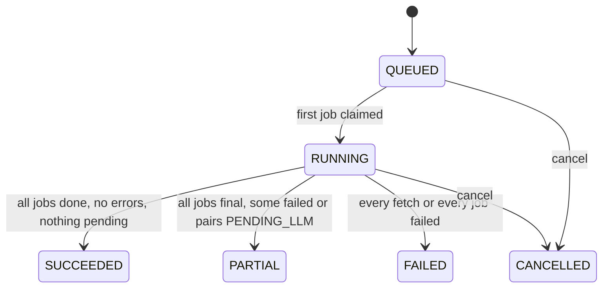
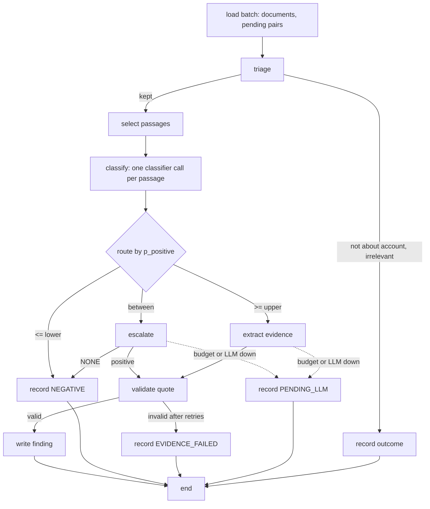

# Worker service

## Responsibilities

The worker runs every piece of background work: account refreshes, reclassification, rescoring, discovery, quality checks, scheduling and housekeeping. It claims jobs from the queue in the database, calls the source plug-ins, the embedder, the classifier and the LLM, and writes documents, passages, triage, classifications, findings, scores, alerts and candidates.

It never answers an HTTP request, never changes configuration, and never writes what a user decides: feedback, overrides, labels, drafts or account fields a user entered.

## Owns

- **Tables and columns**: those of the worker column of [store ownership](/architecture/overview.md#store-ownership).
- **Rules implemented**: [Account attributes](/architecture/rules.md#account-attributes), [Persona mapping](/architecture/rules.md#persona-mapping), [Source detection](/architecture/rules.md#source-detection), [Plug-in availability](/architecture/rules.md#plug-in-availability), [Fetch window](/architecture/rules.md#fetch-window), [Document normalisation](/architecture/rules.md#document-normalisation), [Chunking and passage selection](/architecture/rules.md#chunking-and-passage-selection), [Triage](/architecture/rules.md#triage), [Signal classification](/architecture/rules.md#signal-classification), [Escalation](/architecture/rules.md#escalation), [Evidence extraction](/architecture/rules.md#evidence-extraction), [Reclassification](/architecture/rules.md#reclassification), [Budget guard](/architecture/rules.md#budget-guard), [Recency decay](/architecture/rules.md#recency-decay), [Fit score](/architecture/rules.md#fit-score), [Intent score](/architecture/rules.md#intent-score), [Disqualification](/architecture/rules.md#disqualification), [Priority, standing and band](/architecture/rules.md#priority-standing-and-band), [Score breakdown](/architecture/rules.md#score-breakdown), [Rescoring](/architecture/rules.md#rescoring), [Alerts](/architecture/rules.md#alerts), [Discovery](/architecture/rules.md#discovery), [Evaluation metrics](/architecture/rules.md#evaluation-metrics) (the run), [Refresh scheduling](/architecture/rules.md#refresh-scheduling), and the housekeeping of [Retention and erasure](/architecture/rules.md#retention-and-erasure).
- **Rules invoked**: [Account identity](/architecture/rules.md#account-identity), implemented by the [api](/architecture/services/api.md), when discovery matches companies.

The rules are pure functions in the product package's core module; the api imports the ones it invokes from there.

## Provides and consumes

- Provides the [AI gateway](#ai-gateway) module that implements the [Classifier](/architecture/interfaces.md#classifier) and [LLM](/architecture/interfaces.md#llm) ports for both processes, and the [Source plug-ins](/architecture/interfaces.md#source-plug-ins) port.
- Consumes the [Embedder](/architecture/interfaces.md#embedder), Jev, the Anthropic Messages API and the providers of the [source plug-ins](#source-plug-ins).

## Design

### Job queue

A worker process runs `WORKER_CONCURRENCY` job loops. A loop claims the next job with one statement — `status = 'READY' AND not_before <= now()`, ordered by `priority` then `not_before`, `FOR UPDATE SKIP LOCKED LIMIT 1` — sets it `RUNNING` with `locked_by` and `locked_at`, runs its step, and sets it `DONE` or schedules a retry. Several worker containers can share the queue safely ([ADR-04](/architecture/adrs/adr-04-postgres-job-queue-and-a-worker.md)).

| Priority | Jobs |
|---|---|
| 0 | `RESCORE` from `FEEDBACK`, `OVERRIDE` or `ACCOUNT_CHANGE` |
| 1 | `ACCOUNT_REFRESH` from `USER` |
| 3 | `RECLASSIFY`, and `RESCORE` from `SCORING_ACTIVATION` |
| 5 | `ACCOUNT_REFRESH` from `SCHEDULE` |
| 7 | `DISCOVERY`, `EVALUATION` |

**Retries.** A step that raises is retried with `not_before` = now + `JOB_RETRY_BACKOFF_S × 2^(attempts − 1)`, up to `JOB_MAX_ATTEMPTS` attempts, after which the job is `FAILED` and its run records the error. A `RUNNING` job whose `locked_at` is older than `JOB_LOCK_TIMEOUT_S` is returned to `READY`; this is safe because every step is idempotent: it writes through the unique constraints of the [SQL store](/architecture/sql-store.md#constraints-and-indexes) and skips work already recorded ([N-05](/requirements/system.md)).

**Fan-out.** A step that finishes a stage enqueues the next stage's jobs in the same transaction as its own results. The last job of a run to finish sets the run's final status.

### Run lifecycle

| Kind | Stages, in order | Jobs |
|---|---|---|
| `ACCOUNT_REFRESH` | `FETCH` → `PROCESS` → `TRIAGE` → `CLASSIFY` → `EVIDENCE` → `SCORE` | one `FETCH` per available plug-in; `PROCESS` per batch of fetched documents; `SIGNAL` per batch of processed documents, including the account's `PENDING_LLM` and once-failed `EVIDENCE_FAILED` pairs, covering triage, classification and evidence; one `SCORE` for all active services |
| `RECLASSIFY` | `TRIAGE` → `CLASSIFY` → `EVIDENCE` → `SCORE` | `SIGNAL` per batch of the service's documents; one `SCORE` for the service |
| `RESCORE` | `SCORE` | one `SCORE` |
| `DISCOVERY` | `FETCH` → `TRIAGE` → `SCORE` | one `DISCOVER` per available discovery source; the last one ranks and caps candidates |
| `EVALUATION` | `CLASSIFY` | `EVALUATE` per batch of items; the last one writes the [`evaluation_result`](/architecture/sql-store.md#evaluation_result) |

A run is `FAILED` when nothing usable was produced: every `FETCH` of a refresh failed and there was nothing pending to resume, or every job failed. The `SCORE` stage of a refresh runs even when fetching failed, so decay is applied every interval. On finish a `RUN_FINISHED` audit row is written and, for `ACCOUNT_REFRESH`, the account's refresh times are set by [Refresh scheduling](/architecture/rules.md#refresh-scheduling).

### Signal graph

The `SIGNAL` step is a LangGraph state graph ([ADR-05](/architecture/adrs/adr-05-langgraph-only-for-the-signal-graph.md)); every other step is plain code.

The graph's state holds identifiers and passage texts of one batch. Each node writes its results before the next runs, so an interrupted job resumes from what is recorded; the graph keeps no checkpoint of its own. Classification and escalation of different passages run concurrently up to `AI_CONCURRENCY`.

### AI gateway

One module owns every classifier and LLM call, for the worker and the api. For each call it:

1. checks the [Budget guard](/architecture/rules.md#budget-guard) for Anthropic calls;
2. in `replay` fixture mode answers from `FIXTURE_DIR`, or fails with `FIXTURE_MISSING`; in `record` mode stores the exchange;
3. sends the request with `CLASSIFIER_TIMEOUT_S` or `AI_CALL_TIMEOUT_S`, retrying a transport error, `429` or `5xx` up to `AI_TRANSPORT_RETRIES` times with backoff;
4. validates the output against the port's shape;
5. writes the `AI_CALL` audit row with the payload of [Audit actions](/architecture/sql-store.md#audit-actions), computing `cost_eur` from `LLM_PRICES_EUR_PER_MTOK` or `JEV_PRICE_EUR_PER_CALL`.

**Jev adapter.** Maps a [`ClassifierRequest`](/architecture/interfaces.md#classifierrequest) to one Jev request: the passage and the context line are Jev's state, and each question becomes one of Jev's typed questions — `YES_NO` a yes/no question, `SCALE` a score question over its ordered levels, `CHOICE` a choice question over its options — so that one call answers them all. Jev's per-answer probabilities become the answer's `probabilities`. The request and response fields follow TypeSafe's API documentation for early-access customers.

**LLM classifier adapter.** Sends the same request to `LLM_CLASSIFIER_MODEL` with a tool whose JSON schema requires a probability for every answer value of every question, and normalises each question's probabilities to sum to 1.

**Anthropic adapter.** Every generation role has a prompt versioned in the repository as `prompts/<role>/v<n>.md`; the version is recorded in the audit. Calls use temperature 0 and a tool whose JSON schema is the role's output shape of [LLM shapes](/architecture/interfaces.md#llm-shapes), so the answer is structured, then the rule that owns the role validates its content.

### Source plug-ins

Each plug-in is one adapter implementing `API-68` and, where it searches, `API-69`. HTTP requests share one client with `HTTP_TIMEOUT_S`, `CRAWLER_USER_AGENT`, `robots.txt` checking and `CRAWL_HOST_DELAY_MS` spacing per host.

| Plug-in | Adapter |
|---|---|
| `GDELT` | GDELT DOC 2.0 API, `mode=ArtList`, JSON, query and date range from [Fetch window](/architecture/rules.md#fetch-window); each listed article is then fetched as HTML, because GDELT returns metadata only. Discovery adds `sourcecountry` filters |
| `RSS` | Parses the feed; each item's link is fetched as HTML when the item carries no full text |
| `WEBSITE` | HTML over HTTP; when `WEBSITE_RENDER_JS` is true and the extracted text is shorter than `MIN_DOCUMENT_CHARS`, the page is rendered with headless Chromium through Playwright; linked PDFs are downloaded; runs [Source detection](/architecture/rules.md#source-detection) |
| `CAREERS` | Public applicant-tracking APIs where the careers source is on their host (Greenhouse boards API, Lever postings API, SmartRecruiters postings API); otherwise the career page's listing is crawled like `WEBSITE` and each posting page fetched |
| `CRUNCHBASE` | Crunchbase API v4: the organisation matched by domain, its fields, key people and events as one `COMPANY_PROFILE` document; organisation search for discovery. Category mapping below |
| `NEWSAPI` | `/v2/everything` with the query and date range; article URLs fetched as HTML for the full text |
| `SERPAPI` | Engine `google_news` for news; engine `google` for source detection; result URLs fetched as HTML |

Crunchbase category mapping: the first of the organisation's categories that appears in this table sets `industry`; none sets `OTHER`.

| Crunchbase categories | `industry` |
|---|---|
| Air Transportation, Aerospace, Airlines | `AEROSPACE_AVIATION` |
| Automotive | `AUTOMOTIVE` |
| Banking, Financial Services, FinTech | `BANKING` |
| Insurance, InsurTech | `INSURANCE` |
| Logistics, Shipping, Delivery, Freight Service, Transportation | `LOGISTICS_TRANSPORT` |
| Manufacturing, Industrial, Industrial Automation | `MANUFACTURING` |
| Energy, Utilities, Renewable Energy, Oil and Gas | `ENERGY_UTILITIES` |
| Telecommunications, Media and Entertainment | `TELECOM_MEDIA` |
| Retail, Consumer Goods, E-Commerce | `RETAIL_CONSUMER` |
| Health Care, Pharmaceutical, Biotechnology | `HEALTHCARE_PHARMA` |
| Government, GovTech | `PUBLIC_SECTOR` |
| Software, Information Technology, SaaS | `TECHNOLOGY` |
| Consulting, Professional Services | `PROFESSIONAL_SERVICES` |

### Scheduler and housekeeping

One worker at a time runs the scheduler: each loop takes a PostgreSQL advisory lock and skips the tick if another holds it. Every `SCHEDULER_TICK_S` it applies [Refresh scheduling](/architecture/rules.md#refresh-scheduling); once a day at `HOUSEKEEPING_HOUR_UTC` it applies [Retention and erasure](/architecture/rules.md#retention-and-erasure).

## Runtime

**Queue and schedule.**

| Key | Default | Meaning |
|---|---|---|
| `WORKER_CONCURRENCY` | `4` | Job loops per worker process |
| `AI_CONCURRENCY` | `8` | Concurrent classifier or LLM calls per worker process |
| `JOB_MAX_ATTEMPTS` | `3` | Attempts before a job fails |
| `JOB_RETRY_BACKOFF_S` | `30` | Base retry backoff |
| `JOB_LOCK_TIMEOUT_S` | `900` | Age after which a running job is reclaimed |
| `SCHEDULER_TICK_S` | `60` | Scheduler interval |
| `SCHEDULER_MAX_ENQUEUE` | `20` | Refreshes enqueued per tick |
| `REFRESH_INTERVAL_HOURS` | `24` | Time between refreshes of an account |
| `HOUSEKEEPING_HOUR_UTC` | `3` | Hour of the daily housekeeping |
| `CLOCK_FILE` | unset | Test only, honoured only when `FIXTURE_MODE` is `replay`: a file holding the current time as ISO-8601, read on every use of the clock; unset uses the system clock |
| `REFRESH_TARGET_MINUTES` | `10` | Target duration of one account refresh in replay mode ([N-02](/requirements/system.md)) |

**Fetching and processing.**

| Key | Default | Meaning |
|---|---|---|
| `FETCH_LOOKBACK_DAYS` | `365` | Oldest item fetched |
| `MAX_DOCUMENTS_PER_REFRESH` | `100` | Documents kept per account refresh, across plug-ins |
| `CRAWL_MAX_PAGES_PER_SITE` | `30` | Pages read per site per refresh |
| `CRAWL_MAX_PDFS` | `3` | PDF reports read per refresh |
| `CRAWL_HOST_DELAY_MS` | `1000` | Minimum delay between requests to one host |
| `CRAWLER_USER_AGENT` | `LeadRadar/0.1 (+{APP_BASE_URL}/crawler)` | User agent of every request |
| `WEBSITE_RENDER_JS` | `false` | Render pages with Playwright when static text is too short |
| `HTTP_TIMEOUT_S` | `20` | Timeout of one HTTP request to a source |
| `MIN_DOCUMENT_CHARS` | `200` | Shortest text kept as a document |
| `CHUNK_TARGET_CHARS` | `1600` | Longest passage |
| `CHUNK_OVERLAP_CHARS` | `200` | Overlap between passages |
| `MAX_PASSAGES_PER_DOCUMENT` | `8` | Passages classified per document and service |
| `NEAR_DUPLICATE_SIMILARITY` | `0.95` | Cosine similarity of a near duplicate |
| `NEAR_DUPLICATE_WINDOW_DAYS` | `7` | Date window of near-duplicate search |
| `USD_EUR_RATE` | `0.92` | Conversion of Crunchbase revenue ranges |
| `DOCUMENT_RETENTION_DAYS` | `730` | Sets a document's `purge_after` |

**Classification, evidence and scoring.**

| Key | Default | Meaning |
|---|---|---|
| `TRIAGE_CHARS` | `2000` | Characters of a document read by triage |
| `TRIAGE_ABOUT_MIN_P` | `0.5` | Minimum probability that a document is about its account |
| `TRIAGE_RELEVANCE_MIN_P` | `0.3` | Minimum relevance to keep a document for a service |
| `ESCALATION_LOWER` | `0.35` | At or below: negative without escalation |
| `ESCALATION_UPPER` | `0.65` | At or above: positive without escalation |
| `EVIDENCE_MAX_ATTEMPTS` | `2` | Attempts to obtain a valid quote |
| `EVIDENCE_MAX_QUOTE_CHARS` | `400` | Longest quote |
| `ATTRIBUTE_MIN_P` | `0.6` | Minimum probability to store a classified attribute or persona |
| `ALERT_MAX_AGE_DAYS` | `14` | Oldest finding that raises a strong-signal alert |
| `DISCOVERY_MAX_CANDIDATES` | `50` | Candidates per discovery run |
| `DISCOVERY_LOOKBACK_DAYS` | `30` | News window of discovery |
| `DISCOVERY_MAX_DOCUMENTS` | `100` | News documents read per discovery run |
| `EVAL_MIN_PRECISION` | `0.80` | Release-gate precision ([ADR-14](/architecture/adrs/adr-14-labelled-set-and-precision-gate.md)) |
| `EVAL_MIN_ITEMS` | `200` | Minimum labelled items for a passing quality check |
| `ESCALATION_RATE_TARGET` | `0.15` | Target share of escalated items ([N-03](/requirements/system.md)) |

**AI gateway and embedder** (read by the api as well).

| Key | Default | Meaning |
|---|---|---|
| `CLASSIFIER_PROVIDER` | `LLM` | `JEV` or `LLM`: the classifier adapter ([ADR-02](/architecture/adrs/adr-02-classification-cascade.md)); set `JEV` once a key is provisioned |
| `JEV_API_KEY`, `JEV_BASE_URL` | unset | Jev credentials and endpoint |
| `JEV_PRICE_EUR_PER_CALL` | `0` | Recorded cost of one Jev call |
| `ANTHROPIC_API_KEY` | unset | Anthropic credentials |
| `LLM_CLASSIFIER_MODEL` | `claude-haiku-4-5-20251001` | Model of the LLM classifier adapter |
| `LLM_EVIDENCE_MODEL` | `claude-sonnet-5` | Model of escalation, evidence and discovery extraction |
| `LLM_OUTREACH_MODEL` | `claude-sonnet-5` | Model of outreach drafting |
| `LLM_PRICES_EUR_PER_MTOK` | — (required with `ANTHROPIC_API_KEY`) | JSON object: model id → `{"input": n, "output": n}`, from the provider's current price list |
| `LLM_DAILY_BUDGET_EUR` | `20` | Daily Anthropic spend cap ([Budget guard](/architecture/rules.md#budget-guard)) |
| `CLASSIFIER_TIMEOUT_S` | `10` | Timeout of one classifier call |
| `AI_CALL_TIMEOUT_S` | `60` | Timeout of one LLM call |
| `AI_TRANSPORT_RETRIES` | `2` | Retries of a transport error, `429` or `5xx` |
| `EMBEDDER_URL` | `http://embedder:80` | Text Embeddings Inference endpoint |
| `EMBEDDING_DIM` | `1024` | Dimension of a bge-m3 dense vector |
| `EMBED_BATCH_SIZE` | `32` | Texts per embedding call |
| `FIXTURE_MODE` | `off` | `off`, `record` or `replay` ([Runtime](/architecture/overview.md#runtime)) |
| `FIXTURE_DIR` | `./fixtures` | Location of recorded fixtures |

**Source plug-in keys.** `CRUNCHBASE_API_KEY`, `NEWSAPI_KEY`, `SERPAPI_KEY`: unset by default; a plug-in whose key is unset is unavailable.

## Examples

A Sales user presses Refresh on DHL Group with only the free core available. The run gets four `FETCH` jobs (`GDELT`, `RSS`, `WEBSITE`, `CAREERS`); `GDELT` returns 25 articles, of which 4 are duplicates. `PROCESS` stores 21 documents and their passages. The signal graph keeps 9 for Intelligent Automation, classifies 60 passages, escalates 7 and creates 5 findings. `SCORE` writes a new current score for each active service whose result changed, and one `STRONG_SIGNAL` alert. The run ends `SUCCEEDED`.
