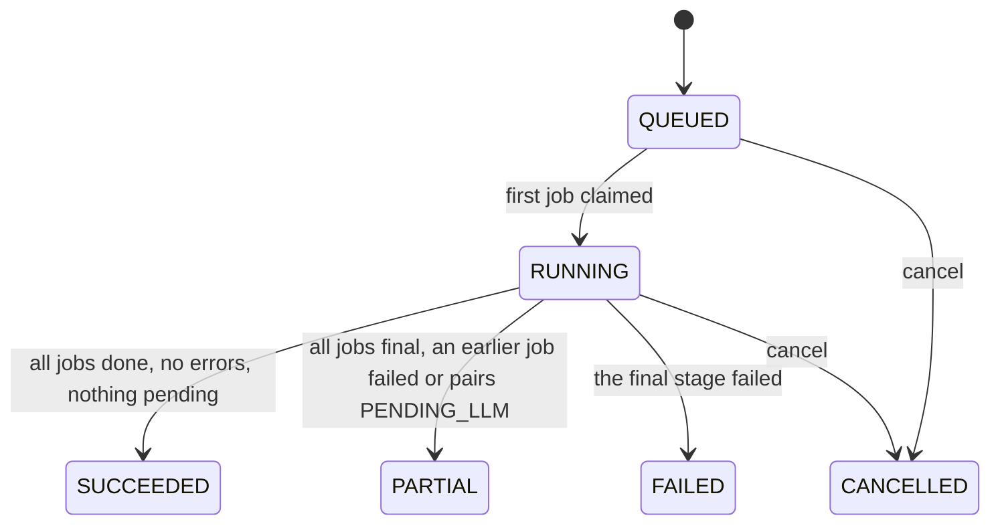
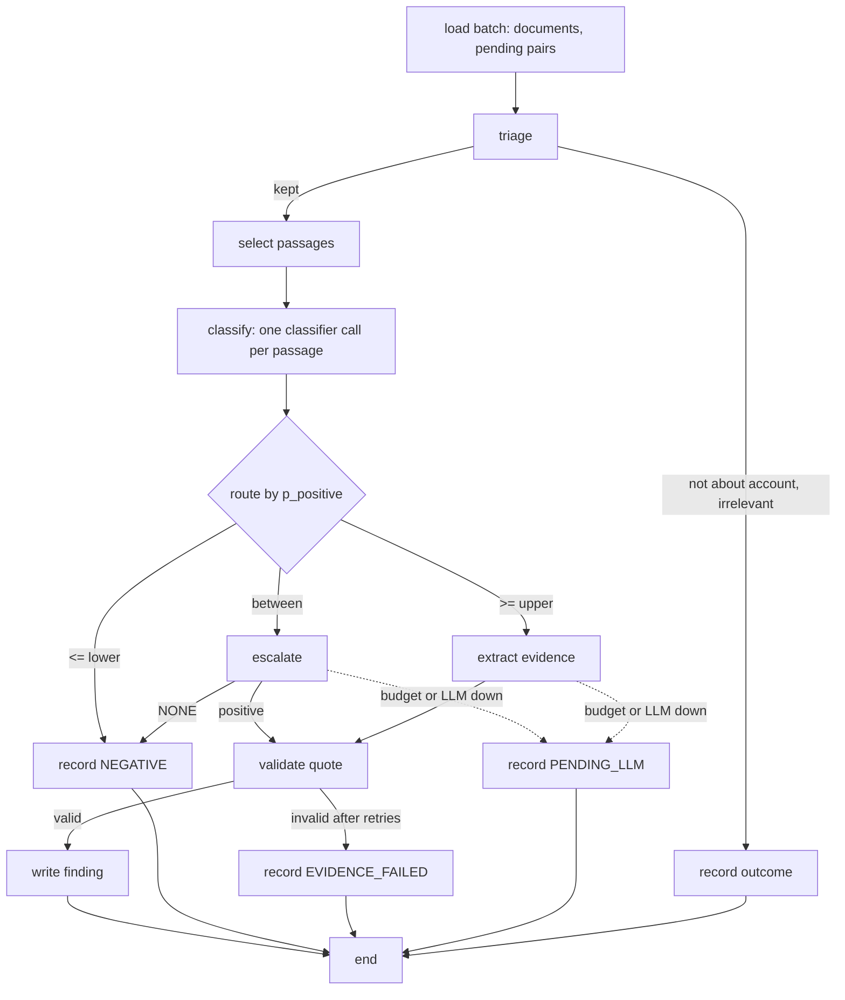

# Worker service

## Responsibilities

The worker runs every piece of background work: account refreshes, reclassification, rescoring, discovery, quality checks, scheduling and housekeeping. It claims jobs from the queue in the database, calls the source plug-ins, the embedder, the classifier and the LLM, and writes documents, passages, triage, classifications, findings, scores, alerts and candidates.

It never answers an HTTP request, never changes configuration, and never writes what a user decides: feedback, overrides, labels, drafts or account fields a user entered.

## Owns

- **Tables and columns**: those of the worker column of [store ownership](/architecture/overview.md#store-ownership).
- **Rules implemented**: [Account attributes](/architecture/rules.md#account-attributes), [Source detection](/architecture/rules.md#source-detection), [Plug-in availability](/architecture/rules.md#plug-in-availability), [Fetch window](/architecture/rules.md#fetch-window), [Document normalisation](/architecture/rules.md#document-normalisation), [Chunking and passage selection](/architecture/rules.md#chunking-and-passage-selection), [Triage](/architecture/rules.md#triage), [Signal classification](/architecture/rules.md#signal-classification), [Escalation](/architecture/rules.md#escalation), [Evidence extraction](/architecture/rules.md#evidence-extraction), [Reclassification](/architecture/rules.md#reclassification), [Budget guard](/architecture/rules.md#budget-guard), [Recency decay](/architecture/rules.md#recency-decay), [Fit score](/architecture/rules.md#fit-score), [Intent score](/architecture/rules.md#intent-score), [Disqualification](/architecture/rules.md#disqualification), [Priority, standing and band](/architecture/rules.md#priority-standing-and-band), [Score breakdown](/architecture/rules.md#score-breakdown), [Rescoring](/architecture/rules.md#rescoring), [Alerts](/architecture/rules.md#alerts), [Discovery](/architecture/rules.md#discovery), [Evaluation metrics](/architecture/rules.md#evaluation-metrics) (the run), [Refresh scheduling](/architecture/rules.md#refresh-scheduling), and the housekeeping of [Retention and erasure](/architecture/rules.md#retention-and-erasure).
- **Rules invoked**: [Account identity](/architecture/rules.md#account-identity), implemented by the [api](/architecture/services/api.md), when discovery matches companies.

The rules are pure functions in the product package's core module; the api imports the ones it invokes from there.

## Provides and consumes

- Provides the [AI gateway](#ai-gateway) module that implements the [Classifier](/architecture/interfaces.md#classifier) and [LLM](/architecture/interfaces.md#llm) ports for both processes, and the [Source plug-ins](/architecture/interfaces.md#source-plug-ins) port.
- Consumes the [Embedder](/architecture/interfaces.md#embedder), OpenRouter's chat completions API and, for Jev, its Decisions API, and the providers of the [source plug-ins](#source-plug-ins).

## Design

### Job queue

A worker process runs `WORKER_CONCURRENCY` job loops. A loop claims the next job with one statement — `status = 'READY' AND not_before <= now()`, ordered by `priority` then `not_before`, `FOR UPDATE SKIP LOCKED LIMIT 1` — sets it `RUNNING` with `locked_by` and `locked_at`, runs its step, and sets it `DONE` or schedules a retry. Several worker containers can share the queue safely ([ADR-04](/architecture/adrs/adr-04-postgres-job-queue-and-a-worker.md)). A loop that finds no job waits `JOB_POLL_INTERVAL_S` before it tries again. A job whose step the worker has no code for is `FAILED` at once, without retries, and its run records the error: no job is ever set `DONE` without its step having run.

| Priority | Jobs |
|---|---|
| 0 | `RESCORE` from `FEEDBACK`, `OVERRIDE` or `ACCOUNT_CHANGE` |
| 1 | `ACCOUNT_REFRESH` from `USER` |
| 3 | `RECLASSIFY`, and `RESCORE` from `SCORING_ACTIVATION` |
| 5 | `ACCOUNT_REFRESH` from `SCHEDULE` |
| 7 | `DISCOVERY`, `EVALUATION` |

**Retries.** A step that raises is retried with `not_before` = now + `JOB_RETRY_BACKOFF_S × 2^(attempts − 1)`, up to `JOB_MAX_ATTEMPTS` attempts, after which the job is `FAILED` and its run records the error: an entry of `errors` with the stage the step was in, the `plugin_code` of a `FETCH` job, and the code the step raised, else `INTERNAL`. A `RUNNING` job whose `locked_at` is older than `JOB_LOCK_TIMEOUT_S` is returned to `READY`; this is safe because every step is idempotent: it writes through the unique constraints of the [SQL store](/architecture/sql-store.md#constraints-and-indexes) and skips work already recorded ([N-05](/requirements/system.md)).

**Fan-out.** A step that finishes a stage enqueues the next stage's jobs in the same transaction as its own results. When every job of an `ACCOUNT_REFRESH` or `RECLASSIFY` run is final and none is a `SCORE` job, the job loop enqueues the run's `SCORE` job, so a refresh whose fetches all failed is still scored. Otherwise the last job of a run to finish sets the run's final status.

### Run lifecycle

| Kind | Stages, in order | Jobs |
|---|---|---|
| `ACCOUNT_REFRESH` | `FETCH` → `PROCESS` → `TRIAGE` → `CLASSIFY` → `EVIDENCE` → `SCORE` | one `FETCH` per available plug-in; `PROCESS` per batch of fetched documents; `SIGNAL` per batch of the account's documents with pending work — newly processed documents, kept documents whose selected passages lack a classification at a current revision, `PENDING_LLM` pairs, and `EVIDENCE_FAILED` pairs whose `evidence_retried` is false — covering triage, classification and evidence; one `SCORE` for all active services |
| `RECLASSIFY` | `TRIAGE` → `CLASSIFY` → `EVIDENCE` → `SCORE` | `SIGNAL` per batch of the service's documents; one `SCORE` for the service |
| `RESCORE` | `SCORE` | one `SCORE` |
| `DISCOVERY` | `FETCH` → `TRIAGE` → `SCORE` | one `DISCOVER` per available discovery source; the last one ranks and caps candidates |
| `EVALUATION` | `CLASSIFY` | `EVALUATE` per batch of items; the last one writes the [`evaluation_result`](/architecture/sql-store.md#evaluation_result) |

A `SCORE` job's `payload` is `{}`: its scope is its run's `account_id` and `service_id`, as the Jobs column states. A `FETCH` job's `payload` is `{plugin_code}`: its account is its run's `account_id`. A refresh requested when no plug-in is available starts with its `SCORE` job.

The first job claimed sets its run `RUNNING` with `started_at`. Claiming a job moves its run's `stage` to the first stage its step covers — `FETCH` for `FETCH` and `DISCOVER`, `PROCESS` for `PROCESS`, `TRIAGE` for `SIGNAL`, `CLASSIFY` for `EVALUATE`, `SCORE` for `SCORE` — never back to an earlier stage; the `SIGNAL` step moves it on through `CLASSIFY` and `EVIDENCE` itself.

Cancelling a run sets it `CANCELLED` with `finished_at` and its `READY` jobs `CANCELLED`; a running job finishes its step, and any job that step enqueues is `CANCELLED` with it. A cancelled run writes a `RUN_CANCELLED` audit row and no `RUN_FINISHED` row, and sets no refresh times.

A run is `FAILED` when its final stage — `SCORE`, the last `DISCOVER` or the last `EVALUATE` — fails after its retries; a failed earlier job makes it `PARTIAL`. The `SCORE` stage of a refresh runs even when every fetch failed, so decay is applied every interval. On finish a `RUN_FINISHED` audit row is written and, for `ACCOUNT_REFRESH`, the account's refresh times are set by [Refresh scheduling](/architecture/rules.md#refresh-scheduling).

### Signal graph

The `SIGNAL` step is a LangGraph state graph ([ADR-05](/architecture/adrs/adr-05-langgraph-only-for-the-signal-graph.md)); every other step is plain code.

The graph's state holds identifiers and passage texts of one batch. Each node writes its results before the next runs, so an interrupted job resumes from what is recorded; the graph keeps no checkpoint of its own. Classification and escalation of different passages run concurrently up to `AI_CONCURRENCY`.

### AI gateway

One module owns every classifier and LLM call, for the worker and the api. For each call it:

1. checks the [Budget guard](/architecture/rules.md#budget-guard) for LLM calls;
2. in `replay` fixture mode answers from `FIXTURE_DIR`, or fails with `FIXTURE_MISSING`; in `record` mode stores the exchange;
3. sends the request with `CLASSIFIER_TIMEOUT_S` or `AI_CALL_TIMEOUT_S`, retrying a transport error, `429` or `5xx` up to `AI_TRANSPORT_RETRIES` times after `AI_TRANSPORT_BACKOFF_MS × 2^(retry − 1)`;
4. validates the output against the port's shape;
5. writes the `AI_CALL` audit row with the payload of [Audit actions](/architecture/sql-store.md#audit-actions), computing `cost_eur` from the response's `usage.cost` at `USD_EUR_RATE`.

A call stopped before it is sent — by the budget guard, by a missing recording, or because `OPENROUTER_API_KEY` outside `replay` or the role's model id is unset — writes no `AI_CALL` row, since nothing answered it. Every other call writes exactly one, whatever its outcome, with its latency across all attempts. A failure is `UPSTREAM_UNAVAILABLE` with `details.dependency` `classifier` for the `CLASSIFIER` role and `llm` otherwise and `details.reason` the call's `outcome`, or `NOT_CONFIGURED` for an unset key or model id; a budget stop is `BUDGET_EXHAUSTED` with `details.resets_at` the next 00:00 UTC; a missing recording is `FIXTURE_MISSING`.

**Jev adapter.** Maps a [`ClassifierRequest`](/architecture/interfaces.md#classifierrequest) to one Jev request: the passage and the context line are Jev's state, and each question, keyed by its `id`, becomes one of Jev's typed questions — `YES_NO` a `noul` question, `SCALE` a `score` question whose `criteria` are its levels' labels in order, `CHOICE` a `choice` question whose `criteria` map each option key to its label — so that one call answers them all. The state is the passage alone without a context line, else `{context, text}`. A `noul` answer is P(`YES`), and P(`NO`) is its complement; a `score` or `choice` answer's `probabilities`, keyed by option key or, for a score, by the level's position from 0, become the answer's `probabilities`; an answer without them is `INVALID_OUTPUT`. Requests go to `JEV_DECISIONS_URL`, OpenRouter's Decisions API, for the model `JEV_MODEL` with the `OPENROUTER_API_KEY` bearer token, and the response's `usage.cost` is the call's cost ([ADR-15](/architecture/adrs/adr-15-openrouter-as-the-llm-provider.md)).

**LLM classifier adapter.** Sends the same request through the OpenRouter adapter to `LLM_CLASSIFIER_MODEL`, with a response schema that requires a probability for every answer value of every question, and normalises each question's probabilities to sum to 1.

**OpenRouter adapter.** Every generation role, and the LLM classifier adapter, has a prompt versioned in the repository as `prompts/<role>/v<n>.md`, `<role>` being the AI role in lower case; the highest `n` is the one in use, and `v<n>` is recorded in the audit as `prompt_version`. The prompt is the system message; the user message is the role's input shape as JSON. Calls go to `{OPENROUTER_BASE_URL}/chat/completions` in the OpenAI chat format with the `OPENROUTER_API_KEY` bearer token, at temperature 0, with a `response_format` of type `json_schema` whose schema is the role's output shape of [LLM shapes](/architecture/interfaces.md#llm-shapes), with `provider.require_parameters` true so that only providers that honour the schema serve the call, and with `usage.include` true so that the response carries its cost; the rule that owns the role then validates the content ([ADR-15](/architecture/adrs/adr-15-openrouter-as-the-llm-provider.md)).

### Source plug-ins

Each plug-in is one adapter implementing `API-68` and, where it searches, `API-69`. HTTP requests share one client with `HTTP_TIMEOUT_S`, `CRAWLER_USER_AGENT`, `robots.txt` checking and `CRAWL_HOST_DELAY_MS` spacing per host.

| Plug-in | Adapter |
|---|---|
| `GDELT` | GDELT DOC 2.0 API, `mode=ArtList`, JSON, query and date range from [Fetch window](/architecture/rules.md#fetch-window), at most `GDELT_MAX_RECORDS` results per request; the API searches a rolling three months only. Requests are spaced at least `GDELT_MIN_INTERVAL_S` apart, and a `429` pauses the plug-in for `GDELT_BACKOFF_S`. Each listed article is then fetched as HTML, because GDELT returns metadata only. Documents it finds are credited to the GDELT Project, whose terms require it ([ADR-19](/architecture/adrs/adr-19-source-provider-terms-and-limits.md)). Discovery adds `sourcecountry` filters |
| `RSS` | Parses the feed; each item's link is fetched as HTML when the item carries no full text. Never reads a feed on `news.google.com`, whose terms allow personal use only |
| `WEBSITE` | HTML over HTTP; when `WEBSITE_RENDER_JS` is true and the extracted text is shorter than `MIN_DOCUMENT_CHARS`, the page is rendered with headless Chromium through Playwright; linked PDFs are downloaded; runs [Source detection](/architecture/rules.md#source-detection) |
| `CAREERS` | Public applicant-tracking APIs where the careers source is on their host (Greenhouse boards API, Lever postings API, SmartRecruiters postings API); otherwise the career page's listing is crawled like `WEBSITE` and each posting page fetched |
| `CRUNCHBASE` | Crunchbase API v4: the organisation matched by domain, its fields, key people and events as one `COMPANY_PROFILE` document; organisation search for discovery. Category mapping below |
| `NEWSAPI` | `/v2/everything` with the query and date range; article URLs fetched as HTML for the full text |
| `SERPAPI` | Engine `google_news` for news — the only way Google News is read; engine `google` for source detection; result URLs fetched as HTML |

Crunchbase category mapping: the first of the organisation's categories that this table maps to an `ACTIVE` [`industry`](/architecture/sql-store.md#industry) sets it; otherwise `industry` stays unknown. The table maps to the seeded industry codes.

| Crunchbase categories | `industry` |
|---|---|
| Air Transportation, Aerospace, Airlines | `AEROSPACE_AVIATION` |
| Automotive | `AUTOMOTIVE` |
| Banking, Financial Services, FinTech | `BANKING` |
| Insurance, InsurTech | `INSURANCE` |
| Logistics, Shipping, Delivery, Freight Service, Transportation | `LOGISTICS_TRANSPORT` |
| Manufacturing, Industrial, Industrial Automation | `MANUFACTURING` |
| Energy, Utilities, Renewable Energy, Oil and Gas | `ENERGY_UTILITIES` |
| Telecommunications, Media and Entertainment | `TELECOM_MEDIA` |
| Retail, Consumer Goods, E-Commerce | `RETAIL_CONSUMER` |
| Health Care, Pharmaceutical, Biotechnology | `HEALTHCARE_PHARMA` |
| Government, GovTech | `PUBLIC_SECTOR` |
| Software, Information Technology, SaaS | `TECHNOLOGY` |
| Consulting, Professional Services | `PROFESSIONAL_SERVICES` |

### Scheduler and housekeeping

One worker at a time runs the scheduler: each loop takes a PostgreSQL advisory lock and skips the tick if another holds it. Every `SCHEDULER_TICK_S` it applies [Refresh scheduling](/architecture/rules.md#refresh-scheduling); once a day at `HOUSEKEEPING_HOUR_UTC` it applies [Retention and erasure](/architecture/rules.md#retention-and-erasure).

## Runtime

**Queue and schedule.**

| Key | Default | Meaning |
|---|---|---|
| `WORKER_CONCURRENCY` | `4` | Job loops per worker process |
| `AI_CONCURRENCY` | `8` | Concurrent classifier or LLM calls per worker process |
| `JOB_MAX_ATTEMPTS` | `3` | Attempts before a job fails |
| `JOB_RETRY_BACKOFF_S` | `30` | Base retry backoff |
| `JOB_LOCK_TIMEOUT_S` | `900` | Age after which a running job is reclaimed |
| `JOB_POLL_INTERVAL_S` | `1` | Wait of a job loop that found no job before it looks again |
| `SCHEDULER_TICK_S` | `60` | Scheduler interval |
| `SCHEDULER_MAX_ENQUEUE` | `20` | Refreshes enqueued per tick |
| `REFRESH_INTERVAL_HOURS` | `24` | Time between refreshes of an account |
| `HOUSEKEEPING_HOUR_UTC` | `3` | Hour of the daily housekeeping |
| `CLOCK_FILE` | unset | For the acceptance tests and the demo, honoured only when `FIXTURE_MODE` is `replay`: a file holding the current time as ISO-8601, read on every use of the clock; unset uses the system clock |
| `REFRESH_TARGET_MINUTES` | `10` | Target duration of one account refresh in replay mode ([N-02](/requirements/system.md)) |

**Fetching and processing.**

| Key | Default | Meaning |
|---|---|---|
| `FETCH_LOOKBACK_DAYS` | `365` | Oldest item fetched |
| `MAX_DOCUMENTS_PER_REFRESH` | `100` | Documents kept per account refresh, across plug-ins |
| `CRAWL_MAX_PAGES_PER_SITE` | `30` | Pages read per site per refresh |
| `CRAWL_MAX_PDFS` | `3` | PDF reports read per refresh |
| `CRAWL_HOST_DELAY_MS` | `1000` | Minimum delay between requests to one host |
| `CRAWLER_USER_AGENT` | `LeadRadar/0.1 (+{APP_BASE_URL}/crawler)` | User agent of every request |
| `WEBSITE_RENDER_JS` | `false` | Render pages with Playwright when static text is too short |
| `HTTP_TIMEOUT_S` | `20` | Timeout of one HTTP request to a source |
| `GDELT_MAX_RECORDS` | `250` | Articles asked of one GDELT request, the API's maximum |
| `GDELT_MIN_INTERVAL_S` | `6` | Least time between two GDELT requests |
| `GDELT_BACKOFF_S` | `60` | Pause of the GDELT plug-in after a `429` |
| `MIN_DOCUMENT_CHARS` | `200` | Shortest text kept as a document |
| `WHOLE_DOCUMENT_MAX_CHARS` | `8000` | Longest document read whole, as one passage |
| `CHUNK_TARGET_CHARS` | `1600` | Longest passage of a longer document |
| `CHUNK_OVERLAP_CHARS` | `200` | Overlap between passages |
| `PASSAGES_PER_QUESTION` | `3` | Passages of a long document selected for each question |
| `MAX_PASSAGES_PER_DOCUMENT` | `20` | Most passages of one long document classified per service |
| `RETRIEVAL_CANDIDATES` | `50` | Passages each ranking contributes to question-scoped retrieval |
| `RETRIEVAL_RRF_K` | `60` | Rank constant of the fused score of question-scoped retrieval |
| `NEAR_DUPLICATE_SIMILARITY` | `0.95` | Cosine similarity of a near duplicate |
| `NEAR_DUPLICATE_WINDOW_DAYS` | `7` | Date window of near-duplicate search |
| `USD_EUR_RATE` | `0.92` | USD to EUR rate for Crunchbase revenue ranges and AI call costs |
| `DOCUMENT_RETENTION_DAYS` | `730` | Sets a document's `purge_after` |

**Classification, evidence and scoring.**

| Key | Default | Meaning |
|---|---|---|
| `TRIAGE_CHARS` | `2000` | Characters of a document read by triage |
| `TRIAGE_ABOUT_MIN_P` | `0.5` | Minimum probability that a document is about its account |
| `TRIAGE_RELEVANCE_MIN_P` | `0.3` | Minimum relevance to keep a document for a service |
| `ESCALATION_LOWER` | `0.35` | At or below: negative without escalation |
| `ESCALATION_UPPER` | `0.65` | At or above: positive without escalation |
| `EVIDENCE_MAX_ATTEMPTS` | `2` | Attempts to obtain a valid quote |
| `EVIDENCE_MIN_QUOTE_CHARS` | `20` | Shortest quote |
| `EVIDENCE_MAX_QUOTE_CHARS` | `400` | Longest quote |
| `EVIDENCE_MAX_RATIONALE_CHARS` | `300` | Longest rationale |
| `ATTRIBUTE_MIN_P` | `0.6` | Minimum probability to store a classified attribute or persona |
| `ALERT_MAX_AGE_DAYS` | `14` | Oldest finding that raises a strong-signal alert |
| `DISCOVERY_MAX_CANDIDATES` | `50` | Candidates per discovery run |
| `DISCOVERY_LOOKBACK_DAYS` | `30` | News window of discovery |
| `DISCOVERY_MAX_DOCUMENTS` | `100` | News documents read per discovery run |
| `EVAL_CLASSIFIER_ONLY_P` | `0.5` | `p_positive` at which the classifier alone counts as positive in `classifier_only` |
| `EVAL_CALIBRATION_BINS` | `10` | Bins of the calibration metric |
| `EVAL_MAX_ERRORS` | `50` | Misclassified items a quality check lists |
| `EVAL_MIN_PRECISION` | `0.80` | Release-gate precision ([ADR-14](/architecture/adrs/adr-14-labelled-set-and-precision-gate.md)) |
| `EVAL_MIN_ITEMS` | `200` | Minimum labelled items for a passing quality check |
| `ESCALATION_RATE_TARGET` | `0.15` | Target share of escalated items ([N-03](/requirements/system.md)) |

**AI gateway and embedder** (read by the api as well).

| Key | Default | Meaning |
|---|---|---|
| `CLASSIFIER_PROVIDER` | `LLM` | `JEV` or `LLM`: the classifier adapter ([ADR-02](/architecture/adrs/adr-02-classification-cascade.md)); set `JEV` once a quality check shows Jev passes the release gate |
| `JEV_MODEL` | `typesafe/jev-1.13` | OpenRouter model id of the Jev adapter |
| `JEV_DECISIONS_URL` | `https://openrouter.ai/api/alpha/decisions` | OpenRouter's Decisions API endpoint, which serves Jev |
| `OPENROUTER_API_KEY` | unset | OpenRouter credentials; unset makes every Jev and LLM call unavailable, except in `replay` fixture mode |
| `OPENROUTER_BASE_URL` | `https://openrouter.ai/api/v1` | OpenRouter API endpoint |
| `LLM_CLASSIFIER_MODEL` | — (required with `OPENROUTER_API_KEY`) | OpenRouter model id, `organisation/model` such as `google/gemini-2.5-flash`, of the LLM classifier adapter |
| `LLM_EVIDENCE_MODEL` | — (required with `OPENROUTER_API_KEY`) | OpenRouter model id of escalation, evidence and discovery extraction |
| `LLM_OUTREACH_MODEL` | — (required with `OPENROUTER_API_KEY`) | OpenRouter model id of outreach drafting |
| `LLM_DAILY_BUDGET_EUR` | `20` | Daily OpenRouter spend cap ([Budget guard](/architecture/rules.md#budget-guard)) |
| `CLASSIFIER_TIMEOUT_S` | `10` | Timeout of one classifier call |
| `AI_CALL_TIMEOUT_S` | `60` | Timeout of one LLM call |
| `AI_TRANSPORT_RETRIES` | `2` | Retries of a transport error, `429` or `5xx` |
| `AI_TRANSPORT_BACKOFF_MS` | `500` | Wait before the first retry of an AI call; each further retry doubles it |
| `EMBEDDER_URL` | `http://embedder:80` | Text Embeddings Inference endpoint |
| `EMBEDDING_DIM` | `1024` | Dimension of a bge-m3 dense vector |
| `EMBED_BATCH_SIZE` | `32` | Texts per embedding call |
| `FIXTURE_MODE` | `off` | `off`, `record` or `replay` ([Runtime](/architecture/overview.md#runtime)) |
| `FIXTURE_DIR` | `./fixtures` | Location of recorded fixtures |

**Source plug-in keys.** `CRUNCHBASE_API_KEY`, `NEWSAPI_KEY`, `SERPAPI_KEY`: unset by default; a plug-in whose key is unset is unavailable.

The worker also reads `DATABASE_URL` and `LOG_LEVEL` of the [api runtime](/architecture/services/api.md#runtime).

## Examples

A Sales user presses Refresh on DHL Group with only the free core available. The run gets four `FETCH` jobs (`GDELT`, `RSS`, `WEBSITE`, `CAREERS`); `GDELT` returns 25 articles, of which 4 are duplicates. `PROCESS` stores 21 documents and their passages. The signal graph keeps 9 for Intelligent Automation, classifies 60 passages, escalates 7 and creates 5 findings. `SCORE` writes a new current score for each active service whose result changed, and one `STRONG_SIGNAL` alert. The run ends `SUCCEEDED`.
