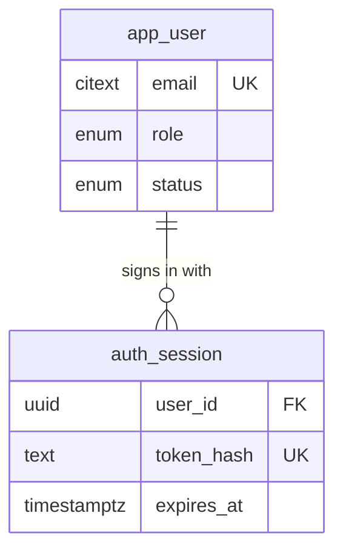
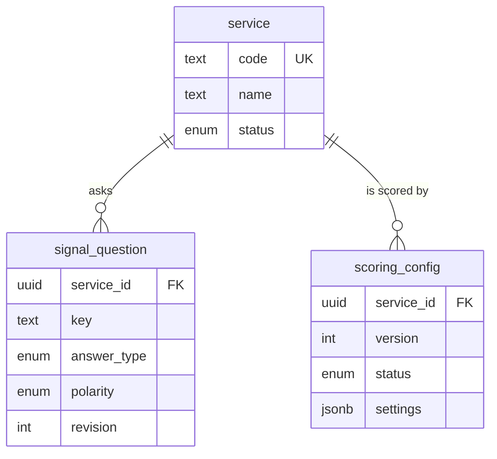
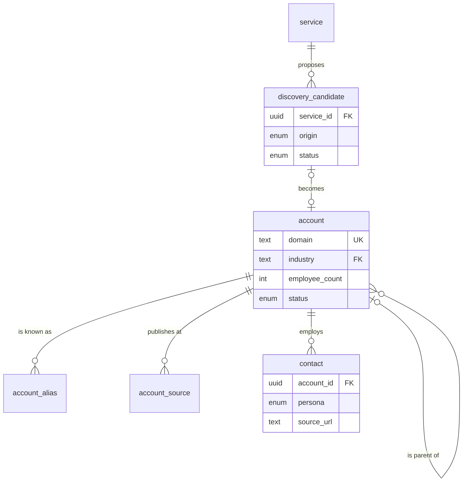
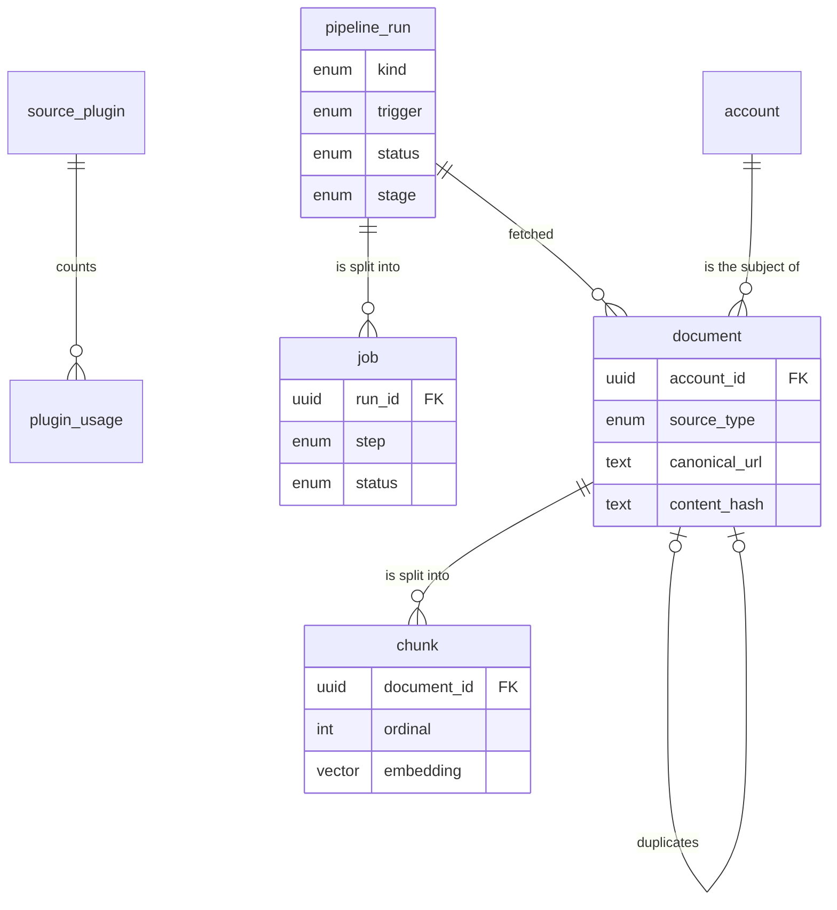
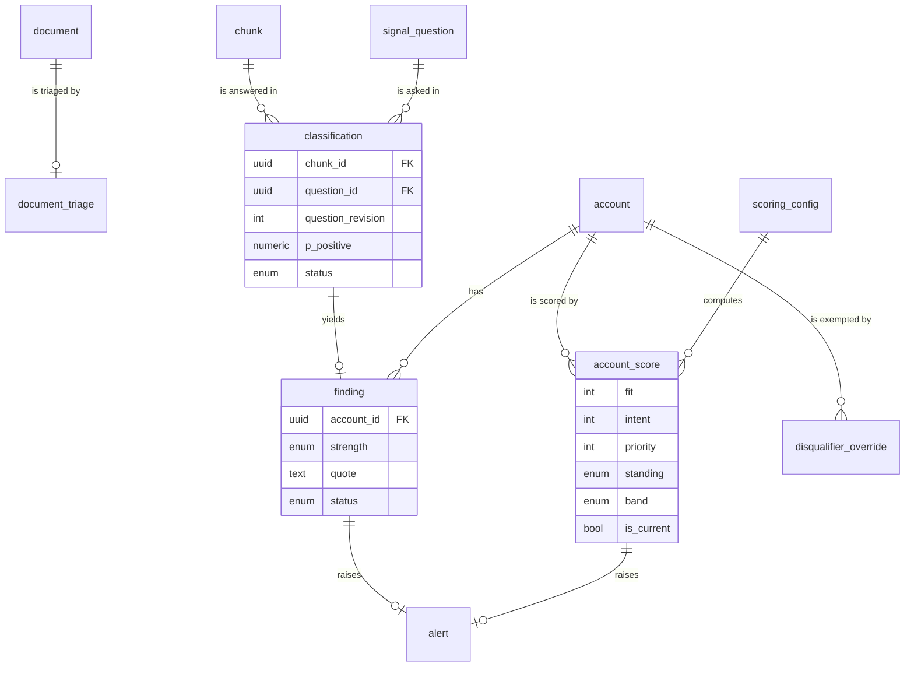
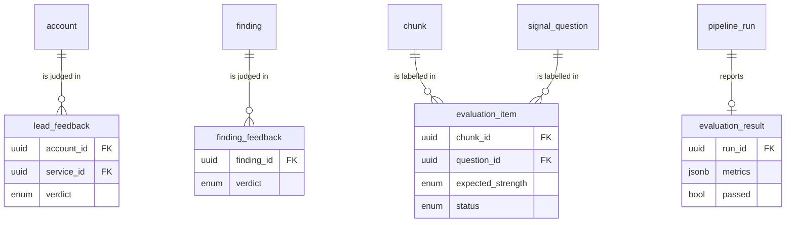
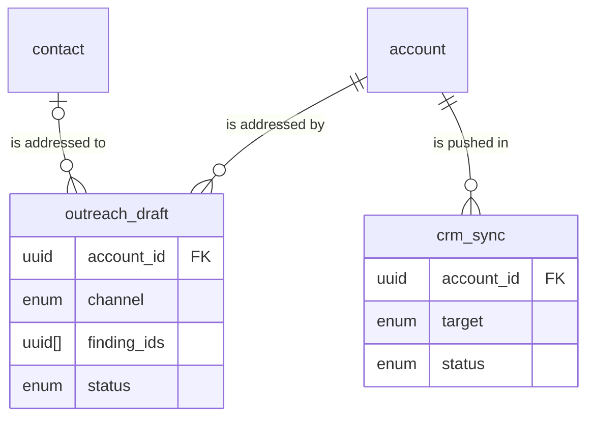

# SQL store

LeadRadar has one store: PostgreSQL with the `pgvector` extension ([ADR-01](/architecture/adrs/adr-01-one-postgresql-store.md)). It holds configuration, accounts, fetched documents and their passages with embeddings, classifier answers, findings, scores, feedback, drafts, the job queue and the audit. Which service writes which table is the [store ownership](/architecture/overview.md#store-ownership) table.

Every table has `id` (uuid), `created_at` and `updated_at` (timestamptz, UTC); they are omitted from the column tables below. Column types are PostgreSQL names. Foreign keys use `RESTRICT` on delete, except [`outreach_draft`](#outreach_draft) `contact_id`, which uses `SET NULL` because a contact is erased. Rows are deactivated or superseded, never deleted, except the tables of the [hard-delete allow-list](#hard-delete-allow-list). Each domain opens with a diagram of its tables and a selection of columns; only the column tables are complete. An enum is defined once, under the column that owns it, and every other column of that enum links there.

## Identity

### app_user

An application account. There is one organisation; every user sees every account.

| Column | Type | Notes |
|---|---|---|
| `email` | citext, unique | Sign-in name. |
| `display_name` | text | Name shown in the interface and the audit. |
| `role` | enum: `SALES`, `ADMIN` | `SALES` works accounts, runs, prospects, feedback, labels and outreach. `ADMIN` may do everything `SALES` may and also configures services and scoring, source plug-ins and users, overrides disqualifiers, runs quality checks and reads the audit ([Roles](/requirements/business.md#roles)). |
| `status` | enum: `ACTIVE`, `DISABLED` | A disabled user cannot sign in; their sessions are revoked when disabled. |
| `password_hash` | text | argon2id hash; the password is never stored or logged. |
| `failed_logins` | integer | Consecutive failed sign-ins; reset to 0 by a successful one. |
| `locked_until` | timestamptz, null | Set to now + `LOGIN_LOCK_MINUTES` when `failed_logins` reaches `LOGIN_MAX_FAILURES` ([api runtime](/architecture/services/api.md#runtime)). |
| `last_login_at` | timestamptz, null | Time of the last successful sign-in. |

### auth_session

A signed-in browser session.

| Column | Type | Notes |
|---|---|---|
| `user_id` | uuid FK → [`app_user`](#app_user) | Session owner. |
| `token_hash` | text, unique | SHA-256 of the cookie token; the token itself is never stored. |
| `expires_at` | timestamptz | Creation time + `SESSION_TTL_HOURS`. |
| `revoked_at` | timestamptz, null | Set on sign-out or when the user is disabled. |

## Configuration

### service

An Orange Systems service that accounts are scored for, such as Intelligent Automation.

| Column | Type | Notes |
|---|---|---|
| `code` | text, unique | UPPER_SNAKE, immutable after creation, e.g. `INTELLIGENT_AUTOMATION`. |
| `name` | text, unique | Display name. |
| `description` | text | What the service delivers, in two or three sentences; it is the subject of the service-relevance question of [Triage](/architecture/rules.md#triage). |
| `value_proposition` | text | What the service offers a prospect; used by [Outreach grounding](/architecture/rules.md#outreach-grounding). |
| `status` | enum: `ACTIVE`, `INACTIVE` | An inactive service is not triaged, classified, scored, discovered for or listed in Prospects; its data is kept. |

### signal_question

One configurable question a passage can answer for a service. Weight and half-life are scoring parameters and live in the [scoring settings document](#scoring-settings-document), so that changing them never reclassifies.

| Column | Type | Notes |
|---|---|---|
| `service_id` | uuid FK → [`service`](#service) | Owning service. |
| `key` | text | UPPER_SNAKE, unique within the service, immutable; the name the scoring settings and disqualifiers use for the question. |
| `text` | text | The question, in English, answerable from one passage, e.g. "Does the company announce a cost-reduction or operational-efficiency programme?". |
| `answer_type` | enum: `YES_NO`, `SCALE`, `CHOICE` | `YES_NO`: yes or no, with the strength of a yes asked in the same classifier pass. `SCALE`: the answer is a [strength](#finding) level itself. `CHOICE`: one of `options`, each mapped to a strength. How each maps to a strength is [Signal classification](/architecture/rules.md#signal-classification). |
| `options` | jsonb, null | `CHOICE` only: an array of `{key, label, strength}`, at least two, with at least one option of strength `NONE`; `key` is UPPER_SNAKE and unique within the question. Null for the other answer types. |
| `polarity` | enum: `POSITIVE`, `NEGATIVE` | `POSITIVE` findings raise Intent; `NEGATIVE` findings lower it ([Intent score](/architecture/rules.md#intent-score)). Immutable after creation, so that every score stays reproducible from its settings version; a question with the other polarity is a new question. |
| `source_types` | text[] | The document source types the question is asked against; each element is a value of [`document`](#document) `source_type`. At least one. |
| `hint_terms` | text[] | Optional search terms in any language. Used to build news queries and discovery searches ([Fetch window](/architecture/rules.md#fetch-window), [Discovery](/architecture/rules.md#discovery)); never used to decide an answer. |
| `revision` | integer | 1 on creation; incremented by any change to `text`, `answer_type`, `options` or `source_types`, which triggers [Reclassification](/architecture/rules.md#reclassification). A change to `hint_terms` or `status` does not. |
| `status` | enum: `ACTIVE`, `INACTIVE` | An inactive question is not classified and is left out of the service's draft; its findings are kept and stop counting once a scoring version without it is activated. A new or reactivated question counts once a scoring version with it is activated. |

### scoring_config

One version of a service's scoring settings. A service has at most one `DRAFT` and, once first activated, exactly one `ACTIVE` version.

| Column | Type | Notes |
|---|---|---|
| `service_id` | uuid FK → [`service`](#service) | Owning service. |
| `version` | integer | 1, 2, … per service, assigned when the draft is created. |
| `status` | enum: `DRAFT`, `ACTIVE`, `RETIRED` | `DRAFT`: editable, not used for scoring. `ACTIVE`: the version every current score uses. `RETIRED`: a previous active version, kept so older scores stay reproducible. `ACTIVE` and `RETIRED` rows are immutable. |
| `settings` | jsonb | The [scoring settings document](#scoring-settings-document). |
| `change_note` | text, null | The Admin's reason for the change, shown in score history. |
| `activated_at` | timestamptz, null | Set on activation. |
| `activated_by` | uuid FK → [`app_user`](#app_user), null | The Admin who activated it. |

### industry

A sector an account belongs to and an ICP criterion names. The list is configuration an Admin maintains ([ADR-18](/architecture/adrs/adr-18-industries-and-markets-as-configuration.md)); its first rows are seeded from the [demo dataset](/architecture/overview.md#demo-dataset).

| Column | Type | Notes |
|---|---|---|
| `code` | text, unique | UPPER_SNAKE, immutable after creation, e.g. `LOGISTICS_TRANSPORT`. |
| `label` | text, unique | Name shown in the interface. |
| `status` | enum: `ACTIVE`, `INACTIVE` | A retired (`INACTIVE`) industry cannot be set on an account or named by a saved draft; accounts that have it keep it, and active scoring versions that name it keep matching it. |

### market

A named group of countries, such as DACH. An Admin maintains the list ([ADR-18](/architecture/adrs/adr-18-industries-and-markets-as-configuration.md)). A market is a shortcut: choosing it in an ICP `GEOGRAPHY` criterion stores its countries, so a later change to the market never changes a saved scoring version.

| Column | Type | Notes |
|---|---|---|
| `code` | text, unique | UPPER_SNAKE, immutable after creation, e.g. `DACH`. |
| `name` | text, unique | Name shown in the interface. |
| `country_codes` | text[] | ISO 3166-1 alpha-2 codes of its countries; at least one. |
| `status` | enum: `ACTIVE`, `INACTIVE` | A retired market is not offered in the editor. |

## Scoring settings document

The `settings` column of [`scoring_config`](#scoring_config) is one JSON object with the keys below. The **Default** column is what a new service's first draft starts with; it is the only place these defaults are stated. The computations that read each key are in [rules](/architecture/rules.md); the checks a draft must pass are [Scoring settings validation](/architecture/rules.md#scoring-settings-validation).

| Key | Type | Meaning | Default |
|---|---|---|---|
| `fit_weight` | number 0–1 | Share of Fit in Priority. | `0.4` |
| `intent_weight` | number 0–1 | Share of Intent in Priority; `fit_weight + intent_weight = 1`. | `0.6` |
| `min_fit` | integer 0–100 | An account below it has standing `BELOW_FIT`. | `40` |
| `hot_threshold` | integer 0–100 | Priority at or above it is `HOT`. | `70` |
| `warm_threshold` | integer 0–100 | Priority at or above it, and below `hot_threshold`, is `WARM`. | `40` |
| `weight_values` | object: weight level → number ≥ 0 | Numeric value of each weight level. Weight levels are `HIGH`, `MEDIUM`, `LOW` and `NONE`; `NONE` keeps a question out of Intent while a disqualifier still reads it. | `{"HIGH": 3, "MEDIUM": 2, "LOW": 1, "NONE": 0}` |
| `strength_values` | object: strength → number 0–1 | Value of a finding of each strength. | `{"WEAK": 0.5, "MEDIUM": 0.75, "STRONG": 1.0}` |
| `default_half_life_days` | object: source type → integer > 0 | Half-life of a finding whose question sets none, by its document's source type. | `{"NEWS": 90, "COMPANY_PUBLICATION": 365, "JOB_POSTING": 60, "COMPANY_PROFILE": 365}` |
| `min_decay` | number 0–1 | A finding whose decay factor falls below it contributes nothing. | `0.05` |
| `negative_factor` | number ≥ 0 | Multiplier on the negative sum in Intent. | `1.0` |
| `intent_saturation` | number, 0 < x ≤ 1 | Share of the maximum possible positive evidence that already scores Intent 100. | `0.5` |
| `unknown_match` | number 0–1 | Match credit of an ICP criterion whose account attribute is unknown. | `0.5` |
| `icp_criteria` | array of ICP criterion | The ICP of the service. | `[]` |
| `questions` | array of question setting | One per `ACTIVE` question of the service. | every active question at `MEDIUM`, `half_life_days` null |
| `disqualifiers` | array of disqualifier | The disqualifiers of the service. | `[]` |

**ICP criterion** — `{key, kind, weight, values?, min?, max?}`. `key` is UPPER_SNAKE and unique within the document; `weight` is a weight level. `kind` is one of:

| Kind | Operand | Matches when |
|---|---|---|
| `INDUSTRY` | `values`: [`industry`](#industry) codes | the account's industry is in `values` |
| `GEOGRAPHY` | `values`: ISO 3166-1 alpha-2 country codes; a [`market`](#market) chosen in the editor is stored as its countries | the account's `country_code` is in `values` |
| `EMPLOYEE_RANGE` | `min` (integer), `max` (integer, optional) | `min ≤ employee_count` and, when `max` is set, `employee_count ≤ max` |
| `REVENUE_RANGE` | `min`, `max` in EUR (integers, `max` optional) | the same over `revenue_eur` |
| `OPERATIONAL_COMPLEXITY` | `values`: [`account`](#account) `operational_complexity` values | the account's complexity is in `values` |

**Question setting** — `{question_key, weight, half_life_days}`: `question_key` names a [`signal_question`](#signal_question) `key` of the same service; `weight` is a weight level; `half_life_days` is an integer > 0 or null for the source-type default.

**Disqualifier** — `{key, label, kind, criterion_key?, question_key?, min_strength?}`: `key` is UPPER_SNAKE, unique within the service and stable across versions, because [`disqualifier_override`](#disqualifier_override) rows name it; `label` is the reason shown to users. `kind` is one of:

| Kind | Operands | Excludes when |
|---|---|---|
| `ICP_MISMATCH` | `criterion_key` | the account's attribute for that ICP criterion is known and does not match |
| `SIGNAL` | `question_key`, `min_strength` (`WEAK`, `MEDIUM` or `STRONG`) | the account has an in-force finding of that question with strength ≥ `min_strength` and a decay factor ≥ `min_decay` |

## Accounts

### account

A company that may buy. Accounts are shared by the whole team.

| Column | Type | Notes |
|---|---|---|
| `domain` | text, unique | Registrable domain in lower case, e.g. `lufthansagroup.com`; the identity key ([Account identity](/architecture/rules.md#account-identity)). Immutable after creation. |
| `name` | text | Display name. |
| `country_code` | text, null | ISO 3166-1 alpha-2 of the headquarters. |
| `industry` | text FK → [`industry`](#industry) `code`, null | The account's industry; only an `ACTIVE` industry can be set, and a retired one stays on the accounts that have it. |
| `employee_count` | integer, null | Number of employees. |
| `revenue_eur` | bigint, null | Annual revenue in EUR. |
| `operational_complexity` | enum: `LOW`, `MEDIUM`, `HIGH`, null | How complex the company's operations are, by the countries it operates in and its business units; headcount is `employee_count`. `LOW`: at most 2 countries and one business unit. `MEDIUM`: 3 to 10 countries, or 2 to 4 business units. `HIGH`: more than 10 countries, or 5 or more business units. When the two measures point to different levels, the higher applies. Entered, or classified by [Account attributes](/architecture/rules.md#account-attributes). |
| `attribute_origin` | jsonb | Object: attribute name → `MANUAL`, `CRUNCHBASE` or `CLASSIFIER`, for `country_code`, `industry`, `employee_count`, `revenue_eur` and `operational_complexity`. A `MANUAL` value is never overwritten by a plug-in or the classifier. |
| `parent_account_id` | uuid FK → [`account`](#account), null | Group parent, e.g. SWISS → Lufthansa Group. Display and navigation only; findings are never inherited. |
| `origin` | enum: `IMPORTED`, `MANUAL`, `DISCOVERED` | How the account entered: CSV import, manual entry, or an accepted [`discovery_candidate`](#discovery_candidate). |
| `status` | enum: `ACTIVE`, `INACTIVE` | An inactive account is not refreshed, scored or listed in Prospects; its data is kept. |
| `crunchbase_id` | text, null | Crunchbase organisation permalink, when matched. |
| `linkedin_url` | text, null | Entered by a user for manual checks; never fetched ([RULE-01](/requirements/business.md#business-rules)). |
| `notes` | text, null | Free notes. |
| `last_refreshed_at` | timestamptz, null | Finish time of the last `ACCOUNT_REFRESH` run that fetched for it. |
| `next_refresh_at` | timestamptz, null | When [Refresh scheduling](/architecture/rules.md#refresh-scheduling) next enqueues it. |

### account_alias

Another name the company is reported under, used to match news to the account.

| Column | Type | Notes |
|---|---|---|
| `account_id` | uuid FK → [`account`](#account) | The account. |
| `alias` | text | The name as written, e.g. "Deutsche Lufthansa AG". |
| `normalised` | text | The alias after name normalisation ([Account identity](/architecture/rules.md#account-identity)); unique per account. |

### account_source

An address where an account publishes: the pages the website, careers and RSS plug-ins read.

| Column | Type | Notes |
|---|---|---|
| `account_id` | uuid FK → [`account`](#account) | The account. |
| `kind` | enum: `WEBSITE`, `NEWSROOM`, `INVESTOR_RELATIONS`, `CAREERS`, `RSS_FEED` | `WEBSITE`: home page. `NEWSROOM`: press releases. `INVESTOR_RELATIONS`: annual reports and strategy publications. `CAREERS`: job listings, including a public applicant-tracking board. `RSS_FEED`: a feed of the company's own news. |
| `url` | text | Absolute URL; unique per account. A feed on `news.google.com` is refused: its terms allow personal use only ([ADR-19](/architecture/adrs/adr-19-source-provider-terms-and-limits.md)). |
| `origin` | enum: `MANUAL`, `DETECTED` | Entered by a user, or found by [Source detection](/architecture/rules.md#source-detection). |
| `status` | enum: `ACTIVE`, `INACTIVE` | An inactive source is not fetched. |

### contact

A decision-maker at an account, entered by a user and kept to the minimum ([RULE-07](/requirements/business.md#business-rules), [ADR-10](/architecture/adrs/adr-10-minimal-contact-data.md)). There is deliberately no column for an email address or a phone number.

| Column | Type | Notes |
|---|---|---|
| `account_id` | uuid FK → [`account`](#account) | Employer. |
| `full_name` | text | As published. |
| `job_title` | text | As published, in any language. |
| `persona` | enum | One of the persona values below; mapped by [Persona mapping](/architecture/rules.md#persona-mapping) and editable. |
| `persona_origin` | enum: `MANUAL`, `CLASSIFIER` | A `MANUAL` persona is never remapped. |
| `source_url` | text | Public page stating the person and title; required. |
| `retain_until` | date | Creation date + `CONTACT_RETENTION_DAYS`; erased after it ([Retention and erasure](/architecture/rules.md#retention-and-erasure)). |

Persona values:

| Value | Meaning |
|---|---|
| `CIO` | Chief information officer |
| `CTO` | Chief technology officer |
| `COO` | Chief operating officer |
| `CFO` | Chief financial officer |
| `CISO` | Chief information security officer |
| `HEAD_OF_DIGITAL_TRANSFORMATION` | Leads digital transformation |
| `HEAD_OF_AUTOMATION` | Leads automation, RPA or intelligent automation |
| `HEAD_OF_PROCESS_EXCELLENCE` | Leads process excellence, lean or business process management |
| `HEAD_OF_SHARED_SERVICES` | Leads a shared service centre or global business services |
| `OTHER` | Any other role |

### discovery_candidate

A company proposed by [Discovery](/architecture/rules.md#discovery) that is not yet an account ([ADR-12](/architecture/adrs/adr-12-suggested-accounts-need-acceptance.md)).

| Column | Type | Notes |
|---|---|---|
| `service_id` | uuid FK → [`service`](#service) | The service whose ICP the discovery run searched for. |
| `run_id` | uuid FK → [`pipeline_run`](#pipeline_run) | The discovery run that proposed it. |
| `name` | text | Company name as found. |
| `normalised_name` | text | Name after name normalisation; used to recognise a company proposed before. |
| `domain` | text, null | Registrable domain, when the source states the website. |
| `country_code` | text, null | ISO 3166-1 alpha-2, when known. |
| `industry` | text FK → [`industry`](#industry) `code`, null | The industry, when known. |
| `employee_count` | integer, null | When known. |
| `origin` | enum: `CRUNCHBASE_SEARCH`, `NEWS_MENTION` | Found by a Crunchbase organisation search, or named as the subject of a relevant news document. |
| `document_id` | uuid FK → [`document`](#document), null | The news document that named it; `NEWS_MENTION` only. |
| `quote` | text, null | Verbatim sentence of that document naming the company and its signal; `NEWS_MENTION` only. |
| `fit_estimate` | integer 0–100 | The [Fit score](/architecture/rules.md#fit-score) over the known attributes, under the service's active settings at proposal time. |
| `status` | enum: `PENDING`, `ACCEPTED`, `REJECTED` | `PENDING` until a user decides. |
| `decided_by` | uuid FK → [`app_user`](#app_user), null | Who accepted or rejected it. |
| `decided_at` | timestamptz, null | When. |
| `reject_reason` | text, null | Optional reason given on rejection. |
| `account_id` | uuid FK → [`account`](#account), null | The account created on acceptance. |

## Ingestion

### source_plugin

One row per source plug-in, seeded; holds the Admin's switches and limits. API keys are never stored here: they are configuration keys of the [worker runtime](/architecture/services/worker.md#runtime).

| Column | Type | Notes |
|---|---|---|
| `code` | enum, unique | One of the plug-in values below. |
| `enabled` | boolean | The Admin's switch. A plug-in that needs a key and has none is unavailable whatever this says ([Plug-in availability](/architecture/rules.md#plug-in-availability)). |
| `rate_limit_per_minute` | integer | Maximum requests per minute to the provider. |
| `daily_quota` | integer, null | Maximum requests per UTC day; null for none. |
| `last_success_at` | timestamptz, null | Last request that succeeded. |
| `last_error` | text, null | Message of the last failed request. |
| `last_error_at` | timestamptz, null | When it failed. |

Plug-in values:

| Value | Needs a key | Reads | Produces source types |
|---|---|---|---|
| `GDELT` | no | GDELT DOC 2.0 article search by company name and aliases | `NEWS` |
| `RSS` | no | The account's `RSS_FEED` sources, including RSSHub routes | `NEWS`, `COMPANY_PUBLICATION` (a feed on the account's own domain) |
| `WEBSITE` | no | The account's `WEBSITE`, `NEWSROOM` and `INVESTOR_RELATIONS` pages and the PDF reports they link | `COMPANY_PUBLICATION` |
| `CAREERS` | no | The account's `CAREERS` sources: career pages and public applicant-tracking boards | `JOB_POSTING` |
| `CRUNCHBASE` | yes | Organisation profile, key people, funding and acquisition events; organisation search for discovery | `COMPANY_PROFILE` |
| `NEWSAPI` | yes | NewsAPI article search by company name and aliases | `NEWS` |
| `SERPAPI` | yes | Google News results by company name; web results for [Source detection](/architecture/rules.md#source-detection) | `NEWS` |

`GDELT`, `RSS`, `WEBSITE` and `CAREERS` are the **free core** ([RULE-08](/requirements/business.md#business-rules), [ADR-07](/architecture/adrs/adr-07-source-plug-ins-with-a-free-core.md)).

### plugin_usage

Requests made to a plug-in's provider per UTC day, for the daily quota.

| Column | Type | Notes |
|---|---|---|
| `plugin_code` | enum | A [`source_plugin`](#source_plugin) `code` value. |
| `day` | date | UTC day. |
| `requests` | integer | Requests made that day, successful or not. |

### pipeline_run

A unit of background work a user can see: a refresh, a reclassification, a rescore, a discovery or a quality check.

| Column | Type | Notes |
|---|---|---|
| `kind` | enum: `ACCOUNT_REFRESH`, `RECLASSIFY`, `RESCORE`, `DISCOVERY`, `EVALUATION` | `ACCOUNT_REFRESH`: fetch, process, triage, classify and score one account. `RECLASSIFY`: classify stored passages for one question at its current revision. `RESCORE`: recompute scores of one account or of a whole service, without fetching or classifying. `DISCOVERY`: propose candidates for one service. `EVALUATION`: run the classification cascade over the labelled set. |
| `trigger` | enum: `SCHEDULE`, `USER`, `QUESTION_CHANGE`, `SCORING_ACTIVATION`, `ACCOUNT_CHANGE`, `FEEDBACK`, `OVERRIDE` | What caused it: the scheduler, a user's explicit request, a question created or changed, a scoring version activated, an account attribute changed, feedback given, or an exception added or revoked. |
| `account_id` | uuid FK → [`account`](#account), null | `ACCOUNT_REFRESH`, and a `RESCORE` of one account. |
| `service_id` | uuid FK → [`service`](#service), null | `RESCORE` of a whole service or of one account for one service, `DISCOVERY`, `RECLASSIFY`. |
| `question_id` | uuid FK → [`signal_question`](#signal_question), null | `RECLASSIFY`. |
| `status` | enum: `QUEUED`, `RUNNING`, `SUCCEEDED`, `PARTIAL`, `FAILED`, `CANCELLED` | `PARTIAL`: finished, but at least one plug-in or step failed, or pairs were left `PENDING_LLM`, as `errors` and `progress` state. `FAILED`: its final stage failed after its retries. |
| `stage` | enum, null: `FETCH`, `PROCESS`, `TRIAGE`, `CLASSIFY`, `EVIDENCE`, `SCORE` | The stage in progress; null when queued or finished. The stages each kind passes through are the [run lifecycle](/architecture/services/worker.md#run-lifecycle). |
| `progress` | jsonb | Counters: `documents_fetched`, `documents_new`, `documents_kept`, `passages`, `pairs_classified`, `pairs_escalated`, `findings_created`, `pending_budget`, `candidates`, `items_evaluated`. |
| `errors` | jsonb | Array of `{stage, plugin_code?, code, message}`; `code` is an error code of [Conventions](/architecture/interfaces.md#conventions) or `FIXTURE_MISSING`. |
| `requested_by` | uuid FK → [`app_user`](#app_user), null | The user whose action caused it; null for the scheduler. |
| `started_at` | timestamptz, null | When the first job started. |
| `finished_at` | timestamptz, null | When the last job finished. |

### job

The work queue behind runs ([ADR-04](/architecture/adrs/adr-04-postgres-job-queue-and-a-worker.md)). Workers claim jobs with `FOR UPDATE SKIP LOCKED`.

| Column | Type | Notes |
|---|---|---|
| `run_id` | uuid FK → [`pipeline_run`](#pipeline_run) | Owning run. |
| `step` | enum: `FETCH`, `PROCESS`, `SIGNAL`, `SCORE`, `DISCOVER`, `EVALUATE` | `FETCH`: one plug-in for one account. `PROCESS`: normalise, deduplicate, chunk and embed a batch of fetched documents. `SIGNAL`: run the [signal graph](/architecture/services/worker.md#signal-graph) over a batch of documents or passages. `SCORE`: rescore. `DISCOVER`: one discovery source for one service. `EVALUATE`: a batch of labelled pairs. |
| `payload` | jsonb | Step input: identifiers only, never document text. |
| `status` | enum: `READY`, `RUNNING`, `DONE`, `FAILED`, `CANCELLED` | `FAILED` after `JOB_MAX_ATTEMPTS` attempts. |
| `priority` | smallint | Lower runs first, as the [job queue](/architecture/services/worker.md#job-queue) assigns it. |
| `attempts` | integer | Attempts started. |
| `not_before` | timestamptz | Earliest start; pushed back by retry backoff. |
| `locked_by` | text, null | Worker instance id while `RUNNING`. |
| `locked_at` | timestamptz, null | When it was claimed. |
| `last_error` | text, null | Message of the last failed attempt. |

### document

One fetched item: a news article, a web page, a report, a job posting or a company profile.

| Column | Type | Notes |
|---|---|---|
| `account_id` | uuid FK → [`account`](#account), null | The account it was fetched for; null only for a news document fetched by discovery. |
| `run_id` | uuid FK → [`pipeline_run`](#pipeline_run) | The run that fetched it. |
| `plugin_code` | enum | A [`source_plugin`](#source_plugin) `code` value. |
| `source_type` | enum: `NEWS`, `COMPANY_PUBLICATION`, `JOB_POSTING`, `COMPANY_PROFILE` | `NEWS`: third-party reporting. `COMPANY_PUBLICATION`: the company's own website, newsroom, reports and feeds. `JOB_POSTING`: a job advertisement. `COMPANY_PROFILE`: a structured profile or corporate event from a data provider. |
| `url` | text | As fetched. |
| `canonical_url` | text | After [Document normalisation](/architecture/rules.md#document-normalisation). |
| `title` | text, null | Title, when the source has one. |
| `language` | text | ISO 639-1 code, detected. |
| `published_at` | timestamptz, null | Publication time stated by the source. |
| `fetched_at` | timestamptz | Fetch time. |
| `content_hash` | text | SHA-256 of the normalised text. |
| `text` | text, null | Normalised plain text; null once purged. |
| `duplicate_of_id` | uuid FK → [`document`](#document), null | Set when [Document normalisation](/architecture/rules.md#document-normalisation) finds it a near duplicate; a duplicate is not triaged or classified. |
| `purge_after` | date | `fetched_at` + `DOCUMENT_RETENTION_DAYS`. |
| `purged_at` | timestamptz, null | When its text was removed ([Retention and erasure](/architecture/rules.md#retention-and-erasure)). |

### chunk

A passage of a document: the unit the classifier reads and a finding quotes.

| Column | Type | Notes |
|---|---|---|
| `document_id` | uuid FK → [`document`](#document) | Owning document. |
| `ordinal` | integer | Position in the document, from 0. |
| `char_start` | integer | Start offset in the document's text. |
| `char_end` | integer | End offset, exclusive. |
| `section` | text, null | Section path, headings joined with ` › `, or `page N` for a PDF without an outline; null when the document has no sections or is one passage ([Chunking and passage selection](/architecture/rules.md#chunking-and-passage-selection)). |
| `text` | text, null | The passage; null once purged unless an `ACTIVE` [`evaluation_item`](#evaluation_item) references it. |
| `embedding` | vector(`EMBEDDING_DIM`), null | Dense bge-m3 embedding of `text` ([ADR-08](/architecture/adrs/adr-08-multilingual-embeddings.md)); null once purged. |
| `lexemes` | tsvector, generated, null | `to_tsvector('simple', text)`, for the keyword ranking of question-scoped retrieval; null once `text` is purged. |

## Signals and scores

### document_triage

The triage decision for one document ([Triage](/architecture/rules.md#triage)).

| Column | Type | Notes |
|---|---|---|
| `document_id` | uuid FK → [`document`](#document), unique | The document. |
| `classifier` | enum: `JEV`, `LLM` | The classifier adapter that answered: Jev, or the LLM structured-output adapter ([ADR-02](/architecture/adrs/adr-02-classification-cascade.md)). |
| `about_account_p` | numeric 0–1, null | Probability that the document is about its account; null when skipped for a document from the account's own source. |
| `service_relevance` | jsonb | Object: service id → probability 0–1 that the document is relevant to that service. |
| `outcome` | enum: `KEPT`, `NOT_ABOUT_ACCOUNT`, `IRRELEVANT` | `KEPT`: its passages are classified for each service whose relevance passed. `NOT_ABOUT_ACCOUNT`: about another company or only mentions it. `IRRELEVANT`: relevant to no active service. |

### classification

The classifier's answer to one question on one passage, at one question revision ([Signal classification](/architecture/rules.md#signal-classification)).

| Column | Type | Notes |
|---|---|---|
| `chunk_id` | uuid FK → [`chunk`](#chunk) | The passage. |
| `question_id` | uuid FK → [`signal_question`](#signal_question) | The question. |
| `question_revision` | integer | The question's `revision` when asked. |
| `run_id` | uuid FK → [`pipeline_run`](#pipeline_run) | The run that asked it. |
| `classifier` | enum | A [`document_triage`](#document_triage) `classifier` value. |
| `answer` | jsonb | The classifier's probability for every answer value of the question. |
| `p_positive` | numeric 0–1 | Probability mass of the answer values whose strength is not `NONE`. |
| `escalated` | boolean | Whether [Escalation](/architecture/rules.md#escalation) sent the pair to the LLM. |
| `strength` | enum, null | Final strength after escalation; a [`finding`](#finding) `strength` value. Null while `PENDING_LLM`. |
| `status` | enum: `NEGATIVE`, `POSITIVE`, `PENDING_LLM`, `EVIDENCE_FAILED` | `NEGATIVE`: final, strength `NONE`, no finding. `POSITIVE`: final, a finding exists. `PENDING_LLM`: escalation or evidence is waiting for the LLM (budget or availability). `EVIDENCE_FAILED`: positive, but no verbatim quote could be obtained; retried by the next refresh. |

### finding

A positive answer to a signal question, backed by a verbatim quote ([RULE-02](/requirements/business.md#business-rules)).

| Column | Type | Notes |
|---|---|---|
| `account_id` | uuid FK → [`account`](#account) | The account. |
| `question_id` | uuid FK → [`signal_question`](#signal_question) | The question it answers; the service is the question's. |
| `question_revision` | integer | The revision it answers. |
| `classification_id` | uuid FK → [`classification`](#classification), unique | The answer it came from. |
| `chunk_id` | uuid FK → [`chunk`](#chunk) | The evidence passage. |
| `strength` | enum: `NONE`, `WEAK`, `MEDIUM`, `STRONG` | How strongly the passage answers the question. `NONE` means no signal and is never stored on a finding; it exists for [`classification`](#classification) and [`evaluation_item`](#evaluation_item). `WEAK`: mentioned or implied. `MEDIUM`: stated. `STRONG`: stated with commitment — a programme, budget, target, date, hire or appointment. |
| `confidence` | numeric 0–1 | `p_positive` of the classification, or the LLM's confidence when escalated. |
| `decided_by` | enum: `CLASSIFIER`, `LLM` | Whether the classifier's answer was accepted or the LLM decided after escalation. |
| `option_key` | text, null | `CHOICE` questions only: the `key` of the option the passage matched, from the question's `options`; its strength is `strength`. |
| `quote` | text | Verbatim substring of the passage, in the original language. |
| `quote_en` | text, null | English translation of `quote`; null when the document language is `en`. |
| `rationale` | text | One English sentence: why the quote answers the question. |
| `observed_at` | timestamptz | The document's `published_at`, else its `fetched_at`; copied at creation because decay counts from it after the document is purged. |
| `status` | enum: `ACTIVE`, `SUPERSEDED`, `REJECTED` | `ACTIVE`: counts in scoring. `SUPERSEDED`: its question revision is no longer current. `REJECTED`: the in-force [`finding_feedback`](#finding_feedback) says it is wrong. Only `ACTIVE` findings are **in force**. |

### account_score

The score of one account for one service, as of one time. Rows are appended; exactly one per account and service is current ([Rescoring](/architecture/rules.md#rescoring)).

| Column | Type | Notes |
|---|---|---|
| `account_id` | uuid FK → [`account`](#account) | The account. |
| `service_id` | uuid FK → [`service`](#service) | The service. |
| `scoring_config_id` | uuid FK → [`scoring_config`](#scoring_config) | The settings version that computed it. |
| `run_id` | uuid FK → [`pipeline_run`](#pipeline_run) | The run that computed it. |
| `as_of` | timestamptz | The time decay was computed at. |
| `fit` | integer 0–100 | [Fit score](/architecture/rules.md#fit-score). |
| `intent` | integer 0–100 | [Intent score](/architecture/rules.md#intent-score). |
| `priority` | integer 0–100 | [Priority, standing and band](/architecture/rules.md#priority-standing-and-band). |
| `standing` | enum: `RANKED`, `BELOW_FIT`, `DISQUALIFIED`, `CUSTOMER` | `RANKED`: in the ranking. `BELOW_FIT`: Fit below `min_fit`. `DISQUALIFIED`: a disqualifier matched and is not overridden. `CUSTOMER`: the in-force lead feedback says the account is already a customer for the service. |
| `band` | enum: `HOT`, `WARM`, `COLD`, null | Set only when `standing` is `RANKED`. |
| `breakdown` | jsonb | The [Score breakdown](/architecture/rules.md#score-breakdown). |
| `is_current` | boolean | True on the latest row of the account and service. |

### disqualifier_override

An Admin's exception: one disqualifier does not apply to one account for one service ([Disqualification](/architecture/rules.md#disqualification)).

| Column | Type | Notes |
|---|---|---|
| `account_id` | uuid FK → [`account`](#account) | The account. |
| `service_id` | uuid FK → [`service`](#service) | The service. |
| `rule_key` | text | The disqualifier's `key` in the [scoring settings document](#scoring-settings-document); applies to every version that has the key. |
| `note` | text | Required reason. |
| `created_by` | uuid FK → [`app_user`](#app_user) | The Admin. |
| `status` | enum: `ACTIVE`, `REVOKED` | Only `ACTIVE` overrides apply. |
| `revoked_by` | uuid FK → [`app_user`](#app_user), null | Who revoked it. |
| `revoked_at` | timestamptz, null | When. |

### alert

A notice that an account needs attention ([Alerts](/architecture/rules.md#alerts)). Acknowledgement is shared by the team.

| Column | Type | Notes |
|---|---|---|
| `account_id` | uuid FK → [`account`](#account) | The account. |
| `service_id` | uuid FK → [`service`](#service) | The service. |
| `kind` | enum: `STRONG_SIGNAL`, `BAND_UP` | `STRONG_SIGNAL`: a new strong, recent, high-weight positive finding. `BAND_UP`: the account's band rose. |
| `finding_id` | uuid FK → [`finding`](#finding), null | `STRONG_SIGNAL` only; unique. |
| `score_id` | uuid FK → [`account_score`](#account_score), null | `BAND_UP` only: the score row that rose; unique. |
| `acknowledged_by` | uuid FK → [`app_user`](#app_user), null | Who acknowledged it. |
| `acknowledged_at` | timestamptz, null | When; null while unread. |

## Feedback and evaluation

### lead_feedback

A user's verdict on a lead. Rows are appended; the latest row of an account and service is **in force** ([Feedback effects](/architecture/rules.md#feedback-effects)).

| Column | Type | Notes |
|---|---|---|
| `account_id` | uuid FK → [`account`](#account) | The account. |
| `service_id` | uuid FK → [`service`](#service) | The service. |
| `user_id` | uuid FK → [`app_user`](#app_user) | Who gave it. |
| `score_id` | uuid FK → [`account_score`](#account_score) | The score shown when it was given. |
| `verdict` | enum: `RELEVANT`, `NOT_RELEVANT`, `ALREADY_CUSTOMER` | `RELEVANT` or `NOT_RELEVANT`: whether the lead is worth pursuing, a label for the quality report. `ALREADY_CUSTOMER`: the account already buys the service. |
| `note` | text, null | Optional comment. |

### finding_feedback

A user's verdict on a finding. Rows are appended; the latest row of a finding is **in force**.

| Column | Type | Notes |
|---|---|---|
| `finding_id` | uuid FK → [`finding`](#finding) | The finding. |
| `user_id` | uuid FK → [`app_user`](#app_user) | Who gave it. |
| `verdict` | enum: `CORRECT`, `WRONG` | Whether the quote really answers the question for this account. |
| `note` | text, null | Optional comment. |

### evaluation_item

A labelled pair: the strength a person says a passage shows for a question ([ADR-14](/architecture/adrs/adr-14-labelled-set-and-precision-gate.md)).

| Column | Type | Notes |
|---|---|---|
| `chunk_id` | uuid FK → [`chunk`](#chunk) | The passage. |
| `question_id` | uuid FK → [`signal_question`](#signal_question) | The question. |
| `question_revision` | integer | The revision the label is for. |
| `expected_strength` | enum | A [`finding`](#finding) `strength` value, `NONE` included. |
| `origin` | enum: `MANUAL`, `FINDING_FEEDBACK` | Labelled on the Labelling screen, or derived from finding feedback ([Feedback effects](/architecture/rules.md#feedback-effects)). |
| `labelled_by` | uuid FK → [`app_user`](#app_user) | Who labelled it. |
| `status` | enum: `ACTIVE`, `STALE` | `STALE` once the question's revision moves on; a stale item is not evaluated. |

### evaluation_result

The metrics of one `EVALUATION` run ([Evaluation metrics](/architecture/rules.md#evaluation-metrics)).

| Column | Type | Notes |
|---|---|---|
| `run_id` | uuid FK → [`pipeline_run`](#pipeline_run), unique | The run. |
| `classifier` | enum | A [`document_triage`](#document_triage) `classifier` value: the adapter evaluated. |
| `escalation_lower` | numeric 0–1 | `ESCALATION_LOWER` in force for the run. |
| `escalation_upper` | numeric 0–1 | `ESCALATION_UPPER` in force for the run. |
| `items` | integer | Active items evaluated. |
| `metrics` | jsonb | The metrics object that [Evaluation metrics](/architecture/rules.md#evaluation-metrics) defines. |
| `passed` | boolean | Whether the run meets the release gate. |

## Outreach and CRM

### outreach_draft

A message draft for a person to send themselves ([RULE-06](/requirements/business.md#business-rules), [Outreach grounding](/architecture/rules.md#outreach-grounding)).

| Column | Type | Notes |
|---|---|---|
| `account_id` | uuid FK → [`account`](#account) | The account. |
| `service_id` | uuid FK → [`service`](#service) | The service it proposes. |
| `contact_id` | uuid FK → [`contact`](#contact), null, `ON DELETE SET NULL` | Addressee, when chosen; set to null when the contact is erased. |
| `channel` | enum: `EMAIL`, `LINKEDIN_INMAIL` | Email (subject and body) or LinkedIn InMail (body only). |
| `subject` | text, null | `EMAIL` only. |
| `body` | text | Message text. |
| `finding_ids` | uuid[] | The findings the draft cites; each an id of [`finding`](#finding). |
| `edited` | boolean | True once a user changed the generated text. |
| `status` | enum: `DRAFT`, `EXPORTED` | `EXPORTED` once copied or downloaded. |
| `created_by` | uuid FK → [`app_user`](#app_user) | Who generated it. |

### crm_sync

One push of an account to a CRM.

| Column | Type | Notes |
|---|---|---|
| `account_id` | uuid FK → [`account`](#account) | The account. |
| `service_id` | uuid FK → [`service`](#service) | The service whose score was pushed. |
| `score_id` | uuid FK → [`account_score`](#account_score) | The score pushed. |
| `target` | enum: `HUBSPOT` | The CRM. |
| `external_id` | text, null | The CRM's company id. |
| `status` | enum: `SUCCEEDED`, `FAILED` | Outcome. |
| `error` | text, null | Provider message on failure. |
| `requested_by` | uuid FK → [`app_user`](#app_user) | Who pushed it. |

## Audit

### audit_event

The append-only record of who did what ([RULE-09](/requirements/business.md#business-rules)). No path updates or deletes a row.

| Column | Type | Notes |
|---|---|---|
| `occurred_at` | timestamptz | When. |
| `actor_id` | uuid FK → [`app_user`](#app_user), null | The user; null for the scheduler and the worker acting on its own. |
| `kind` | enum: `AUTH`, `USER`, `CONFIG`, `ACCOUNT`, `CONTACT`, `RUN`, `OVERRIDE`, `FEEDBACK`, `OUTREACH`, `CRM`, `AI_CALL` | Family of the action, for filtering. |
| `action` | text | One value of [Audit actions](#audit-actions). |
| `entity_type` | text, null | Table name of the entity acted on. |
| `entity_id` | uuid, null | Its id. |
| `run_id` | uuid FK → [`pipeline_run`](#pipeline_run), null | The run it happened in. |
| `request_id` | text, null | The API request id. |
| `payload` | jsonb | What the action's row in [Audit actions](#audit-actions) states. Never a password, token, API key or contact name. |

## Audit actions

The closed vocabulary of `audit_event.action`. **AI call payload**: `ai_role` (a role of [AI roles and boundaries](/architecture/overview.md#ai-roles-and-boundaries)), `provider` (`JEV` or `OPENROUTER`), `model` (the OpenRouter model id for `OPENROUTER`), `prompt_version` (null for `JEV`), `items` (passages or questions in the call), `input_tokens`, `output_tokens`, `cost_eur`, `latency_ms`, `outcome` (`OK`, `TIMEOUT`, `ERROR`, `INVALID_OUTPUT`), `fixture` (true when replayed).

| Action | Kind | Entity | Payload |
|---|---|---|---|
| `LOGIN_SUCCEEDED` | `AUTH` | `app_user` | — |
| `LOGIN_FAILED` | `AUTH` | `app_user`, when the email matches one | `reason`: `BAD_CREDENTIALS`, `LOCKED`, `DISABLED` |
| `LOGOUT` | `AUTH` | `app_user` | — |
| `USER_CREATED` | `USER` | `app_user` | `role` |
| `USER_UPDATED` | `USER` | `app_user` | changed fields, never the password |
| `SERVICE_CREATED` | `CONFIG` | `service` | `code` |
| `SERVICE_UPDATED` | `CONFIG` | `service` | changed fields |
| `INDUSTRY_CREATED` | `CONFIG` | `industry` | `code` |
| `INDUSTRY_UPDATED` | `CONFIG` | `industry` | changed fields |
| `MARKET_CREATED` | `CONFIG` | `market` | `code`, `country_codes` |
| `MARKET_UPDATED` | `CONFIG` | `market` | changed fields |
| `QUESTION_CREATED` | `CONFIG` | `signal_question` | `key`, `revision` |
| `QUESTION_UPDATED` | `CONFIG` | `signal_question` | changed fields, `revision` |
| `SCORING_DRAFT_SAVED` | `CONFIG` | `scoring_config` | `version` |
| `SCORING_ACTIVATED` | `CONFIG` | `scoring_config` | `version`, `previous_version`, `change_note` |
| `PLUGIN_UPDATED` | `CONFIG` | `source_plugin` | changed fields |
| `ACCOUNT_CREATED` | `ACCOUNT` | `account` | `domain`, `origin` |
| `ACCOUNT_UPDATED` | `ACCOUNT` | `account` | changed fields |
| `ACCOUNTS_IMPORTED` | `ACCOUNT` | — | `rows`, `created`, `updated`, `duplicates`, `invalid` |
| `CANDIDATE_ACCEPTED` | `ACCOUNT` | `discovery_candidate` | `account_id` |
| `CANDIDATE_REJECTED` | `ACCOUNT` | `discovery_candidate` | `reason` |
| `CONTACT_CREATED` | `CONTACT` | `contact` | `account_id`, `persona` |
| `CONTACT_UPDATED` | `CONTACT` | `contact` | changed field names only |
| `CONTACT_ERASED` | `CONTACT` | `contact` | `account_id`, `reason`: `REQUEST` or `RETENTION` |
| `RUN_REQUESTED` | `RUN` | `pipeline_run` | `kind`, `trigger` |
| `RUN_FINISHED` | `RUN` | `pipeline_run` | `status`, `progress` |
| `RUN_CANCELLED` | `RUN` | `pipeline_run` | — |
| `OVERRIDE_CREATED` | `OVERRIDE` | `disqualifier_override` | `rule_key`, `note` |
| `OVERRIDE_REVOKED` | `OVERRIDE` | `disqualifier_override` | `rule_key` |
| `LEAD_FEEDBACK_GIVEN` | `FEEDBACK` | `lead_feedback` | `verdict` |
| `FINDING_FEEDBACK_GIVEN` | `FEEDBACK` | `finding_feedback` | `verdict` |
| `ITEM_LABELLED` | `FEEDBACK` | `evaluation_item` | `expected_strength` |
| `DRAFT_CREATED` | `OUTREACH` | `outreach_draft` | `channel`, `finding_ids` |
| `DRAFT_UPDATED` | `OUTREACH` | `outreach_draft` | changed field names |
| `DRAFT_EXPORTED` | `OUTREACH` | `outreach_draft` | — |
| `CRM_PUSHED` | `CRM` | `crm_sync` | `target`, `status` |
| `AI_CALL` | `AI_CALL` | the passage, document, draft or run the call served | the AI call payload above |

## Hard-delete allow-list

Only these tables have rows deleted:

- [`contact`](#contact) — erased on request or at `retain_until` ([Retention and erasure](/architecture/rules.md#retention-and-erasure)); its `CONTACT_ERASED` audit row carries no personal data.
- [`auth_session`](#auth_session) — expired or revoked sessions older than `SESSION_TTL_HOURS` are removed by the worker's housekeeping.

## Constraints and indexes

- `app_user.email`, `service.code`, `service.name`, `industry.code`, `industry.label`, `market.code`, `market.name`, `account.domain`, `source_plugin.code` are unique.
- `signal_question (service_id, key)`, `scoring_config (service_id, version)`, `account_alias (account_id, normalised)`, `account_source (account_id, url)`, `plugin_usage (plugin_code, day)`, `chunk (document_id, ordinal)` and `classification (chunk_id, question_id, question_revision)` are unique.
- `document (account_id, content_hash)` is unique with `NULLS NOT DISTINCT`, so discovery documents without an account are deduplicated too; the same canonical URL with new content is a new document ([Document normalisation](/architecture/rules.md#document-normalisation)).
- Partial unique indexes: one `scoring_config` with `status = 'DRAFT'` and one with `status = 'ACTIVE'` per service; one `account_score` with `is_current` per account and service; one `pipeline_run` of kind `ACCOUNT_REFRESH` with status `QUEUED` or `RUNNING` per account; one `ACTIVE` `disqualifier_override` per account, service and rule key; one `ACTIVE` `evaluation_item` per passage, question and revision.
- `finding.classification_id`, `alert.finding_id`, `alert.score_id`, `document_triage.document_id` and `evaluation_result.run_id` are unique.
- `chunk.embedding` has an HNSW index with cosine distance; `chunk.lexemes` has a GIN index.
- `job (status, priority, not_before)` is indexed for claiming; `audit_event (kind, occurred_at)` and `audit_event (run_id)` for filtering and the [Budget guard](/architecture/rules.md#budget-guard); `finding (account_id, status)` and `account_score (service_id, is_current, standing, priority)` for Prospects.
- Check constraints: every 0–1 probability and every 0–100 score is within range; `account_score.band` is null unless `standing = 'RANKED'`; `signal_question.options` is non-null exactly when `answer_type = 'CHOICE'`.
- The schema is created and changed only by Alembic migrations owned by the [api service](/architecture/services/api.md#owns).
