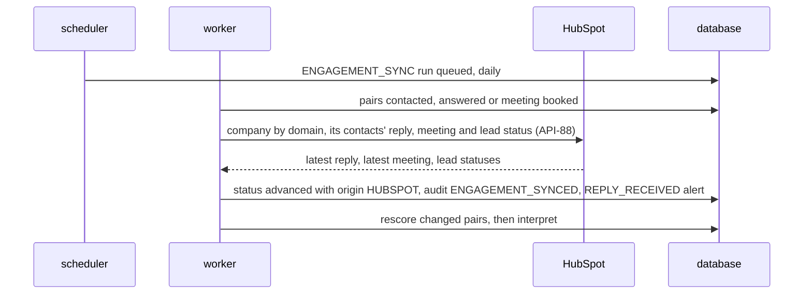

# Outreach, engagement and CRM

## Purpose

Once a lead is worth contacting, the first message should reference what the company actually said. The Outreach composer drafts an email or InMail from the account's strongest in-force signals, the service's value proposition and what Orange Systems has delivered, cites the signals and facts it uses, and leaves sending to the person: LeadRadar never contacts anyone. The team then records how far it got with the company — contacted, answered, meeting booked or rejected — and, when it works in HubSpot, the status follows the company's replies and meetings there on its own. One action pushes the account to HubSpot with its Priority, band and top signals.

## Flows

### FL-17 Draft outreach

```mermaid
sequenceDiagram
  actor Sales
  participant Web as Outreach composer
  participant API as api
  participant L as OpenRouter LLM
  Sales->>Web: choose channel and, optionally, a contact
  Web->>API: generate (API-56)
  API->>API: budget guard; select top signals and Orange Systems facts of the service
  API->>L: draft outreach with signals, value proposition, facts, contact
  L-->>API: subject, body, cited signal and fact ids
  API->>API: validate citations, numbers, length, no invented contact data
  API-->>Web: draft stored as DRAFT
  Sales->>Web: edit, then Copy or Download
  Web->>API: update (API-58): status EXPORTED
  Sales->>Web: Mark as contacted
  Web->>API: engagement (API-85): CONTACTED
```

### FL-25 Record an engagement status

1. After sending a message from their own mailbox, Sales sets the account's engagement status for the service to Contacted — from the composer after an export, or from the header of [Account detail](/features/prospect-dashboard.md#account-detail) (`API-85`).
2. As the company answers, books a meeting or declines, Sales or an Admin moves the status on; each change is kept with who set it and when (`API-86`).
3. Rejected takes the account out of the service's ranking after its rescore, listed under Rejected; a later status returns it.
4. [Prospects](/features/prospect-dashboard.md#prospects) filters by status and shows the service's statistics (`API-87`).

### FL-26 Sync engagement from HubSpot



Without a HubSpot token no sync runs and statuses are set by people only ([Engagement sync](/architecture/rules.md#engagement-sync)).

### FL-18 Push to HubSpot

1. Sales opens the [HubSpot push dialog](#hubspot-push-dialog) from [Account detail](/features/prospect-dashboard.md#account-detail).
2. The dialog shows what will be written: domain, name, service, Priority, band, standing, top signals and a link back.
3. Push (`API-59`) finds the company by domain in HubSpot, updates or creates it, and records the outcome; without a configured token the dialog says HubSpot is not connected.

## Reading order

1. Terms in the [glossary](/requirements/glossary.md): Outreach draft, Value proposition, Provider fact, Finding, Contact, Persona, Budget guard, Engagement status, Engagement statistics, Daily cycle.
2. Requirement rows: `S-OUT-01`, `S-OUT-02`, `S-ENG-01` to `S-ENG-03` in [system requirements](/requirements/system.md); `B-25`, `B-26`, `B-43` to `B-45`, `RULE-02`, `RULE-06`, `RULE-07`, `RULE-10` in [business requirements](/requirements/business.md).
3. Stores: [`outreach_draft`](/architecture/sql-store.md#outreach_draft), [`engagement_status`](/architecture/sql-store.md#engagement_status), [`crm_sync`](/architecture/sql-store.md#crm_sync), [`finding`](/architecture/sql-store.md#finding), [`provider_fact`](/architecture/sql-store.md#provider_fact), [`contact`](/architecture/sql-store.md#contact), [`service`](/architecture/sql-store.md#service).
4. Rules: [Outreach grounding](/architecture/rules.md#outreach-grounding), [Budget guard](/architecture/rules.md#budget-guard), [Engagement statistics](/architecture/rules.md#engagement-statistics), [Engagement sync](/architecture/rules.md#engagement-sync), [Scheduling](/architecture/rules.md#scheduling), [Priority, standing and band](/architecture/rules.md#priority-standing-and-band).
5. Interfaces: [Outreach and CRM](/architecture/interfaces.md#outreach-and-crm) (`API-56` to `API-59`), [Engagement](/architecture/interfaces.md#engagement) (`API-85` to `API-87`), [Provider facts](/architecture/interfaces.md#provider-facts) (`API-78`), [LLM](/architecture/interfaces.md#llm) (`API-66`), [CRM](/architecture/interfaces.md#crm) (`API-70`, `API-88`).
6. Services: the [api](/architecture/services/api.md) (`OUTREACH_MAX_FINDINGS`, `OUTREACH_EMAIL_MAX_CHARS`, `OUTREACH_INMAIL_MAX_CHARS`, `HUBSPOT_ACCESS_TOKEN`, `APP_BASE_URL` in its [runtime](/architecture/services/api.md#runtime)); the [worker](/architecture/services/worker.md) (`PROVIDER_FACTS_PER_CALL`, `ENGAGEMENT_SYNC_INTERVAL_HOURS`, `HUBSPOT_REJECTED_LEAD_STATUSES` in its [runtime](/architecture/services/worker.md#runtime)); the [AI gateway](/architecture/services/worker.md#ai-gateway); the [frontend](/architecture/services/frontend.md) shell; [AI roles and boundaries](/architecture/overview.md#ai-roles-and-boundaries) and [Degradation](/architecture/overview.md#degradation).
7. Decisions: [ADR-03](/architecture/adrs/adr-03-models-answer-rules-score.md), [ADR-10](/architecture/adrs/adr-10-minimal-contact-data.md), [ADR-15](/architecture/adrs/adr-15-openrouter-as-the-llm-provider.md), [ADR-23](/architecture/adrs/adr-23-engagement-status-synced-from-hubspot.md), [ADR-24](/architecture/adrs/adr-24-daily-cycle.md).
8. Screens: [Outreach composer](#outreach-composer), [HubSpot push dialog](#hubspot-push-dialog); the engagement status control of [Account detail](/features/prospect-dashboard.md#account-detail) and the statistics of [Prospects](/features/prospect-dashboard.md#prospects).
9. Acceptance rows in [acceptance criteria](/requirements/acceptance.md): `AC-27`, `AC-50`, `AC-51`, `AC-62`, `AC-70`, `AC-82`, `AC-83`, `AC-84`, `AC-85`, `AC-86`.

## Outreach composer

Route `/accounts/:id/outreach`, with the service from the selector. Any signed-in user. It is the Outreach tab of [Account detail](/features/prospect-dashboard.md#account-detail).

**Layout**

```text
┌──────────────────────────────────────────────────────────────────────────────┐
│ DHL Group · Intelligent Automation                                           │
├───────────────────────────────┬──────────────────────────────────────────────┤
│ Signals the draft can use     │ Channel (•) Email ( ) LinkedIn InMail        │
│ 1 AI and automation projects  │ To      [ J. Example — CIO ▾ ]  (optional)   │
│   "DHL setzt in über 1.000 …" │                               [ Generate ]   │
│ 2 Cost programme              │ Subject [ Automating the next 1,000 processes ] │
│   "Fit for Growth senkt …"    │ Body    [ Dear J. Example, your announcement …] │
│ Orange Systems facts          │ Uses signals: 1, 2 · facts: A                │
│ A 750+ processes automated    │ Nothing is sent from LeadRadar.              │
│ B UiPath Platinum Partner     │           [ Mark as contacted ]              │
│ Earlier drafts                │                                              │
│ Email · 2 days ago · exported │          [ Copy ]  [ Download .txt ] [ Save ] │
└───────────────────────────────┴──────────────────────────────────────────────┘
```

WF-19 — Outreach composer

**Behaviour**

| ID | Requirement |
|---|---|
| `FR-086` | The left panel shall list the account's counted positive signals for the service, most points first, and mark the ones a generated draft cites; below them, the account's earlier drafts for the service with channel, age and status. |
| `FR-087` | Generate shall take the channel and an optional contact of the account, and show the subject (email only), the body and which signals it cites. |
| `FR-088` | The subject and body shall be editable and saved with Save; the screen shall state that nothing is sent from LeadRadar. |
| `FR-089` | Copy and Download .txt shall export the draft and mark it exported. |
| `FR-090` | When the account has no in-force positive signal for the service, Generate shall be disabled with the reason. |
| `FR-168` | Below the signals, the left panel shall list the Orange Systems facts the draft can use for the service, and mark the ones a generated draft cites. |
| `FR-169` | After Copy or Download, the composer shall offer Mark as contacted, which sets the account's engagement status for the service to Contacted unless a later status is in force. |

Obligations: `S-OUT-01`, `S-ENG-01`.

**Data**: `API-25`, `API-42`, `API-56`, `API-57`, `API-58`, `API-78`, `API-85`. **States**: [States](/architecture/services/frontend.md#states); `429` and `503` show the unavailable state and keep the edited text.

## HubSpot push dialog

Opened from the Push to HubSpot button of [Account detail](/features/prospect-dashboard.md#account-detail). Any signed-in user. No route of its own.

**Layout**

```text
┌ Push to HubSpot ─────────────────────────────────────────────────────────────┐
│ Company   DHL Group · dhl.com                                                │
│ Service   Intelligent Automation   Priority 78 · Hot · Ranked                │
│ Signals   AI and automation projects — "DHL setzt in über 1.000 …"           │
│ Link      https://leadradar.example/accounts/…                               │
│ Last push: 3 days ago · succeeded                    [ Cancel ]  [ Push ]    │
└──────────────────────────────────────────────────────────────────────────────┘
```

WF-20 — HubSpot push dialog

**Behaviour**

| ID | Requirement |
|---|---|
| `FR-091` | The dialog shall show the values that will be written, the last push of the account for the service with its outcome, and push on confirmation. |
| `FR-092` | A `NOT_CONFIGURED` answer shall show that HubSpot is not connected and that an Admin must set it up; a failure shall show HubSpot's message. |

Obligations: `S-OUT-02`.

**Data**: `API-40`, `API-59`. **States**: [States](/architecture/services/frontend.md#states).

## Open questions

- The HubSpot custom properties `leadradar_*` must exist in the target portal; whether the setup creates them or an Admin does. Missing: access to the portal. Decides: the HubSpot administrator.
- Whether the sales team marks declined leads in HubSpot with the lead status `UNQUALIFIED`, as `HUBSPOT_REJECTED_LEAD_STATUSES` assumes, or with another value. Missing: the team's HubSpot conventions. Decides: the sales team lead.
