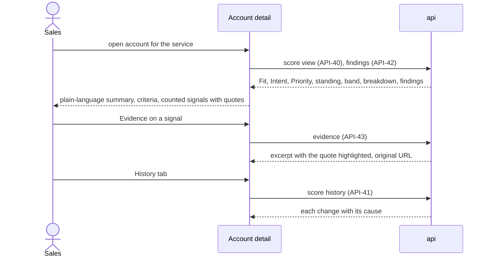

# Prospect dashboard

## Purpose

This is where a sales manager spends the day. Prospects ranks a service's accounts by Priority and shows, in one line each, why they are there. Account detail answers "why this lead, and why now?" in plain language: which ICP criteria it meets, which signals count and how much, which count against it, and what excludes it, with every signal quoted from its source and one click away from the original page. History shows what changed and why. Alerts bring forward accounts whose band rose or that produced a strong new signal.

## Flows

### FL-11 Work the prospect list

1. Sales opens [Prospects](#prospects) for the selected service.
2. The list shows ranked accounts by Priority with their band, Fit, Intent and top signals; filters narrow it by band, country and industry, and a status filter shows accounts below fit, excluded or marked as customers with their reason.
3. Sales selects a row to read the account's strongest signals in a drawer, and opens its [Account detail](#account-detail) for the full explanation.

### FL-12 Explain a lead



### FL-13 Override a disqualifier

1. An Admin opens an excluded account's [Account detail](#account-detail); the Why tab names the matched disqualifier and the fact or signal that matched it.
2. The Admin adds an exception with a note (`API-44`); a `RESCORE` run recomputes the score and the account returns to the ranking if nothing else excludes it.
3. Revoking the exception (`API-45`) excludes it again. Both are audited.

### FL-14 Act on an alert

1. The navigation shows the number of unread alerts of the selected service.
2. Sales opens [Alerts](#alerts), reads what happened — a band rise or a strong new signal with its quote — and opens the account.
3. Sales acknowledges the alert; the team sees it as read.

## Reading order

1. Terms in the [glossary](/requirements/glossary.md): Prospect, Fit score, Intent score, Priority score, Standing, Band, Score breakdown, Finding, Strength, Confidence, Evidence quote, Disqualifier, Disqualifier override, Negative signal, Recency decay, Alert.
2. Requirement rows: `S-PRO-01` to `S-PRO-06`, `S-SCO-04` to `S-SCO-06`, `S-PIP-01`, `S-SIG-09` in [system requirements](/requirements/system.md); `N-01`, `N-10`, `N-13`; `B-14`, `B-16` to `B-23`, `RULE-02`, `RULE-10` in [business requirements](/requirements/business.md).
3. Stores: [`account_score`](/architecture/sql-store.md#account_score), [`finding`](/architecture/sql-store.md#finding), [`document`](/architecture/sql-store.md#document), [`chunk`](/architecture/sql-store.md#chunk), [`disqualifier_override`](/architecture/sql-store.md#disqualifier_override), [`alert`](/architecture/sql-store.md#alert), [`lead_feedback`](/architecture/sql-store.md#lead_feedback), [`finding_feedback`](/architecture/sql-store.md#finding_feedback), [`pipeline_run`](/architecture/sql-store.md#pipeline_run).
4. Rules: [Score breakdown](/architecture/rules.md#score-breakdown), [Fit score](/architecture/rules.md#fit-score), [Intent score](/architecture/rules.md#intent-score), [Recency decay](/architecture/rules.md#recency-decay), [Disqualification](/architecture/rules.md#disqualification), [Priority, standing and band](/architecture/rules.md#priority-standing-and-band), [Alerts](/architecture/rules.md#alerts), [Rescoring](/architecture/rules.md#rescoring).
5. Interfaces: [Prospects and evidence](/architecture/interfaces.md#prospects-and-evidence) (`API-39` to `API-45`), [Feedback and alerts](/architecture/interfaces.md#feedback-and-alerts) (`API-46` to `API-49`), `API-33` and `API-35` of [Runs and source plug-ins](/architecture/interfaces.md#runs-and-source-plug-ins).
6. Services: the [api](/architecture/services/api.md) with `EVIDENCE_CONTEXT_CHARS` and `INTERACTIVE_P95_TARGET_MS` in its [runtime](/architecture/services/api.md#runtime); the [frontend](/architecture/services/frontend.md) — [screen labels](/architecture/services/frontend.md#screen-labels), [Formatting](/architecture/services/frontend.md#formatting), [Polling](/architecture/services/frontend.md#polling), [Accessibility](/architecture/services/frontend.md#accessibility); [Degradation](/architecture/overview.md#degradation) for what these screens still show when a dependency is down.
7. Decisions: [ADR-03](/architecture/adrs/adr-03-models-answer-rules-score.md), [ADR-06](/architecture/adrs/adr-06-rule-based-scoring-with-versioned-settings.md), [ADR-13](/architecture/adrs/adr-13-run-progress-by-polling.md).
8. Screens: [Prospects](#prospects), [Account detail](#account-detail), [Alerts](#alerts); the Profile tab is [Account profile](/features/accounts-and-discovery.md#account-profile), the Outreach tab is [Outreach composer](/features/outreach-and-crm.md#outreach-composer).
9. Acceptance rows in [acceptance criteria](/requirements/acceptance.md): `AC-24`, `AC-28`, `AC-36` to `AC-38`, `AC-41` to `AC-45`, `AC-60`, `AC-65`, `AC-68`.

## Prospects

Route `/prospects`. Any signed-in user; shows the selected service.

**Layout**

```text
┌──────────────────────────────────────────────────────────────────────────────┐
│ Prospects · Intelligent Automation                                          │
│ Status [Ranked ▾]  Band [All 6][Hot 1][Warm 2][Cold 3]  Country ▾  Industry ▾  [ search ] │
├───┬───────────────────┬───────┬──────────┬─────┬────────┬────────────────────┤
│ # │ Account           │ Band  │ Priority │ Fit │ Intent │ Top signals        │
├───┼───────────────────┼───────┼──────────┼─────┼────────┼────────────────────┤
│ 1 │ DHL Group  ● 1    │ ▲ Hot │ 78       │ 88  │ 72     │ AI projects · Strong · 3 wk │
│   │ Germany · Logistics│      │          │     │        │ Cost programme · Clear · 2 mo │
│ 2 │ Lufthansa Group   │ ■ Warm│ 58       │ 88  │ 38     │ Cost programme · Strong · 6 wk │
└───┴───────────────────┴───────┴──────────┴─────┴────────┴────────────────────┘
```

WF-12 — Prospects

```text
┌────────────────────────────────────────────────┬──────────────────────────────┐
│ # Account         Band  Priority Fit Intent    │ DHL Group             [Hot]  │
│ 1 DHL Group       Hot   78       88  72        │ Priority 78                  │
│   selected row, top two signals shown          │ Fit 88, how well it matches  │
│ 2 Lufthansa Group Warm  58       88  38        │ Intent 72, recent signals    │
│ 3 Kuehne+Nagel    Warm  53       81  35        │ Strongest signals            │
│                                                │ + AI projects, Strong, 3 wk  │
│ Hot: Priority 70 or more. Warm: 40 to 69.      │ + Cost programme, Clear      │
│ Cold: below 40.                                │ [ Open full explanation ] [x]│
└────────────────────────────────────────────────┴──────────────────────────────┘
```

WF-25 — Prospects, account drawer

**Behaviour**

| ID | Requirement |
|---|---|
| `FR-062` | The list shall show, for the selected service, rank, account name with country and industry, band with a shape as well as a colour, Priority, Fit, Intent, its top signals, at most `PROSPECT_TOP_SIGNALS`, with strength label and age, the in-force signal count, the last refresh and an unread-alert marker. |
| `FR-063` | The default view shall be ranked accounts in ranking order; filters shall narrow by band, country and industry, and search by name; sorting by Intent, Fit, name or last refresh shall be available. |
| `FR-064` | The status filter shall also show accounts below fit, excluded or marked as customers, each with its reason in one line — the minimum fit, the disqualifier's label, or who marked it a customer — and without a rank or band. |
| `FR-065` | When the service has no scores yet, the empty state shall explain that accounts appear after their first refresh and link to [Accounts](/features/accounts-and-discovery.md#accounts). |
| `FR-129` | The band filter shall show the number of ranked accounts in each band beside its label, with All first, and a legend under the list shall explain Hot, Warm and Cold, reading their thresholds as [FR-117](/architecture/services/frontend.md#score-presentation) states. |
| `FR-130` | Selecting a row shall open a drawer over the right side of the list, without moving the rows, showing the account's name and band, Priority, Fit and Intent each with its meaning in words, its top signals from the list row with strength and age, and Open full explanation to [Account detail](#account-detail); Escape or a close button shall dismiss it and return focus to the row. |

Obligations: `S-PRO-01`, `S-SCO-05`, `N-01`, `N-10`, `N-13`.

**Data**: `API-39`, `API-71`. **States**: [States](/architecture/services/frontend.md#states).

## Account detail

Route `/accounts/:id`, with the service from the selector. Any signed-in user; exceptions are Admin only. Tabs: Why, Signals, History, Profile ([Account profile](/features/accounts-and-discovery.md#account-profile)) and Outreach ([Outreach composer](/features/outreach-and-crm.md#outreach-composer)).

**Layout**

```text
┌──────────────────────────────────────────────────────────────────────────────┐
│ DHL Group · dhl.com ↗ · Germany · Logistics            ▲ Hot  Priority 78     │
│ Fit 88 · Intent 72 · scored 2 h ago with scoring v3     [ Refresh now ]       │
│ Is this a good lead?  [ Relevant ] [ Not relevant ] [ Already a customer ]    │
│ [Why] [Signals] [History] [Profile] [Outreach]            [ Push to HubSpot ] │
├──────────────────────────────────────────────────────────────────────────────┤
│ In short: strong fit (sector, region, size). Strongest signals: AI and        │
│ automation projects (strong, 3 weeks ago) and a cost programme (clear,        │
│ 2 months ago). Holding back: an in-house automation centre (clear).           │
├──────────────────────────────────────────────────────────────────────────────┤
│ Fit 88       ✓ Sector  Logistics                        High     +37.5        │
│              ✓ Region  Germany                          Medium   +25.0        │
│              ? Size    unknown                          Medium   +12.5        │
│ Intent 72    + AI and automation projects   Strong · 3 wk · group.dhl.com  +53.0 │
│                "DHL setzt in über 1.000 Prozessen KI-Agenten ein…"             │
│                EN: "DHL uses AI agents in more than 1,000 processes…" [Evidence] │
│              − In-house automation capability  Clear · 5 mo · dhl.com   −20.7 │
│ Exclusions   none matched                                                     │
└──────────────────────────────────────────────────────────────────────────────┘
```

WF-13 — Account detail, Why tab

```text
┌ Signals ─── Question ▾  Status [Counting ▾] ─────────────────────────────────┐
│ AI and automation projects · Strong · High confidence · Quick check          │
│ "DHL setzt in über 1.000 Prozessen KI-Agenten ein…"  EN: "DHL uses AI …"     │
│ group.dhl.com · Press release · 3 weeks ago       [Evidence] [✓ Correct] [✗ Wrong] │
├ Evidence ────────────────────────────────────────────────────────────────────┤
│ …im Rahmen der Strategie 2030 ▐DHL setzt in über 1.000 Prozessen KI-Agenten  │
│ ein▌ und kombiniert eigene Entwicklungen mit Lösungen von Partnern…          │
│ Open original ↗                                                              │
└──────────────────────────────────────────────────────────────────────────────┘
```

WF-14 — Account detail, Signals tab with evidence

```text
┌ History ─────────────────────────────────────────────────────────────────────┐
│ 2 h ago   Refresh            Warm 61 → Hot 78   + AI and automation projects │
│ 3 days ago Scoring v3 "Hiring counts less"  Hot 72 → Warm 61                 │
│ 2 weeks ago Exception added by Admin: "Outside the target region" no longer applies │
└──────────────────────────────────────────────────────────────────────────────┘
```

WF-15 — Account detail, History tab

**Behaviour**

| ID | Requirement |
|---|---|
| `FR-066` | The header shall show name, domain linking to the website, country, industry, parent account as a link — a parent's view never combines its subsidiaries' signals — standing and band, Priority, Fit and Intent, when it was scored and with which scoring version. |
| `FR-067` | Refresh now shall request a refresh and show the run's stage and counters in the header until it finishes, then reload the score; a refresh already running shall be shown instead of starting another. |
| `FR-068` | The lead verdict buttons shall record Relevant, Not relevant or Already a customer with an optional note and show the verdict in force with who gave it and when. |
| `FR-069` | The Why tab shall open with an "In short" paragraph composed from the breakdown only: the matched, unknown and unmatched criteria by label; the two counted positive signals with the most points, with strength label and age; the counted negative signals; and, when not ranked, the reason — below the minimum fit, the matched disqualifier's label, or marked as a customer. |
| `FR-070` | The Fit section shall list every criterion with match mark (matched, unknown, not matched), the account's value, weight level and points; the Intent section shall list every question that counts with its counted signal's strength, the matched option for a choice question, age, source domain, quote, English translation and points, positive and negative separately, and the number of other signals for the same question. |
| `FR-071` | The Exclusions section shall list every matched disqualifier with its label and the fact or signal that matched; an Admin shall be able to add an exception with a required note, or revoke one, with confirmation. |
| `FR-072` | The Signals tab shall list the account's signals for the service, filtered by question and by status (Counting, Marked wrong, Outdated question), each with question, strength label, the matched option for a choice question, confidence word, Quick check or Detailed check, quote, translation, source and age. |
| `FR-073` | Correct and Wrong on a signal shall record the verdict with an optional note, show it on the signal, and say that the score will be updated. |
| `FR-074` | Evidence shall open the passage with its section path, surrounding text and the quote highlighted, and a link to the original page, credited to the GDELT Project with a link to it when GDELT found the document ([ADR-19](/architecture/adrs/adr-19-source-provider-terms-and-limits.md)); for a purged document it shall show the quote, the link and a sentence that the full text is no longer stored. |
| `FR-075` | The History tab shall list score changes newest first, each with when, the cause in words (refresh, scoring version with its change note, feedback, exception, account change, question change), the Priority and band before and after, the signals added and removed, and the exceptions changed. |
| `FR-131` | Each counted signal on the Why tab shall offer Read the evidence, which opens the Signals tab on that signal with its evidence open. |
| `FR-132` | The running state of [FR-067](#account-detail) shall be a callout below the header that lists the run's stages with done, current and pending marks and the current stage's counter, while the Refresh now button reads Refreshing. |
| `FR-133` | The lead verdict shall be a segmented control; the note beside it shall say who recorded the verdict and when, and Already a customer shall say that the account leaves the ranking for this service. |
| `FR-134` | Each History row shall carry an icon for its cause and, when the band changed, a chip for the band before and after. |

Obligations: `S-PRO-02`, `S-PRO-03`, `S-PRO-04`, `S-PRO-05`, `S-PIP-01`, `S-SCO-04`, `S-SCO-06`, `S-SIG-09`, `S-EVL-01`, `S-EVL-02`, `N-13`.

**Data**: `API-23`, `API-33`, `API-35`, `API-40` to `API-47`, `API-71`. **States**: [States](/architecture/services/frontend.md#states); an account never scored for the service shows its profile and Refresh now.

## Alerts

Route `/alerts`. Any signed-in user; shows the selected service.

**Layout**

```text
┌──────────────────────────────────────────────────────────────────────────────┐
│ Alerts · Intelligent Automation            (•) Unread  ( ) All               │
├──────────────────────────────────────────────────────────────────────────────┤
│ ● DHL Group — strong new signal: AI and automation projects · 2 h ago        │
│   "DHL setzt in über 1.000 Prozessen KI-Agenten ein…"   [ Open ] [ Mark read ]│
│ ● Kuehne+Nagel — moved up: Warm → Hot · yesterday       [ Open ] [ Mark read ]│
└──────────────────────────────────────────────────────────────────────────────┘
```

WF-16 — Alerts

**Behaviour**

| ID | Requirement |
|---|---|
| `FR-076` | The screen shall list the selected service's alerts newest first, unread by default, each saying what happened in words — a strong new signal with its question and quote, or a band rise with the bands before and after — and when. |
| `FR-077` | Open shall go to the account's [Account detail](#account-detail); Mark read shall acknowledge the alert for the whole team and show who read it. |
| `FR-135` | Alerts shall offer a segmented control for Unread and All, showing the number of unread alerts, and when no alert is unread the empty state shall say that the user is all caught up and when new alerts appear. |
| `FR-136` | An unread alert shall carry an accent edge; a read alert shall be dimmed and say who read it and when. |

Obligations: `S-PRO-06`.

**Data**: `API-48`, `API-49`. **States**: [States](/architecture/services/frontend.md#states).

