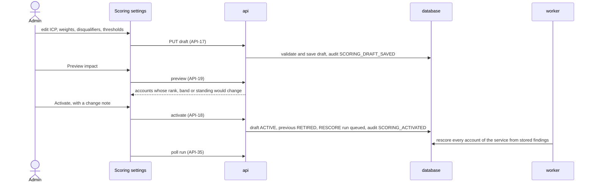

# Service configuration

## Purpose

Everything LeadRadar looks for and how it weighs it is data an Admin edits: which services exist, what questions reveal a need for each, which companies fit, how strongly each signal counts, which facts exclude an account, and where the Hot, Warm and Cold lines are. Questions drive classification, so changing one reclassifies stored passages for that question only. Scoring settings are versioned: a change is prepared as a draft, previewed, and activated with a note, after which every score of the service is recomputed from stored findings without fetching anything.

## Flows

### FL-01 Define a service and its signal questions

1. The Admin opens [Services](#services) and creates a service with its code, name, description and value proposition (`API-08`). The service gets a scoring draft with the default settings.
2. In the [Service editor](#service-editor) the Admin adds signal questions (`API-12`). Each new question joins the draft at weight `MEDIUM` and a `RECLASSIFY` run asks it of every stored passage of the service's accounts; its signals count in scores once the Admin activates a scoring version that includes it ([FL-02](#fl-02-edit-and-activate-scoring-settings)).
3. Editing a question's text, answer type, options or source types increments its revision and reclassifies it; editing only its hint terms does not (`API-13`).
4. Deactivating a question removes it from the draft; its findings stop counting once a version without it is activated.

### FL-02 Edit and activate scoring settings



### FL-03 Try a question

1. In the [Service editor](#service-editor) the Admin writes or selects a question and opens Try it.
2. The Admin pastes a text or picks an account and runs the preview (`API-14`).
3. The panel shows, for up to `PREVIEW_MAX_PASSAGES` passages, the answer strength, the confidence word, whether a detailed check was needed, and the quote with its translation. Nothing is stored.

### FL-22 Maintain industries and markets

1. The Admin opens [Industries and markets](#industries-and-markets) and adds an industry with its code and label (`API-72`), or a market with its code, name and countries (`API-75`).
2. The new industry is offered wherever an account's industry is set and in the ICP editor; the new market is offered as a shortcut in the ICP editor, where choosing it adds its countries to a `GEOGRAPHY` criterion.
3. Renaming changes only the label. Retiring an industry or market removes it from pickers and validation; accounts that have a retired industry keep it, and saved scoring versions are unchanged (`API-73`, `API-76`); the next draft drops a retired industry before it is saved.

## Reading order

1. Terms in the [glossary](/requirements/glossary.md): Service, Signal question, Question revision, Answer type, Polarity, Source type, Scoring settings, Scoring version, ICP criterion, Industry, Market, Weight level, Half-life, Disqualifier, Fit score, Intent score, Priority score, Band.
2. Requirement rows: `S-CFG-01` to `S-CFG-07`, `S-SIG-07`, `S-SCO-07`, `S-RUN-03` in [system requirements](/requirements/system.md); `B-01` to `B-06`, `B-39`, `RULE-04`, `RULE-05` in [business requirements](/requirements/business.md).
3. Stores: [`service`](/architecture/sql-store.md#service), [`signal_question`](/architecture/sql-store.md#signal_question), [`scoring_config`](/architecture/sql-store.md#scoring_config), [`industry`](/architecture/sql-store.md#industry), [`market`](/architecture/sql-store.md#market) and the [scoring settings document](/architecture/sql-store.md#scoring-settings-document).
4. Rules: [Scoring settings validation](/architecture/rules.md#scoring-settings-validation), [Reclassification](/architecture/rules.md#reclassification), [Rescoring](/architecture/rules.md#rescoring), and for preview [Signal classification](/architecture/rules.md#signal-classification), [Escalation](/architecture/rules.md#escalation), [Evidence extraction](/architecture/rules.md#evidence-extraction), [Fit score](/architecture/rules.md#fit-score), [Intent score](/architecture/rules.md#intent-score), [Priority, standing and band](/architecture/rules.md#priority-standing-and-band).
5. Interfaces: [Services and questions](/architecture/interfaces.md#services-and-questions) (`API-07` to `API-14`), [Scoring](/architecture/interfaces.md#scoring) (`API-15` to `API-19`) and [Industries and markets](/architecture/interfaces.md#industries-and-markets) (`API-71` to `API-76`).
6. Services: the [api](/architecture/services/api.md) and its [runtime](/architecture/services/api.md#runtime) (`PREVIEW_MAX_PASSAGES`); the [worker](/architecture/services/worker.md) for the runs; the [frontend](/architecture/services/frontend.md) shell; the seeded services of the [demo dataset](/architecture/overview.md#demo-dataset).
7. Decisions: [ADR-06](/architecture/adrs/adr-06-rule-based-scoring-with-versioned-settings.md), [ADR-09](/architecture/adrs/adr-09-findings-per-passage-and-question-revision.md), [ADR-03](/architecture/adrs/adr-03-models-answer-rules-score.md), [ADR-18](/architecture/adrs/adr-18-industries-and-markets-as-configuration.md).
8. Screens: [Services](#services), [Service editor](#service-editor), [Scoring settings](#scoring-settings), [Industries and markets](#industries-and-markets).
9. Acceptance rows in [acceptance criteria](/requirements/acceptance.md): `AC-01` to `AC-08`, `AC-26`, `AC-27`, `AC-39`, `AC-70`, `AC-59`, `AC-62`, `AC-66`, `AC-74`.

## Services

Route `/services`. Admin only.

**Layout**

```text
┌──────────────────────────────────────────────────────────────────────────────┐
│ Services                                                     [ New service ] │
├──────────────────────────────┬────────────────────────┬────────┬──────┬──────┤
│ Name                         │ Code                   │ Status │ Scoring │ Q │
├──────────────────────────────┼────────────────────────┼────────┼──────┼──────┤
│ Intelligent Automation       │ INTELLIGENT_AUTOMATION │ Active │ v3 (draft v4) │ 9 │
│ Cybersecurity services       │ CYBERSECURITY          │ Active │ v1   │ 7    │
└──────────────────────────────┴────────────────────────┴────────┴──────┴──────┘
```

WF-02 — Services

**Behaviour**

| ID | Requirement |
|---|---|
| `FR-018` | The screen shall list every service with name, code, status, active scoring version with any draft version, and active question count; a row opens the [Service editor](#service-editor). |
| `FR-019` | New service shall open a dialog with code, name, description and value proposition; the code field shall accept UPPER_SNAKE only and explain that it cannot be changed later. |
| `FR-020` | A row menu shall offer Deactivate or Reactivate; deactivation shall confirm that the service will stop being refreshed, scored and listed, and that its data is kept. |
| `FR-149` | Each row shall show the service's description, its status, its active scoring version with any draft as chips and its active question count, with links to its Signal questions and its Scoring. |

Obligations: `S-CFG-01`.

**Data**: `API-07`, `API-08`, `API-10`. **States**: [States](/architecture/services/frontend.md#states).

## Service editor

Route `/services/:id`. Admin only. Tabs: Overview, Signal questions, and Scoring, which opens [Scoring settings](#scoring-settings).

**Layout**

```text
┌───────────────────────────────────────────────────────────────────────────────────────┐
│ Intelligent Automation            [Overview] [Signal questions] [Scoring]             │
├────────────────────────────────────────┬──────────────────────────────────────────────┤
│ Signal questions       [ Add question ]│ COST_PROGRAM                    Revision 2   │
│ [+] COST_PROGRAM         Yes/no    14  │ Question [ Does the company announce…    ]   │
│ [+] AUTOMATION_HIRING    Yes/no     6  │ Answer   (•) Yes/no ( ) Scale ( ) Choice     │
│ [-] IN_HOUSE_AUTOMATION  Scale      3  │ Polarity Positive (fixed)                    │
│                                        │ Sources  [x] News [x] Company publication    │
│                                        │ Hints    [ cost reduction ][ + ]             │
│                                        │ ! Changing the question re-checks data       │
│                                        │          [ Try it ] [ Cancel ] [ Save ]      │
│                                        │ Try it: Strong · High confidence             │
│                                        │   "Mit dem Programm Fit for Growth…"         │
└────────────────────────────────────────┴──────────────────────────────────────────────┘
```

WF-03 — Service editor, signal questions

```text
┌ Try it ──────────────────────────────────────────────────────────────────────┐
│ ( ) Paste text  (•) Account [ DHL Group ▾ ]                        [ Run ]   │
│ 1  Strong · High confidence · Detailed check: no                            │
│    "Mit dem Programm Fit for Growth senkt der Konzern bis 2026 die Kosten…" │
│    EN: "With the Fit for Growth programme the group cuts costs by 2026…"    │
│    Annual report 2025 · dhl.com · 2 months ago                              │
│ 2  No signal · High confidence                                              │
└──────────────────────────────────────────────────────────────────────────────┘
```

WF-04 — Try it panel

**Behaviour**

| ID | Requirement |
|---|---|
| `FR-021` | The Overview tab shall edit name, description and value proposition, and show the code read-only. |
| `FR-022` | The Signal questions tab shall list the service's questions with key, text, answer type, polarity, source types, status and in-force signal count, active first. |
| `FR-023` | Add question and Edit shall use one form: key (on creation only, UPPER_SNAKE), question text, answer type, options for Choice (key, label and strength per option, at least one option with strength None), polarity (on creation only), source types (at least one) and hint terms. |
| `FR-024` | The form shall warn, before Save, when the change will increment the revision and re-check stored data, and shall say that hint terms only steer searching. |
| `FR-025` | Saving shall show the new revision and a link to the `RECLASSIFY` run on [Runs](/features/signal-pipeline.md#runs) when one was queued. |
| `FR-026` | Deactivate and Reactivate shall be row actions with confirmation; deactivation shall say the question's signals stop counting once scoring without it is activated. |
| `FR-027` | Try it shall run the form's current, possibly unsaved, question against pasted text or a chosen account and show each result's strength label, confidence word, whether a detailed check was needed, the quote, its English translation and the source; it shall state that nothing is saved. |
| `FR-150` | The Signal questions tab shall be two panes: the list at the left with polarity mark, key, one line of text, answer type and in-force signal count, and at the right the form of the selected question with Try it below it. |

Obligations: `S-CFG-02`, `S-CFG-05`, `S-SIG-07`.

**Data**: `API-09`, `API-10`, `API-11`, `API-12`, `API-13`, `API-14`, `API-35`. **States**: [States](/architecture/services/frontend.md#states); Try it shows the unavailable state on `503` and `429`.

## Scoring settings

Route `/services/:id/scoring`. Admin only; Sales sees the effect of the active version on each account in the Why tab of [Account detail](/features/prospect-dashboard.md#account-detail), not here.

**Layout**

```text
┌────────────────────────────────────────────────────────────┬────────────────────────────────┐
│ Intelligent Automation · Scoring  v3 active, draft v4      │ Impact of this draft           │
│ Balance    Fit share [30][40][50][60]  Intent 60 %         │ DHL Group          Hot to Hot  │
│ Lines      Minimum fit [40] Warm from [40] Hot from [70]   │ Kuehne+Nagel      Warm to Hot  │
│ ICP        SECTOR  Industry in Aviation, …   High [edit]   │ 17 accounts unchanged          │
│            REGION  Country in DE, AT, CH, …  Medium [edit] │ Versions                       │
│            SIZE    Employees ≥ 5 000         Medium [edit] │ v3 active, "Hiring counts less"│
│            [ + criterion ]                                 │ v2 retired                     │
│ Signals    COST_PROGRAM         + [High ▾]                 │ v1 retired                     │
│            IN_HOUSE_AUTOMATION  - [Medium ▾]               │                                │
│ Exclusions OUTSIDE_EUROPE  "Outside the target region"     │                                │
│            INSOLVENT       "In insolvency"                 │                                │
│            [ + disqualifier ]                              │                                │
│ > Advanced (weights, half-lives, decay floor, …)           │                                │
│   [ Save draft ] [ Preview impact ] [ Activate… ]          │                                │
└────────────────────────────────────────────────────────────┴────────────────────────────────┘
```

WF-05 — Scoring settings

**Behaviour**

| ID | Requirement |
|---|---|
| `FR-028` | The screen shall edit the service's draft, creating it from the active version on the first change, and show which version is active and whether the draft has unsaved changes. |
| `FR-029` | Balance shall set `fit_weight` with `intent_weight` shown as its complement; Lines shall set `min_fit`, `warm_threshold` and `hot_threshold`. |
| `FR-030` | ICP shall list the criteria and add or edit one with key, kind, the operand the kind takes (active industries from [Industries and markets](#industries-and-markets); countries, with the active markets as shortcuts that expand to their country codes; ranges; complexity levels) and weight level. A criterion that names an industry retired since the active version was saved shall show it marked Retired and say that the draft cannot be saved until it is removed ([Scoring settings validation](/architecture/rules.md#scoring-settings-validation)). |
| `FR-031` | Signals shall list every active question with its polarity, a weight level select and an optional half-life in days whose placeholder shows the source-type defaults. |
| `FR-032` | Exclusions shall list the disqualifiers and add or edit one with key, label, kind and its operand (a criterion, or a question and minimum strength). |
| `FR-033` | Advanced, collapsed by default, shall edit `weight_values`, `strength_values`, `default_half_life_days`, `min_decay`, `negative_factor`, `intent_saturation` and `unknown_match`, each with a one-line explanation. |
| `FR-034` | Save draft shall show every validation error at the control whose JSON pointer it names. |
| `FR-035` | Preview impact shall list the accounts whose rank, band or standing would change, current and proposed side by side, and the count of unchanged accounts. |
| `FR-036` | Activate shall require a change note, confirm that every score of the service will be recomputed from stored signals, and then show the `RESCORE` run's progress. |
| `FR-037` | Versions shall list every version with status, activation date, Admin and change note, and open a read-only view of a retired or active version's settings. |
| `FR-151` | Balance shall offer Fit share as a segmented choice with the Intent share shown as its complement, and Preview impact and Versions shall appear in a panel at the right of the settings; Activate shall open a dialog requiring the change note ([FR-036](#scoring-settings)). |

Obligations: `S-CFG-03`, `S-CFG-04`, `S-CFG-06`, `S-SCO-07`.

**Data**: `API-11`, `API-15`, `API-16`, `API-17`, `API-18`, `API-19`, `API-35`, `API-71`, `API-74`. **States**: [States](/architecture/services/frontend.md#states).

## Industries and markets

Route `/settings/industries-markets`. Admin only.

**Layout**

```text
┌──────────────────────────────────────────────────────────────────────────────┐
│ Industries and markets                                                       │
├──────────────────────────────────────────────────────────────────────────────┤
│ Industries                                                 [ New industry ]  │
│ Code                   Label                              Status   Accounts │
│ LOGISTICS_TRANSPORT    Logistics and transport            Active         4  │
│ SHIPPING               Shipping and ports                 Active         0  │
│ TELECOM_MEDIA          Telecom and media                  Retired        1  │
├──────────────────────────────────────────────────────────────────────────────┤
│ Markets                                                      [ New market ]  │
│ Code      Name        Countries                                    Status   │
│ DACH      DACH        DE, AT, CH                                   Active   │
│ NORDICS   Nordics     DK, SE, NO, FI                               Active   │
└──────────────────────────────────────────────────────────────────────────────┘
```

WF-26 — Industries and markets

**Behaviour**

| ID | Requirement |
|---|---|
| `FR-154` | The screen shall list the industries with code, label, status and the number of accounts that have each, and the markets with code, name, countries and status, active first. |
| `FR-155` | New industry and New market shall open a dialog with a code that accepts UPPER_SNAKE only and says it cannot be changed later, a label or name, and for a market a multi-select of countries by English name. |
| `FR-156` | A row menu shall offer Rename, and Retire or Restore with confirmation; retiring shall say that the entry leaves every picker while accounts and saved scoring versions that use it keep it. |

Obligations: `S-CFG-07`.

**Data**: `API-71` to `API-76`. **States**: [States](/architecture/services/frontend.md#states).
