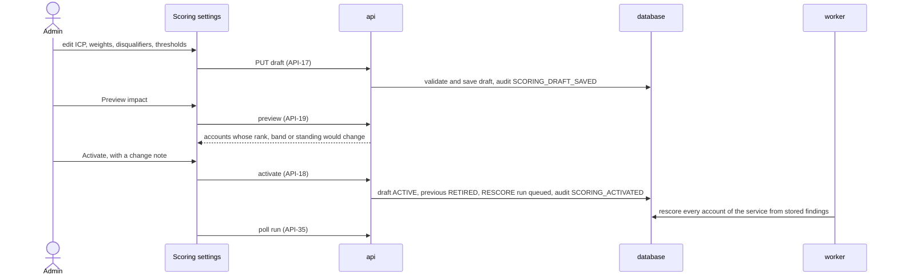

# Service configuration

## Purpose

Everything LeadRadar looks for and how it weighs it is data an Admin edits: which services exist, what questions reveal a need for each, which companies fit, how strongly each signal counts, which facts exclude an account, and where the Hot, Warm and Cold lines are. Questions drive classification, so changing one reclassifies stored passages for that question only. Scoring settings are versioned: a change is prepared as a draft, previewed, and activated with a note, after which every score of the service is recomputed from stored findings without fetching anything.

## Flows

### FL-01 Define a service and its signal questions

1. The Admin opens [Services](#services) and creates a service with its code, name, description and value proposition (`API-08`). The service gets a scoring draft with the default settings.
2. In the [Service editor](#service-editor) the Admin adds signal questions (`API-12`). Each new question joins the draft at weight `MEDIUM` and a `RECLASSIFY` run asks it of every stored passage of the service's accounts.
3. Editing a question's text, answer type, options or source types increments its revision and reclassifies it; editing only its hint terms does not (`API-13`).
4. Deactivating a question removes it from the draft; its findings stop counting once a version without it is activated.

### FL-02 Edit and activate scoring settings



### FL-03 Try a question

1. In the [Service editor](#service-editor) the Admin writes or selects a question and opens Try it.
2. The Admin pastes a text or picks an account and runs the preview (`API-14`).
3. The panel shows, for up to `PREVIEW_MAX_PASSAGES` passages, the answer strength, the confidence word, whether a detailed check was needed, and the quote with its translation. Nothing is stored.

## Reading order

1. Terms in the [glossary](/requirements/glossary.md): Service, Signal question, Question revision, Answer type, Polarity, Source type, Scoring settings, Scoring version, ICP criterion, Weight level, Half-life, Disqualifier, Fit score, Intent score, Priority score, Band.
2. Requirement rows: `S-CFG-01` to `S-CFG-06`, `S-SIG-07`, `S-SCO-07`, `S-RUN-03` in [system requirements](/requirements/system.md); `B-01` to `B-06`, `RULE-04`, `RULE-05` in [business requirements](/requirements/business.md).
3. Stores: [`service`](/architecture/sql-store.md#service), [`signal_question`](/architecture/sql-store.md#signal_question), [`scoring_config`](/architecture/sql-store.md#scoring_config) and the [scoring settings document](/architecture/sql-store.md#scoring-settings-document).
4. Rules: [Scoring settings validation](/architecture/rules.md#scoring-settings-validation), [Reclassification](/architecture/rules.md#reclassification), [Rescoring](/architecture/rules.md#rescoring), and for preview [Signal classification](/architecture/rules.md#signal-classification), [Escalation](/architecture/rules.md#escalation), [Evidence extraction](/architecture/rules.md#evidence-extraction), [Fit score](/architecture/rules.md#fit-score), [Intent score](/architecture/rules.md#intent-score), [Priority, standing and band](/architecture/rules.md#priority-standing-and-band).
5. Interfaces: [Services and questions](/architecture/interfaces.md#services-and-questions) (`API-07` to `API-14`) and [Scoring](/architecture/interfaces.md#scoring) (`API-15` to `API-19`).
6. Services: the [api](/architecture/services/api.md) and its [runtime](/architecture/services/api.md#runtime) (`PREVIEW_MAX_PASSAGES`); the [worker](/architecture/services/worker.md) for the runs; the [frontend](/architecture/services/frontend.md) shell.
7. Decisions: [ADR-06](/architecture/adrs/adr-06-rule-based-scoring-with-versioned-settings.md), [ADR-09](/architecture/adrs/adr-09-findings-per-passage-and-question-revision.md), [ADR-03](/architecture/adrs/adr-03-models-answer-rules-score.md).
8. Screens: [Services](#services), [Service editor](#service-editor), [Scoring settings](#scoring-settings).
9. Acceptance rows in [acceptance criteria](/requirements/acceptance.md): `AC-01` to `AC-08`, `AC-26`, `AC-39`, `AC-59`.

## Services

Route `/services`. Admin only.

**Layout**

```text
┌──────────────────────────────────────────────────────────────────────────────┐
│ Services                                                     [ New service ] │
├──────────────────────────────┬────────────────────────┬────────┬──────┬──────┤
│ Name                         │ Code                   │ Status │ Scoring │ Q │
├──────────────────────────────┼────────────────────────┼────────┼──────┼──────┤
│ Intelligent Automation       │ INTELLIGENT_AUTOMATION │ Active │ v3 (draft v4) │ 9 │
│ Cybersecurity services       │ CYBERSECURITY          │ Active │ v1   │ 7    │
└──────────────────────────────┴────────────────────────┴────────┴──────┴──────┘
```

WF-02 — Services

**Behaviour**

| ID | Requirement |
|---|---|
| `FR-018` | The screen shall list every service with name, code, status, active scoring version with any draft version, and active question count; a row opens the [Service editor](#service-editor). |
| `FR-019` | New service shall open a dialog with code, name, description and value proposition; the code field shall accept UPPER_SNAKE only and explain that it cannot be changed later. |
| `FR-020` | A row menu shall offer Deactivate or Reactivate; deactivation shall confirm that the service will stop being refreshed, scored and listed, and that its data is kept. |

Obligations: `S-CFG-01`.

**Data**: `API-07`, `API-08`, `API-10`. **States**: [States](/architecture/services/frontend.md#states).

## Service editor

Route `/services/:id`. Admin only. Tabs: Overview, Signal questions, and Scoring, which opens [Scoring settings](#scoring-settings).

**Layout**

```text
┌──────────────────────────────────────────────────────────────────────────────┐
│ Intelligent Automation                   [Overview] [Signal questions] [Scoring] │
├──────────────────────────────────────────────────────────────────────────────┤
│ Signal questions                                            [ Add question ] │
│ Key                 Question                              Type    Pol.  Sources     Signals │
│ COST_PROGRAM        Does the company announce or run a …  Yes/no  +     News, Company  14 │
│ AUTOMATION_HIRING   Is the company hiring for RPA …       Yes/no  +     Jobs            6 │
│ IN_HOUSE_AUTOMATION Does the company describe a strong …  Scale   −     News, Company   3 │
├──────────────────────────────────────────────────────────────────────────────┤
│ Edit COST_PROGRAM  (revision 2)                                              │
│ Question  [ Does the company announce or run a cost-reduction, …          ]  │
│ Answer    (•) Yes/no  ( ) Scale  ( ) Choice        Polarity: Positive (fixed) │
│ Sources   [x] News [x] Company publication [ ] Job posting [ ] Company profile │
│ Hints     [ cost reduction ][ Effizienzprogramm ][ + ]                        │
│ ⚠ Changing the question, answer type or sources re-checks stored data.       │
│                                            [ Try it ]  [ Cancel ]  [ Save ]  │
└──────────────────────────────────────────────────────────────────────────────┘
```

WF-03 — Service editor, signal questions

```text
┌ Try it ──────────────────────────────────────────────────────────────────────┐
│ ( ) Paste text  (•) Account [ DHL Group ▾ ]                        [ Run ]   │
│ 1  Strong · High confidence · Detailed check: no                            │
│    "Mit dem Programm Fit for Growth senkt der Konzern bis 2026 die Kosten…" │
│    EN: "With the Fit for Growth programme the group cuts costs by 2026…"    │
│    Annual report 2025 · dhl.com · 2 months ago                              │
│ 2  No signal · High confidence                                              │
└──────────────────────────────────────────────────────────────────────────────┘
```

WF-04 — Try it panel

**Behaviour**

| ID | Requirement |
|---|---|
| `FR-021` | The Overview tab shall edit name, description and value proposition, and show the code read-only. |
| `FR-022` | The Signal questions tab shall list the service's questions with key, text, answer type, polarity, source types, status and in-force signal count, active first. |
| `FR-023` | Add question and Edit shall use one form: key (on creation only, UPPER_SNAKE), question text, answer type, options for Choice (key, label and strength per option, at least one option with strength None), polarity (on creation only), source types (at least one) and hint terms. |
| `FR-024` | The form shall warn, before Save, when the change will increment the revision and re-check stored data, and shall say that hint terms only steer searching. |
| `FR-025` | Saving shall show the new revision and a link to the `RECLASSIFY` run on [Runs](/features/signal-pipeline.md#runs) when one was queued. |
| `FR-026` | Deactivate and Reactivate shall be row actions with confirmation; deactivation shall say the question's signals stop counting once scoring without it is activated. |
| `FR-027` | Try it shall run the form's current, possibly unsaved, question against pasted text or a chosen account and show each result's strength label, confidence word, whether a detailed check was needed, the quote, its English translation and the source; it shall state that nothing is saved. |

Obligations: `S-CFG-02`, `S-CFG-05`, `S-SIG-07`.

**Data**: `API-09`, `API-10`, `API-11`, `API-12`, `API-13`, `API-14`, `API-35`. **States**: [States](/architecture/services/frontend.md#states); Try it shows the unavailable state on `503` and `429`.

## Scoring settings

Route `/services/:id/scoring`. Admin only; the active version is readable by any user through the account's score view, not this screen.

**Layout**

```text
┌──────────────────────────────────────────────────────────────────────────────┐
│ Intelligent Automation · Scoring       Active v3 · Draft v4 (unsaved changes) │
├──────────────────────────────────────────────────────────────────────────────┤
│ Balance     Fit [■■■■□□□□□□] 40 %   Intent 60 %                               │
│ Lines       Minimum fit [40]   Warm from [40]   Hot from [70]                 │
│ ICP         SECTOR   Industry in Aviation, Logistics, …        High   [edit]  │
│             REGION   Country in DE, AT, CH, …                  Medium [edit]  │
│             SIZE     Employees ≥ 5 000                         Medium [edit]  │
│             [ + criterion ]                                                   │
│ Signals     COST_PROGRAM          + [High ▾]  half-life [default 90/365 d]    │
│             IN_HOUSE_AUTOMATION   − [Medium ▾] half-life [ … ]                │
│ Exclusions  OUTSIDE_EUROPE  "Outside the target region"  ICP mismatch: REGION │
│             INSOLVENT       "In insolvency"  Signal INSOLVENCY ≥ Clear        │
│             [ + exclusion rule ]                                              │
│ ▸ Advanced (weight values, strength values, half-lives, decay floor, …)       │
│                         [ Save draft ]  [ Preview impact ]  [ Activate… ]     │
├──────────────────────────────────────────────────────────────────────────────┤
│ Versions   v3 active · 2026-09-20 · "Hiring counts less"   v2 retired · …     │
└──────────────────────────────────────────────────────────────────────────────┘
```

WF-05 — Scoring settings

**Behaviour**

| ID | Requirement |
|---|---|
| `FR-028` | The screen shall edit the service's draft, creating it from the active version on the first change, and show which version is active and whether the draft has unsaved changes. |
| `FR-029` | Balance shall set `fit_weight` with `intent_weight` shown as its complement; Lines shall set `min_fit`, `warm_threshold` and `hot_threshold`. |
| `FR-030` | ICP shall list the criteria and add or edit one with key, kind, the operand the kind takes (industries, countries with region shortcuts DACH, Benelux, Nordics and EU that expand to country codes, ranges, complexity levels) and weight level. |
| `FR-031` | Signals shall list every active question with its polarity, a weight level select and an optional half-life in days whose placeholder shows the source-type defaults. |
| `FR-032` | Exclusions shall list the disqualifiers and add or edit one with key, label, kind and its operand (a criterion, or a question and minimum strength). |
| `FR-033` | Advanced, collapsed by default, shall edit `weight_values`, `strength_values`, `default_half_life_days`, `min_decay`, `negative_factor`, `intent_saturation` and `unknown_match`, each with a one-line explanation. |
| `FR-034` | Save draft shall show every validation error at the control whose JSON pointer it names. |
| `FR-035` | Preview impact shall list the accounts whose rank, band or standing would change, current and proposed side by side, and the count of unchanged accounts. |
| `FR-036` | Activate shall require a change note, confirm that every score of the service will be recomputed from stored signals, and then show the `RESCORE` run's progress. |
| `FR-037` | Versions shall list every version with status, activation date, Admin and change note, and open a read-only view of a retired or active version's settings. |

Obligations: `S-CFG-03`, `S-CFG-04`, `S-CFG-06`, `S-SCO-07`.

**Data**: `API-11`, `API-15`, `API-16`, `API-17`, `API-18`, `API-19`, `API-35`. **States**: [States](/architecture/services/frontend.md#states).

## Open questions

- Whether a Sales user should see a read-only version of Scoring settings. Decides: product owner.
